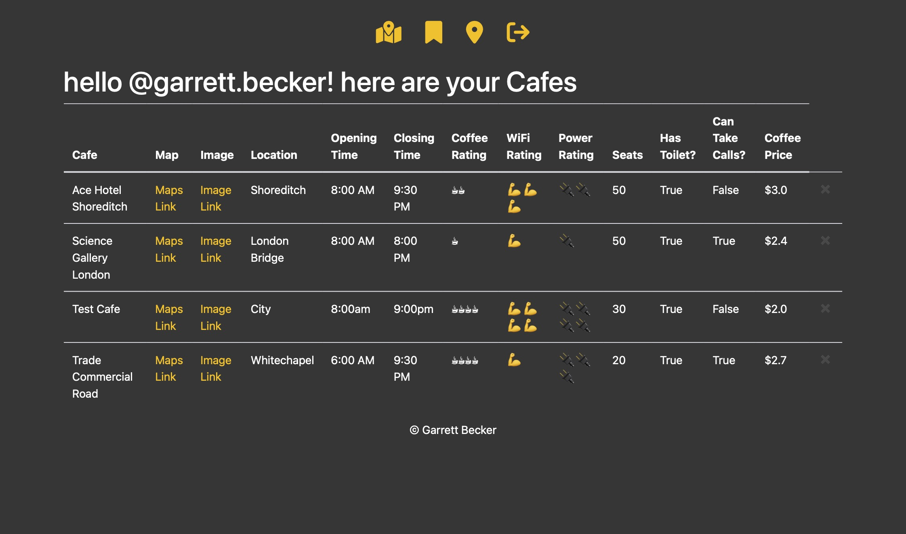

# Coffee and WiFi Web App - Django

Goal was to adjust another project I worked on by switching the back-end framework from Flask to Django. I also added an additional feature to select cafes as favorites and view them with your account.

Flask version of this app:
- [Coffee and WiFi Web App - Flask](https://github.com/gdbecker/100DaysOfCodePython/tree/main/06%20-%20Professional/Day%20087%20-%20Coffee%20and%20WiFi%20Web%20App%20V2)

### Demo View

## Links

[Replit](https://replit.com/@gdbecker/Coffee-and-WiFi-Web-App-Django)