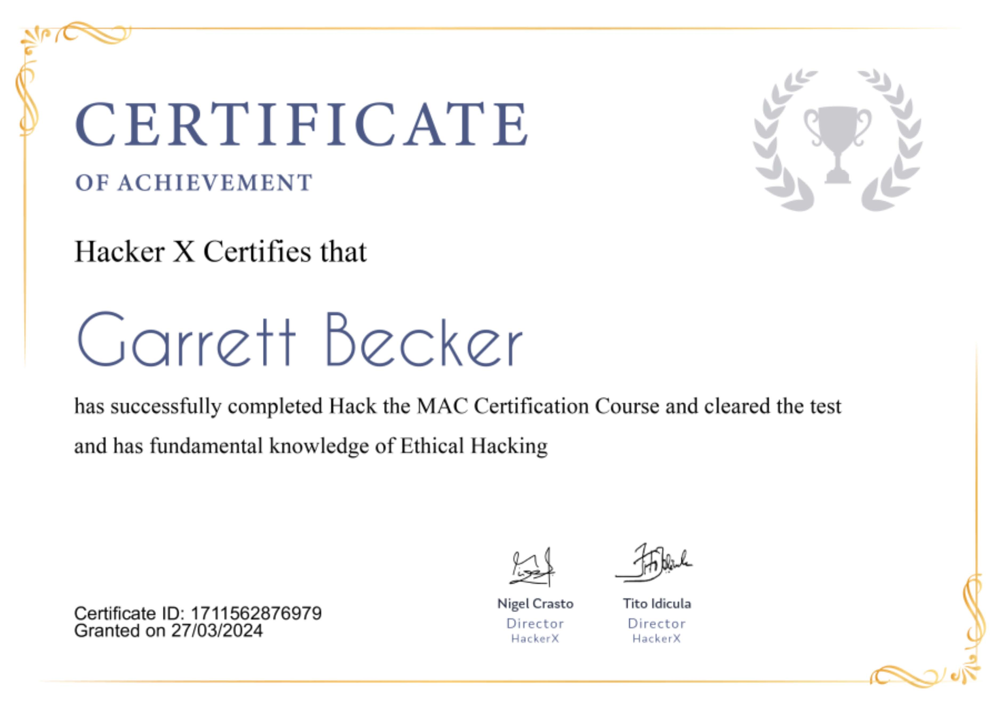

## 02_ Hack the MAC

### Certificate

### MAC Spoofing
- MAC Address stands for Media Access Control Address
- MAC Addresses ensure that the physical address of the computer is unique
- MAC spoofing is a technique for changing a factory-assigned MAC address of a network interface on a networked device
- It's just like taking over someone else's identify and performing actions by impersonating them
- MAC spoofing plays a major role when it comes to network hacking. MAC spoofing helps you overtake the identity of some other device in the network and plays a major role in one of the most dangerous attacks called Man-in-the-middle

### MAC Addresses
- Short for "Media Access Control Address"
- It's a permanent, physical, and unique address assigned to network interfaces by the manufacturer
- IP addresses are used on the Internet to identify computers and communicate between the devices
- MAC addresses are used within a network to identify devices and transfer data between them
- Each piece of data or a packet that is sent within the network contains a source MAC and a destination MAC

### How to check?
- Run the command "ipconfig /all" to check the MAC address of various network cards on your Windows system
- Run the command "ifconfig" to check the MAC address of various network cards on your Kali Linux system

### Why take over another MAC address?
- Since this is a physical, unique address to each interface, to each network device, and because it's used to identify devices, then changing it will make you anonymous on the network
- Not only that, but the MAC address is often used by filters to prevent or allow devices to connect to networks, and do specific tasks on the network
- So, being able to change your MAC address to another device's MAC address will allow you to impersonate this device and allow you to do things that you might not be able to do
- You'd be able to bypass filters or connect to networks that only specific devices with specific MAC addresses can connect to, and you will be able to hide your identity

### Legit reason for hacking the MAC
- An example for legitimate use: changing the function of a single computer from a router to a computer and back to the router through MAC spoofing
- If you only have a single public IP, you can only hook up one unit directly (PC or router)
- If one has two WAN IPs, the MAC address of the two devices must be different
- For whatever reason, if one needs to swap 2 PCs regularly to connect to the cable modem, it would be a lot easier to change the MAC addresses rather than to change the Network Interface Card (NIC)

### Non-legitimate reason for hacking the MAC
- Example: an attacker changes the MAC address of his station to enter a target network as an authorized user, taking over a computer's identity that is authorized to function on the network
- With this new identity, an attacker can wreak havoc -> launch denial of service attacks or bypassing access control mechanisms to advance more intrusion
- An attacker might choose to change one's MAC address in an attempt to evade network intrusion detection systems, to become invisible to security measures, allowing more time to act without detection

### Changing MAC Addresses on Kali
1. Disable the interface you want to change the MAC address for
2. Change the MAC address
3. Enable the interface

### In Action
1. Run the command "ifconfig"
2. Disable the interface: "ifconfig eth0 down"
3. Change the MAC address: "ifconfig eth0 hw ether 00:11:22:33:44:55"
   1. "hw" stands for hardware interface, and "00:11:22:33:44:55" is the fake MAC
4. Enable the interface: "ifconfig eth0 up"

### Technitium MAC Address Changer for Windows
https://technitium.com/tmac/

Steps to use:
1. Download and install Technitium
2. Execute the file
3. Go to the network connections tab in Technitium
4. Select WiFi
5. Select Random MAC Address option
6. Click on Change Now

Check the change using this command in the terminal: "ipconfig /all"

### Preventing MAC Spoofing
- It's possible to lock a MAC address to a specific physical port on the switch
- When MAC-locking locks a MAC/port combo, it prevents the MAC address from being used from any other port on the segment
- This combined with static ARP and MAC/IP filters could totally eradicate the spoofing possibilities on a shared-segment network
- Expensive, managed switches allow port locking, but the disadvantage is the overhead cost

### Using ARP Tables
- The use of the (static) ARP table in combination with the routing table could prevent most of the shared-segment spoofing possibilities
- Most operating systems by default do not check if a received IP datagram originated from a local MAC address matches the MAC address in the static ARP table, or if the external datagram matches the MAC address of one of the known network routers that have a valid route entry in the routing table
- Unauthorized MAC addresses are therefore exposed, and the decision to take defensive action can then take place

### Real Life Facts
- MAC Addresses is not an attack that will give you access to systems, but it will play a very important role in network hacking
- MAC Spoofing is one of the important steps in WiFi hacking
- MAC Spoofing plays a very important role in Man-in-the-Middle (MITM) attacks
- You can change your MAC to the MAC of another system and pretend to be someone else. Then you can sit in the middle of the network and intercept it