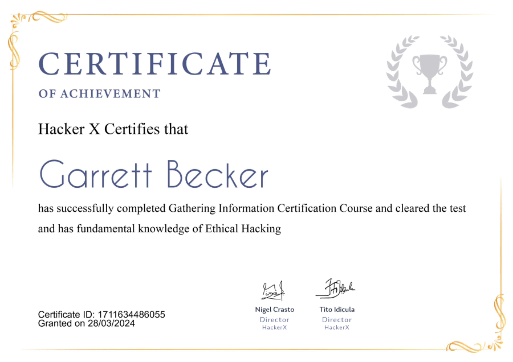

## 03_ Gathering Information

### Certificate


### General five step hacking process
1. Footprinting or information gathering
2. Scanning
3. Gaining access
4. Maintaining access
5. Clearing tracks

### Footprinting
- Footprinting is the initial stage of any hacking activity where we try to gather some basic info about the target. Footprinting helps us in deciding the path we have to follow during our hacking activity.
- Also known as reconnaissance. Some of the info we need to scrape in this method are:
  - Domain name
  - IP addresses
  - Phone numbers
  - Emails
  - And more
- This gives us an idea about the target
  - Your plan of attack will depend on the target you're after

### Online tools
- Archive.org
  - Used to gather info from old versions or closed websites of your target
  - It's like an internet time machine. The sites are cloned onto the different servers and you can access it to gather data by just entering the domain
- Who.is
  - Used to search the who.is database, look up domain and IP owner info, and check out dozens of other stats
  - You can get all the data you need about a domain and everything associated with that domain anytime with a single search
- Pipl.com
  - One of the most useful online info-gathering tools
  - Gives all the info about a person that is present on their various social media sites or the data that has been leaked. The info will be sufficient enough to know a person's strength, weakness, location, and other such details
- Insecam.org
  - All the cameras connected to the internet are available and we can access them. It's the world's biggest directly of online surveillance security cameras
  - Select a country to watch live street, traffic, parking, office, road, beach, earth online webcams
- Exploit-db.com
  - Used to see IoT devices, usernames, passwords, etc and other available info
  - Even it contains various scripts and tools that might have been used in some real hacks
- OnlineEmailTracer
  - Tool to track the email sender's identity
  - Analyzes the email header and gives the complete details of the sender like IP address, which is a key point to find the culprit and the route followed by the mail, the mail server, details of the service provider, etc. EmailTracer traces up to the internet service provider level only
  - Further tracing can be done with the help of ISP and law enforcement agencies. The message-id will be useful for analyzing the mail logs at ISP

### Using Kali tools
- NMAP and ZenMAP
  - Useful tools for the scanning phase of ethical hacking in Kali Linux. They're practically the same tools, however, NMAP uses the command line, while ZenMAP has a GUI
  - NMAP is a free utility tool for network discovery and security auditing
  - Many systems and network admins also find it useful for tasks such as network inventory, managing service upgrade schedules, and monitoring host or service uptime

### Detecting the OS in Kali
Command that we will use is:
```bash
nmap -O 192.168.1.101
```
The IP address mentioned should be the IP address of the target

### Checking the open ports
To scan all of the TCP ports based on NMAP, use this command:
```bash
nmap -p 1-65535 -T4 192.168.1.101
```
Where the parameter "-p" indicates all the TCP ports that have to be scanned. In this case, we are scanning all the ports, and "-T4" is the speed of scanning at which NMAP has to run

### NMAP stealth scan
- A stealth scan, or SYN, is also known as a half-open scan, as it doesn't complete the TCP three-way handshake
- A hacker sends an SYN packet to the target; if an SYN/ACK frame is received back, then it's assumed that the target would complete the connection and the port is listening
- If an RST is received back from the target, then it's assumed that the port isn't active or is closed

Use the parameter "-sS" in NMAP:
```bash
nmap -sS -T4 192.168.1.101
```

### DNS Tools
- Dnsenum.pl
  - The first tool is dnsenum.pl which is a PERL script that helps to get MX, A and other records connected to a domain
- DNSMAP
  - This helps to find the phone numbers, contacts, and other subdomains connected to this domain that we are searching for
```bash
dnsmap domain name
```

### Real life facts
- We know info gathering plays an important role when it comes to hacking
- Using these tools you can gather enough info about your target, whether it's a person or a system
- The info gathered is enough to create a plan of action for the attack