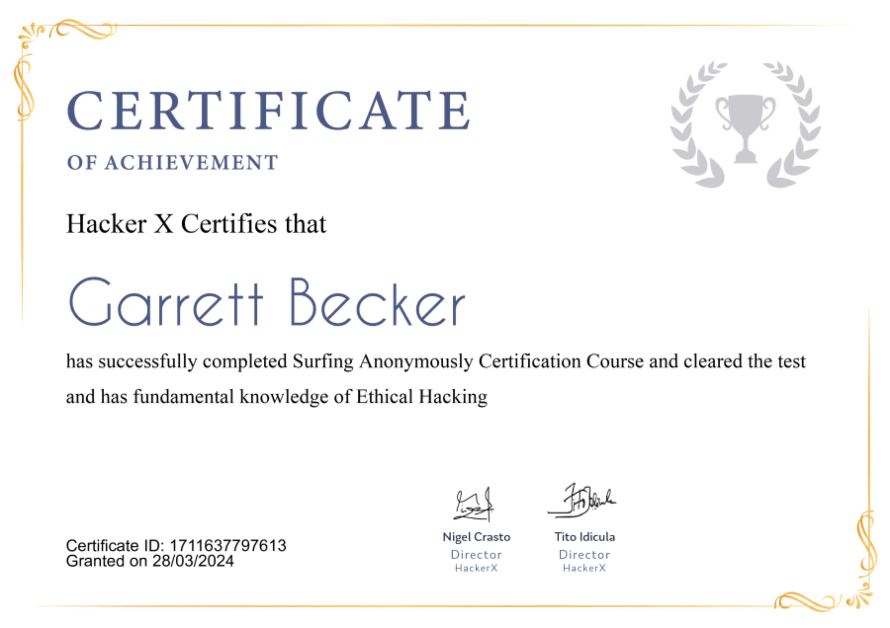

## 04_ Surfing Anonymously

### Certificate

### Why use a VPN?
- As a hacker, you need to cover your tracks and sur anonymously
- Surfing online leaks a lot of personal data that you might wish to keep private
- A VPN will help you do that. Using a VPN allows you to surf anonymously and prevent your personal data from getting leaked on the browser
- VPN = Virtual Private Network
  - It's a network connection that enables you to create a secure connection over the public internet to private networks at a remove location

### VPN
- VPNs are secure and separate networks, which let users connect to the internet through an encrypted tunnel bypassing their public network and securely transfers their internet data packs through it
- VPN is just like a firewall in computers which protects you from the local area network (LAN) attacks
- VPN works as an online firewall to protect you from all the cyber hazards and attackers, to use a VPN an active connection is required
- It's a mix of various technologies which:
  - Gives you anonymity over the internet
  - Hides your IP address and internet activities from your ISP and other snoopers like government surveillance and security agencies, provide internet security and privacy
  - Let you bypass geo-restrictions and access all the blocked websites when you are outside your country
  - Gives you absolute protection from cyber attackers like hackers, spammers, etc

### VPN Advantages
- Enhanced security
- Remote control
- Share fles
- Online anonymity
- Unblock websites and bypass filters
- Change IP address
- Better performance
- Reduce costs

### What data of yours is being leaked?
- Browseleaks.com
  - This is all about browsing privacy and web browser fingerprinting
  - You can see all the data that is leaked by your browser

### VPNs will help
- Passing or accessing sensitive or secret data/info such as bank account passwords, certificates, important documents securely via an unsecured internet connection
- Accessing a restricted website or foreign website which is unavailable in your country
- Hiding your browsing activity from your local network and ISP

### Opera browser
- Opera is a freeware web browser for Microsoft Windows, Android, iOS, macOS, and Linux operating systems, developed by Opera Software
- It's a Chromium-based browser using the Blink layout engine
- Surfing anonymously and using a VPN can be done with the help of Opera, without the need for third-party VPN software
- How?
  - Browse to Settings
  - Click on Advanced Settings
  - In Advanced Settings, click on Browser
  - Click on the VPN option to enable it
  - Browse to WebRTC option in the same category in Settings
  - Disable non-proxied UDP
  - Next, browse to Privacy and Security
  - Enable the option "Send a 'Do Not Track' request with your browsing traffic"
  - Turn off Location in Content Settings
  - Finally, browse to option - Block ads and surf the web up to 3x faster, and turn it on

### VPN tools
- Proton VPN
  - Another provider that offers a free VPN alongside a paid option, but the former has some very strong points; most notable of which is that it doesn't impose any bandwidth restrictions
  - In other words, you're free to use as much data as you want every month
  - There are limitations for the free plan to incentivize upgrading to the paid offering
  - Its restrictions include limiting you to only one device, only three locations, and free users get a lower priority when it comes to speed, compared to paying subscribers
- Betternet
  - Provides you with a better internet on all the devices to unblock any websites, protect your privacy against hackers, and surf the web
  - It encrypts your internet connection to browse the web privately and protects you from known online scams and malware
- OpenVPN
  - Open-source commercial software that implements virtual private network techniques to create secure point-to-point or site-to-site connections in routed or bridged configurations and remote access facilities
  - Uses a custom security protocol that utilizes SSL/TLS for key exchange
- Psiphon VPN
  - Free and open-source internet censorship circumvention tool that uses a combination of secure communication and obfuscation technologies
  - Centrally managed, and geographically diverse network of thousands of proxy servers, using a performance-oriented, single and multi-hop architecture

### Betternet
- Provides you with a better internet on all devices to unblock any websites, protect your privacy against hackers, and surf the web
- It encrypts your internet connection to browse the web privately and protects you from known online scams and malware

### OpenVPN
- Open-source commercial software that implements virtual private network techniques to create secure point-to-point or site-to-site connections in routed or bridged configurations and remote access facilities
- Uses a custom security protocol that utilizes SSL/TLS for key exchange
- How?
  - In the taskbar, a computer kind of logo will appear after downloading and unzipping
  - Right-click on it and select import file
  - Import any of the unzipped files, generally UDP25000 file is preferred
  - Once done with importing, click Connect

### Real life facts
- There are situations where some videos on some streaming channels or some websites are not available in some countries
- A VPN service is a good solution to bypass this issue or to skip country restrictions
- Using a VPN only lets you change your details but also lets you surf anonymously