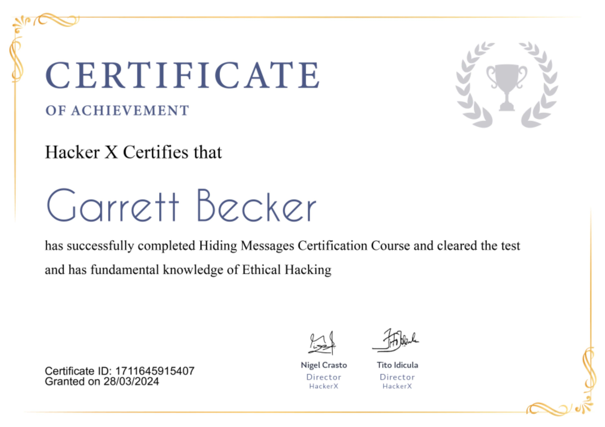

## 05_ Hiding Messages

### Certificate


### Steganography
- Hiding information intended to be secret inside some other information that isn't secret
- In hacking, steganography is practiced by hiding messages in images and videos
- This is the art and science of embedding secret messages in a cover message in such a way that no one, apart from the sender and intended recipient, suspects the existence of the message
- It's a combination of two Greek words which are steganos, which means covered, and graphia, which means writing
- Has historic roots of its use throughout time
- Focuses more on high security and capacity

### Steganography Technical Methods
- Invisible ink: one of the methods with the oldest tradition
- Microdots: method that can be used to hide up to one page in a dot
- Computer-based methods: uses redundant information in texts, pictures, sounds, videos, etc

### Steganopgrahy Types
- Pure steganography
  - Does not require the exchange of ciphers such as a stego-key, but the sender and receiver must have access to embedding and extraction algorithms
  - The cover for this method is chosen such that is minimizes the changes caused by the embedding process
- Secret-key steganography
  - Uses a key to embed the secret message into the cover
  - The key is only known to the sender and the receiver, and is known prior to communication
  - The key should be exchanged in a secure medium
- Public-key steganography
  - Uses two keys, the public key stored in a public database and is used for the embedding process, and the secret key is known only to communication parties and is used to reconstruct the original message

### Practicing on Windows
Command:
```bash
copy /b "img.jpg" + "message.txt"
```

### Practicing on Kali Linux
- Stegosuite
  - One of the simplest tools for steganography
  - Cross-platform tool that you can download from its official site
  - How to use:
    - Browse to the file menu and open the image you want to use
    - In the first box, fill your message
    - Stegosuite is password-protected, thus while embedding and extracting you will need a password. So while embedding, add a password. Remember the same password will be used to extract the message
    - Click on Embed
  - Note: messages that are embedded using Stegosuite can only be extracted using Stegosuite. No other tool can be used to extract the message

### Other Kali tools for steganography
- Steghide
  - Steganography program that hides data in various kinds of images and audio files. It only supports three file formats: JPEG, BMP, WAV, and AU. But it's also useful for extracting embedded and encrypted data from other files
  - Useful commands:
    - "steghide info file" -> displays info about a file whether it has embedded data or not
    - "steghide extract -sf file" -> extracts embedded data from a file
- Foremost
  - Recovers files based on their headers, footers, and internal data structures; it's useful when dealing with .png images
  - Useful commands:
    - "foremost -i file" -> extracts data from the given file
- Strings
  - Linux tool that displays printable strings in a file. That simple tool can be very helpful when solving stego challenges
  - Usually, the embedded data is password protected or encrypted and sometimes the password is actually in the file itself and can be easily views by using Strings
  - It's a default Linux tool, so no additional installs needed
  - Useful commands:
    - "strings file" -> displays printable strings in the given file

### Real life facts
- A Russian spy was recently arrested by the FBI and was accused of encoding messages into otherwise innocuous pictures
- The accused spies posted the seemingly mundane photos on publicly accessible websites, but then extracted coded messages from the computer data of their pictures, according to the criminal complaint filed by the FBI

