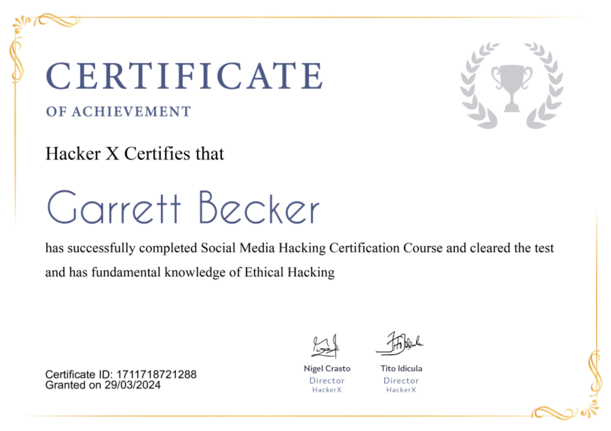

## 06_ Social Media Hacking

### Certificate


### Social Media Hacking
- "Phishing" is a term used to identify techniques that hackers or cybercriminals use to 'fish' a person and launder their information
- Cybercriminals use techniques to hack usernames, passwords, security answers, etc of users to hack into their social media or bank accounts
- Phishing is a type of identity theft that uses technical tricks and social engineering to deceive users into revealing sensitive personal information. When it comes to cyber attacks, phishing is one of the most dangerous attacks

### Phishing
- Form of malicious social engineering to elicit digital security information from an innocent individual
- The target is usually passwords or some personal information
- The process is to fool the individual into giving the information by spoofing authentic authority
- The email somehow convinces the individual that it's necessary for them to enter their security details which, if they are effectively fooled, will go to a site controlled by the malicious actor who will then be able to use the credentials and access their accounts

### Types of Phishing
1. Spear Phishing
   1. The attacker has limited knowledge of the victim and usually sends a broadcast email to many potential victims, hoping for at least one response
   2. You may receive the same email as family, friends, and colleagues
   3. The attacker has info about you, and they use their knowledge of you to launch their phishing attack
   4. Information can be gathered from public sources such as social media, social engineering, trash surfing, etc
2. Whaling
   1. Victims of whaling are usually high profile individuals such as a company executive, celebrity, etc
   2. The attacker may or may not have specific info about the individual
   3. The most common type of whaling is usually trying CEOs or CFOs to get them to submit the company bank account info, intellectual property, etc

### Shellphish
- Tool that illustrates how easy and powerful phishing tools have become today
- It leverages some of the templates generated by another tool called SocialFish
- Offers phishing templates for 18 popular sites, the majority are focused on social media and email providers
- There is also an option to use a custom template if so desired

Installing on Kali and changing permissions so we as the admin can use it:
```bash
cd Desktop
git clone https://github.com/thelinuxchoice/shellphish.git

cd shellphish/
ls

chmod 744 shellphish.sh
```

Launch the tool:
```bash
./shellphish.sh
```

### HiddenEye
- Modern phishing tool with advanced functionality and it also currently has Android support. You will have live information about the victims such as IP addresses, geolocations, ISP, country, and many more

### Evil SSDP
- Responds to SSDP multicast discovery requests, posing as a generic UPNP device
- Your spoofed device will magically appear in Windows Explorer on machines in your local network
- Users who are tempted to open the device are shown a configurable phishing page. This page can load a hidden image over SMB, allowing you to capture or relay the NetNTLM challenge/response
- Templates are also provided to capture clear-text credentials via basic auth and login forms, and creating your own custom templates is quick and easy

### Zphisher
- Upgraded form of Shellphish; the main source code is from Shellphish but isn't fully copied
- It has upgraded it and cleared the unnecessary files
- It has 37 phishing page templates, including Facebook, Twitter, and PayPal, and it also has 4 port forwarding tools

### Investigate every link's final destination
- Just because a link is typed out and looks like a normal hyperlink doesn't mean the destination is authentic
- To find out if a link is real, hover over it with your mouse and look at the link's destination in the lower-left corner of your browser. This is the real destination, regardless of what the text says

### Be cautious with shortened links
- We've all clicked on Bitly or Linktree links at some point - most likely on social media
- Link shortening tools are popular for brands and users since they save character count and look cleaner than longer urls
- Phishers are hip to this trend and employ it themselves -> watch out for shortened links anytime you're tempted to click, as they might lead to a fake landing page

### Change your passwords frequently
- Unless you work in IT or security, you most likely use the same password, like your street name or a child's birthday. The truth is, having a unique password for each account has never been easier
- There are reputable platforms available you can use to create strong passwords and store them for safekeeping, like LastPass

### Set up two-factor authentication
- Many organizations offer 2FA for an extra layer of security
- Take advantage of this whenever possible, so no one else can log in without needing your device

### Protecting yourself against phishing
- Don't click unknown links
- Don't download unknown files or files from unknown sources
- Don't open attachments (even on social media) from untrusted sources

### Real life facts
- Somebody just put up these pictures of you drunk at this wild party! Check them out here - By reading these, immediately many people clicked on the enclosed link, which took them to their Twitter or Facebook login page
- There they entered their account info, and a cybercriminal now had their password, along with total control of their account

