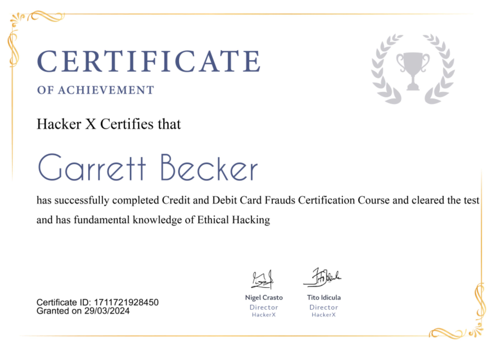

## 07_ Credit and Debit Card Frauds

### Certificate

### Online frauds
- There are situations when many times we get fake calls. The caller pretends to be a person from some legitimate company or bank and offers some deal, and in return asks for sensitive information such as bank account or more
- The victim falls into the trap and gives away all the info and in return loses all the money
- This is a scenario of hacking where the fraudulent person used the technique called social engineering

### Social Engineering
- Act of tricking someone into divulging information or taking action, usually through technology
- The idea behind this is to take advantage of a potential victim's natural tendencies and emotional reactions and steal data/money from them
- "To continue you will need to enter your Facebook password" -> this line is a social engineering attempt that is built on to obtain your password by involuntarily making you enter your own password. This is how social engineering happens
- Hacker creates such a situation that leads the victim to share confidential information
- Social engineering refers to the psychological manipulation of people into performing actions or divulging confidential information
- A type of confidence trick for the purpose of information gathering, fraud, or system access
- It differs from the traditional "con" in that it is often one of the many steps in a more complex fraud scheme
- It's also associated with social sciences, since it pertains to computers, and it is referred by information security professionals as a field of computer science
- It can be defined as "Social engineering is an art, Hacker is the artist, and the Victim is the painting"
- 91% of data breaches come from socially engineered phishing attacks, it's one of the most exploited forms of social engineering

### Social engineering toolkit
- Social Engineering Toolkit = SET
- Set of open-source penetration testing frameworks designed for social engineering
- SET has a number of custom attack vectors that allow you to make a believable attack quickly
- The success of SET is totally dependent on your social engineering skills

### SET Attack Vectors
1. Spear-phishing attack vectors: this tool allows you to send emails with a malicious file as payload
2. Website attack vectors: this tool allows you to create a malicious website link
3. Infectious media generator: this tool creates a payload and a .ini file for a USB, CD, or DVD injection
4. Create a payload and listener: creates an .exe file and opens a listener
5. Mass mailer attack: sends emails to the target
6. Arduino-based attack vector: for use with a "teensy USB"
7. SMS spoofing attack vector: you'll be able to craft SMS messages and send them
8. Wireless access point attack vector: should be straightforward
9. QRcode generator attack vector: generates a QR code to a specific url
10. Powershell attack vector: allows you to use Powershell exploits (Powershell is available on Windows Vista and above)
11. Third-party modules: allows you to browse for more add-ons

### Pastebin
- https://pastebin.com/
- You might get details here of many credit and debit cards with all their sensitive information
- All these cards are absolutely true and working
- This site contains the details of the cards that are leaked with their info
- This is just for educational purposes and as a hacker, you should know this site

### Credit and debit card hacks
- For debit cards, there are various methods via which one can do fraud
- One is phishing: trying to obtain sensitive details via false emails sent to you
  - Common type of attack
  - Encourages people to share their details
- Another is skimming: they can obtain your details from the magnetic stripe of the card and then clone your card and prepare a new card, then do fraud
  - The source can be from anywhere to anything like from ATM machines to restaurants, where you hand over the card to the waiters for bill payment
  - For credit cards, both of the above are applicable, but the credit card is more dangerous since in a debit card you have an idea of what your loss would be
  - But if it's a credit card, if your limit is higher, then the exposure is more

### How to safeguard and prevent?
- Hold on: hackers want you to act first and think later. If the message conveys a sense of urgency or uses high-pressure sales tactics, be skeptical; do not let their urgency influence your careful review and better judgement
- Research facts: be suspicious of any unsolicited messages. If the email looks like it's from a company you use, do your own research. Use a search engine to go to the real company's site. Social media verified accounts of companies are a good place to start
- Financial info or passwords: if you get asked to reply to a message with personal info, it's a scam
- Reject requests for help or offers of help: legitimate companies and organizations do not contact you to provide help. If you did not specifically request assistance from the sender, consider any offer to 'help' restore credit scores, refinance a home, answer your question, etc, a scam
- Do not let a link control you: stay in control y finding the website yourself using a search engine, to be sure you land where you intend to land
- Do not open emails in the spam folder: or emails whose recipients you do not know
- Do not open attachments: in emails of unknown origin
- No not pay the ransom: the reason why criminals keep using this form of blackmailing attacks is that people keep paying. To try to get your data back, consult a professional

### Real life cases
- Mark Rifkin used a series of social engineering attacks to pull off a large bank heist in the 1970s
- He is responsible for stealing $10.2 million through wire transfer via telephone in the autumn of 1978
- At that time, it was the largest bank robbery in US history