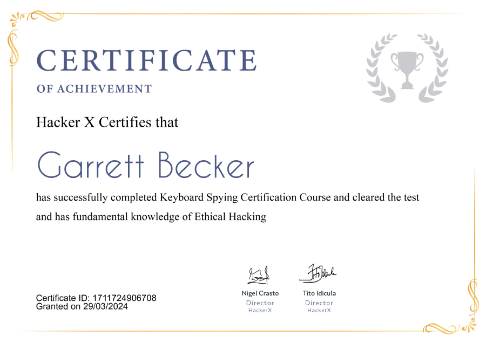

## 08_ Keyboard Spying

### Certificate


### Keyboard Logging
- Keyboard spying, also called keylogging, is one of the most used and dangerous attacks that a hacker can perform
- A keylogger is software that's able to record all your actions or keystrokes performed on a computer
- A keylogger is software that secretly monitors your keyboard strokes, so it could steal your sensitive information while using your keyboard

### Keyloggers
- The term "keylogger" is neutral and the word describes the program's function
- Most sources define a keylogger as a software program designed to secretly monitor and log all keystrokes
- This definition is not altogether correct, since a keylogger doesn't have to be software; it can also be a device
- Keylogging devices are much rarer than keylogging software, but it's important to keep their existence in mind when thinking about information security
- Keylogger: software program or hardware device that's used to monitor and og each of the keys a user types into a computer's keyboard
- The user who installed the program or hardware device can then view all the keys typed in by that user
- Because these programs and hardware devices monitor the keys typed in by a user, can easily find user passwords and other info a user many not wish others to know about
- Keyloggers, as a surveillance tool, are often used by employers to ensure employees use work computers for business purposes only
- Unfortunately, keyloggers can also be embedded in spyware, allowing your info to be transmitted to an unknown third party
- Once keystrokes are logged, they are hidden in the machine for later retrieval or shipped raw to the attacker
- The attacker then peruses them carefully in the hopes of either finding passwords, or possibly other useful info that could be used to compromise the system or be used in a social engineering attack
- For example, a keylogger will reveal the contents of all email composed by a user
- Keyloggers are often included in rootkits

### The threat of keyloggers
- Unlike other types of malicious programs, keyloggers present no threat to the system itself
- Nevertheless, they can pose a serious threat to users, as they can be used to intercept passwords and other confidential info entered via the keyboard
- As a result, cybercriminals can get PIN codes and account numbers for e-payment systems, passwords to online gaming accounts, email addresses, user names, email passwords, and more
- Once a cybercriminal has got hold of confidential user data, they can easily transfer money from the user's account or access the user's online gaming account
- Unfortunately, access to confidential data can sometimes have consequences that are far more serious than an individual's loss of a few dollars
- Keyloggers can be used as tools in both industrial and political espionage, accessing data that may include proprietary commercial info and classified government material, which could compromise the security of commercial and state-owned organizations (for example, by stealing private encryption keys)
- Keyloggers, phishing, and social engineering are currently the main methods being used in cyber fraud
- Users who are aware of security issues can easily protect themselves against phishing, by ignoring phishing emails and by not entering any personal info on suspicious websites
- It's more difficult, however, for users to combat keyloggers; the only possible method is to use an appropriate security solution as it's usually impossible for a user to tell that a keylogger has been installed on their machine

### Beelogger
- An email-keylogger that is an open-source tool
- Ever thought the way to get someone's credentials who is out of your network, whom you cannot hack by simply using a payload and listener, then the only method left is to spy for his/her credentials are putting in a keylogger, and most of the keyloggers accessible online for remote keyloggers are paid
- However, you can create an email-keylogger using Beelogger free of charge, if you have a Linux of Mac OS system
- It can build keyloggers of many types including:
  - Adobe Flash update setup file
  - Adobe PDF
  - Office Word
  - Office PowerPoint
  - Office Excel
  - Blank executable
- This tool provides additional energy to the social engineering subject
- We all face issues when we try to install a keylogger on other computers, as generally, people know about .exe format files and that these should be avoided
- However if we send them a Word doc or PDF file, then there is a good chance of them clicking on it
- Beelogger features:
  - Send logs every 120 seconds
  - Send logs when chars > 50
  - Send logs with gmail
  - Some phishing methods are included
  - Multiple sessions are disabled
  - Auto persistence

### Beelogger installation
Use these commands on Kali:
```bash
git clone https://github.com/4w4k3/Beelogger.git

cd Beelogger
./install.sh

./bee.py

K
```

Keyloggers are generated in the /dist/ folder

### Spyrix Free Keylogger
- Free version of the paid Pyrix Personal Monitor
- It's able to capture keystrokes, clipboard text, and take screenshots but advanced features like social network and IM capture, visited webpage logging, webcam snapshots, sound recording, and alerts are not available
- Spyrix can be launched with either a hotkey (Ctrl + Alt + A) or run command (run key) and can be protected with a password

### BlackBox Express
- Security monitoring tool that can be used as a keylogger
- The free version is back from 2011 and is not for download on the official site, but does work on the latest Windows 10
- It works slightly differently from the other tools, because it can monitor 1 local PC and up to 200 remote PCs on the network
- BlackBox Express can log keystrokes, web searches, run programs, visit websites, email client programs, webmails, instant messaging chat programs, and capture screenshots

### Revealer Keylogger Free
- Can record keystrokes, has multiple language support, has all/selected user-startup settings, the ability to run with elevated privileges, hotkey support (default is Ctrl + Alt + F9), password protection, and automatic log cleanup
- Screenshot capture and automated delivery options are paid features only and disabled in the free version

### Preventative measures
- Take caution when opening attachments: keyloggers can be present in files received through email, chats, P2P networks, text messages or even social networks
- If someone sends you an email out of the cold, or the contents of the email are asking for your personal info, chances are that there's a keylogger in there somewhere
- Implement two factor authentication
  - One-time passwords help users protect their sensitive info since hackers can't use that temporary password again
- Use a virtual keyboard
  - Helps to avoid personal data interception by hackers
  - It's software used to allow users to input characters without the actual need for keyboard keys
- Use a comprehensive security system
  - Use good, quality paid antivirus software
  - These can detect malicious tools that might come into your system and help to remove them

### Real life cases
- In February 2005, Joe Lopez, a businessman from Florida, filed a suit against Bank of America after unknown hackers stole $90,000 from his Bank of America account
- An investigation showed that Mr. Lopez's computer was infected with a malicious program that recorded every keystroke and sent this info to malicious users via the internet