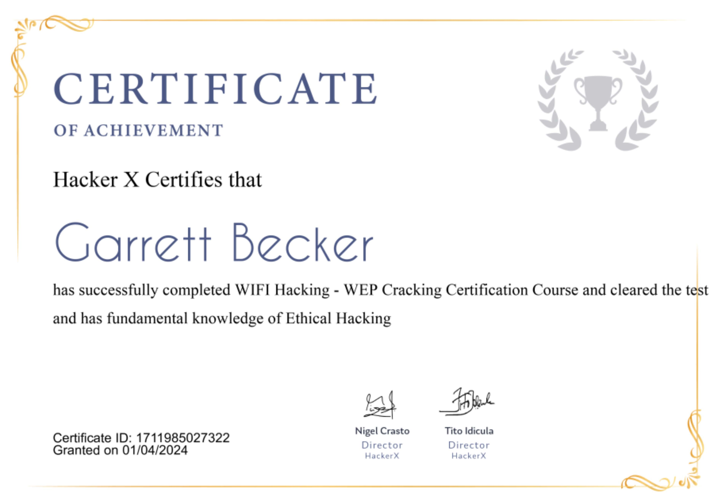

## 09_ WiFi Hacking - WEP Cracking

### Certificate


### WiFi Hacking
- Internet and WiFi are some of the basic necessities today
- Have you ever wondered how a WiFi network gets hacked?
- Once an attacker gets into your WiFi, he wil not only have your WiFi password but can access the network, using various attacks an even spy on your network
- A hacker can control your activities, spy on your browsing activities, steal your sensitive info such as your credentials that you might enter while on the network, that will eventually pass through your WiFi router -> that's where hackers are waiting for such info

### Encryptions
- WiFi security algorithms have been through many changes and upgrades since the 1990s to become more secure and effective
- Different types of wireless security protocols were developed for home wireless network protection
- The wireless security protocols are WEP, WPA, and WPA2, serving the same purpose but being different at the same time
- Not only do the wireless security protocols prevent unwanted parties from connecting to your wireless network, but also encrypt your private data sent over the airwaves
- No matter how protected and encrypted, wireless networks cannot keep up in safety with wired networks

### WEP
- Developed for wireless networks and approved as a WiFi security standard in Sept 1999
- WEP was supposed to offer the same security level as wired networks, however there are a lot of well-known security issues in WEP, which is also easy to break and hard to configure
- Despite all the work that has been done to improve the WEP system, it still is a highly vulnerable solution
- Systems that rely on this protocol should be either upgraded or replaced in case a security upgrade is not possible
- WEP was officially abandoned by the WiFi Alliance in 2004

### WPA
- For the time the 802.11i wireless security standard was in development, WPA was used as a temporary security enhancement for WEP
- One year before WEP was officially abandoned, WPA was formally adopted
- Most modern WPA apps use a pre-shared key (PSK), most often referred to as a WPA Personal, and the Temporal Key Integrity Protocol (TKIP) for encryption
- WPA Enterprise uses an authentication server for keys and certificates generation
- WPA was a significant enhancement over WEP, but as the core components were made, so they could be rolled out through firmware upgrades on WEP-enabled devices, they still relied upon exploited elements

### WPA2
- The 802.11i wireless security standard based protocol was introduced in 2004
- The most important improvement of WPA2 over WPA was the usage of the Advanced Encryption Standard (AES)
- At this time the main vulnerability to a WPA2 system is when the attacker already has access to a secured WiFi network and can gain access to certain keys to perform an attack on other devices on the network
- Unfortunately, the possibility of attacks via WiFi Security Protocols (WPS) are still high in the current WPA2-capable access points, which is the issue with WPA as well
- Even though breaking into a WPA/WPA2 secured network through this hole will any anywhere between 2-14 hours, it's still a real security issue and WPS should be disabled and it would be good if the access point firmware could be reset to a distribution not supporting WPS to entirely exclude this attack vector

### Why do we need an adapter?
- Wireless adapters are external USB devices that get connected to your computer and allow you to communicate with wireless networks
- Most of the computers and laptops come with the built-in wireless adapter card, but these are not powerful for hacking; we need an adapter that allows a monitor mode and packet injection
- You can buy a wireless WiFi adapter online

### How to connect on Kali Linux
1. Click on your Kali setup in VirtualBox and go to settings
2. In settings, browse to USB option
3. Now connect your wireless adapter to your machine and select the appropriate USB port that it's connected to, nad click on the plus (+) sign that you can see on the right side
4. It will list out various devices from which you can select your wireless adapter and click on OK

### Check that the above steps worked:
1. Use the following command in your terminal:
```bash
ifconfig
```
   1. This will list out various networks connected to the system, and here you will see an entry called wlan0
   2. If you see this, that means your wireless adapter is successfully connected to Kali

### Why do we need the monitor mode?
- We know that devices in each network communicate with each other using different packets, so all the data over the internet is sent as packets
- In a network, devices ensure that these packets go in the right direction using the MAC address; so each packet has a source MAC and a destination MAC
- But as a hacker, if you are in the range, you will be able to capture all this data, because these packets are literally sent in the air
- So we can capture the data even if they don't have the destination MAC as our MAC
- To do this, we will need to change the mode of operation of our wireless adapter from managed mode (default) to monitor mode

### Commands
- "iwconfig" -> will show the details of the wireless network interfaces

### Steps to change the operation mode
1. Disable the interface you want to change the mode for
2. Change the mode of operation
3. Enable the interface

### In action on Kali
1. Disable the interface: "ifconfig wlan0 down"
2. Change the mode: "iwconfig wlan0 mode monitor"
3. Enable the interface: "ifconfig wlan0 up"

### Using "Airodump-ng"
- Once monitor mode is enabled, we can sniff other packets in our range; for that we will use a tool called Airodump-ng
- It's part of the aircrack-ng suite and is a packet sniffer
- Airodump-ng is used to capture all the packets that are in the range and it displays detailed info about the network, connected clients, and much more
- Kali command: "airodump-ng wlan0"
  - This will start sniffing the packets and will show the result as shown 
  - Result table:
    - ESSID: shows the names of the wireless networks around us
    - BSSID: shows the MAC address of the target network
    - PWR: shows the network strength, higher the number = more powerful the network is
    - Beacons: frames sent by the network to show and broadcast its existence
    - #Data: number of data frames
    - #/s: number of data packets collected in the past 10 seconds
    - CH: channel the network works on
    - MB: max speed supported by the network
    - ENC: the encryption used by the network
    - CIPHER: the cipher used by the network
    - Auth: authentication used on the network

### Targeted packet sniffing
- Command "airodump-ng wlan0" -> gets as much info about a specific network
- Run this command to target a particular network
  - "airodump-ng --bssid <bssid/MAC address of the target network> --channel <channel number> --write <name of the file> wlan0"
  - Example: "airodump-ng --bssid F8:23:B2:B9:50:A8 --channel 1 --write test wlan0"
- Results
  - Shows details of the network you targeted
  - There is also an additional table that contains details of all the devices/clients connected to that particular network
  - Here, BSSID is the MAC of the target network, STATION is the MAC of te client/connected device

### Disconnecting a client
- Deauthentication attacks allow us to disconnect any device from the network without having the need for a password to connect to that network
- Works like this:
  - Changes our MAC to the client MAC
  - Requests the network, that I am your client and I wish to connect
  - Then changes the MAC to router's MAC and pretend to be the router
  - Thus tells the client, you requested to disconnect, so I am disconnecting you

### Using "Airplay-ng"
- To do this attack, we'll use a tool called Airplay-ng
- Command: "airplay-ng --deauth 1000000 -a <MAC address of the network> -c <MAC address of the client wlan0>"
  - wlan0 = wireless interface
  - 1000000 = number of packets that we want to send to the router and the client and keeps the client disconnected

### How to break WEP encryption
- WEP uses an algorithm called RC4 to encrypt data
- So the way this works is basically if a client wants to send something to the router it will first encrypt using a key
- This encrypted packet will be sent into the air, so if a hacker captures this packet as we have seen before, we won't be able to read it because it's encrypted
- The access point will receive this encrypted packet, and it will be able to transform it back to its original form because it has the key
- Therefore, it'll actually be able to read the contents which are the data sent to the router
- The same happens if the router wants to send something back to the client, it will first encrypt it using a key, send it to the client, and the client will be able to decrypt because it has the key
- So the algorithm and the way RC4 works is actually fine, the problem is with the way that WEP implements the algorithm
- WEP tries to generate a unique key for each packet
- So literally every packet that's sent into the air, it tries to create a new unique key for it, and to do that it generates a random 24-bit initialization vector
- The initialization vector s then added to the password of the network to the actual key that people use to connect to the network
- This generates a keystream, and then this keystream is used to encrypt this packet and transform it into the encrypted form
- But before sending this into the air, WEP will also append the initialization vector
- The reason why it adds the initialization vector (IV) to the packet is that once the router receives the packet, it needs to be able to decrypt it, and to decrypt it, it needs the key and IV
- Basically, the IV is sent in plain text, so the packet content is encrypted, so if someone captures this packet, they won't be able to read this but they will be able to read the IV in plain text
- IV size is only 24 bits
- Considering the huge amount of traffic that can be generated on a WiFi network, this number is not big enough, and the IVs will start to get repeated in a busy network
- This makes WEP vulnerable to statistical attacks, so we can use a tool called Aircrack-ng to determine the keystream, once we have enough repeated IVs
- And from that, it will also be able to crack WEP and give us the key to the network

### Using "Aircrack-ng"
- In order to crack WEP, we will need to capture large numbers of packets/IVs and we will know that since IVs are short, they will be repeated
- Use Aircrack-ng to analyze captured IVs and crack the key

1. Capture the packets: run airodump-ng against the target network using WEP
   1. "airodump-ng --bssid <MAC of the target network> --channel <channel number> --write basic_wep wlan0"
2. Run aircrack-ng command against the file in which the data is captured
   1. "aircrack-ng <name of the file>.cap"
   2. Example: "aircrack-ng basic_wep_01.cap"
   3. It will analyze the packets and try to find the key from the data captured, and prompts with KEY FOUND! once it finds the key
3. Then you can connect to the network using the key that's found
   1. Example: if the key is "41:73:32:33:70", then remove the colons so the the key is "4173323370"

### How to prevent WEP attacks
- WEP was supposed to offer the same security level as wired networks but there are a lot of well-known security issues in WEP, which is also easy to break and hard to configure
- WEP systems are still highly vulnerable despite the work done to improve it
- Unfortunately, there isn't a lot that one can do to prevent this from happening to them, because WEP is very outdated
- Only thing you can do is either get a second level of security or change your WiFi's security from WEP to WPA or WPA2

### Real life cases
- Maurits Martijn, a Dutch journalist at De Correspondent, entered a busy Amsterdam cafe with Wouter Slotboom, an ethical hacker
- Within a few minutes, Slotboom had set up his gear, consisting of a laptop and a small black device, and connected to the coffeehouse's WiFi
- Soon enough, his laptop started to display what other people in the cafe were doing on their devices: what games they were playing, apps installed, Google searches, password and email accounts, and more
- Slotboom's small black device would fool a phone into connecting to its own WiFi network, giving him control over the entire traffic coming and going from a device