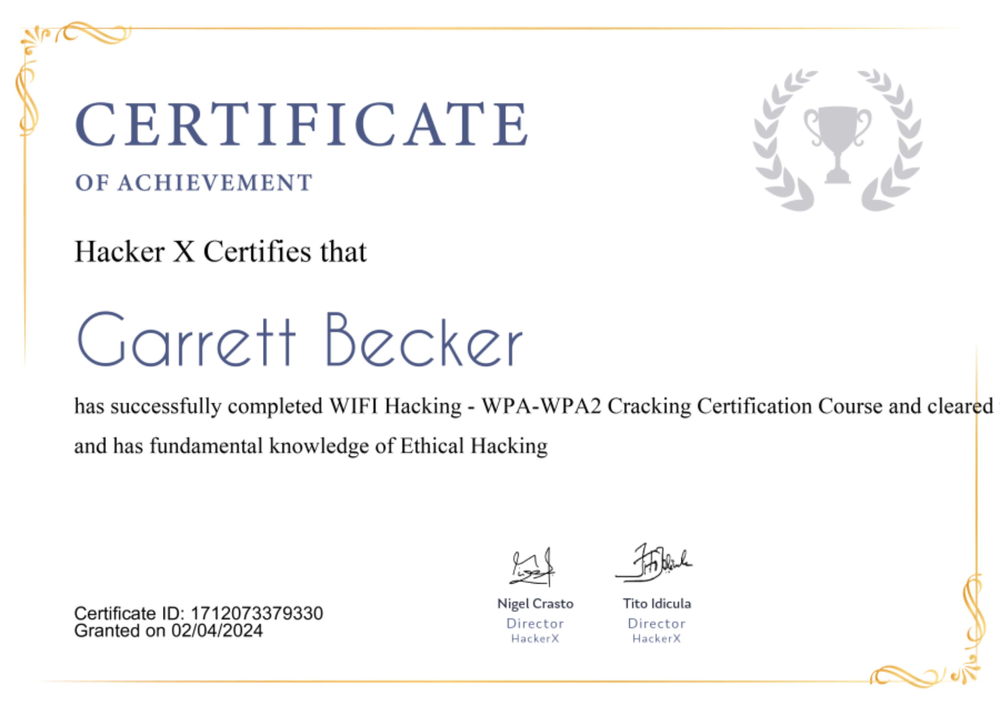

## 10_ WiFi Hacking - WPA-WPA2 Cracking

### Certificate

### WiFi Hacking
- Once an attacker gets into your WiFi, he will not only have your WiFi password, but he can then actually access the network, using various attacks and even spy on your network
- For this, the data is encrypted using various encryptions such as WEP, WPA, and WPA2, of which WPA2 is the most secure
- WPA and WPA2 can be cracked in two ways
  - Using the WPS feature
  - Using a wordlist
- WPA = WiFi Protected Access

### WPA and WPA2
- WPA applications use a pre-shared key (PSK) most often referred to as a WPA Personal, and the Temporal Key Integrity Protocol or TKIP for encryption
- WPA Enterprise uses an authentication server for keys and certificates generation
- The most important improvement of WPA2 over WPA is the usage of the Advanced Encryption Standard (AES)
- WPA and WPA2 are very similar but differ based on the algorithm used to encrypt the info, but these algorithms work the same way
- They can be cracked:
  - By exploiting WPS feature
  - By cracking WPA using a wordlist

### What is WPS?
- WPS = WiFi Protected Setup, a network security standard to create a secure wireless home network
- WPS is a feature supplied in many routers
- It's designed to make the process of connecting to a secure wireless network from a computer or other device easier
- A major security flaw was revealed in December 2011 that affects wireless routers with the WPS PIN feature, which most recent models have enabled by default
- The flaw allows a remote attacker to recover the WPS PIN in a few hours with a brute-force attack and with the WPS PIN, the network's WPA/WPA2 pre-shared key
- If the WPS feature is enabled, then there is a high chance of obtaining the key regardless of its complexity, and this can be done by exploiting a weakness in the WPS feature
- WPS is used to allow users to connect their wireless network without entering the key, this is done by pressing a WPS button on both the router and the device that they want to connect to
- The authentication works by using an 8-digit pin, hackers can brute-force this pin in a relatively short time (ave of 10 hours)
- Once they get the right pin they can use a tool called Revealer to reverse engineer the pin and get the key, this is all possible due to the fact that the WPS feature uses an easy pin (only 8 characters and only contains digits)
- So it's not a weakness in WPA/WPA2, it's a weakness in the feature that can be enabled on routers that use WPA/WPA2, which can be exploited to get the actual WPA/WPA2 key

### Cracking WPA/WPA2 using the WPS feature
1. Find the networks in range with the WPS enabled
   1. Command: "wash --interface wlan0"
      1. "wash" = tool that is used to find the networks with monitor mode enabled
      2. "wlan0" = wireless interface in monitor mode
2. Run the fake authentication attack to associate with the network and tell the network to please start accepting my requests, I want to communicate with you
   1. Command: "airplay-ng --fakeauth 30 -a <MAC address of the network> -h <MAC address of our wireless adapter> wlan0"
      1. "30" = time delay of 30 seconds after every other request sent
3. Run the brute force attack to guess the pin
   1. Command: "reaver --bssid <MAC address of the network> --channel <channel of the network> --interface wlan0 --no-associate"
      1. "reaver" = tool that's used to perform the attack
      2. "--no-associate" = we tell reaver that don't associate, because we are already associate using fakeauth
   2. If the pin gets cracked, it will show the result as above, then you can use this pin to connect to the network

### Capturing the handshakes
- If WPS is not enabled, then the only way to crack WPA/WPA2 is using a dictionary attack
- In this attack, a list of passwords (dictionary) is compared against a file (handshake file) to check if any of the passwords is the actual key for the network so if the password does not exist in the wordlist, then the attacker will not be able to find the password
- Only packets that aid with the cracking process are the handshake packets; there are four packets that are sent when a client connects to a network so we need to capture these 
- First we will run this command to store all the data in a file:
  - "airodump-ng --bssid <MAC of the target network> --channel <channel of the target network> --write wpa_handshake wlan0"
    - "wpa_handshake" = the name of the file
- Rather than waiting for a new client to get connected, what we can do is run a deauth attack that we have learned from the WEP section to disconnect the client for a while
- Once we stop the deauth attack, the client will automatically try to connect to the network and we will capture the handshake
  - "airplay-ng --deauth 10 -a <MAC of the target system> -c <channel of target> wlan0"

### Why create wordlists?
- The handshake does not contain any info that can help us to recover or recalculate the WPA key
- The info in it can only be used to check whether a password is valid or not
- Therefore what we're going to do is create a wordlist, which is basically a big text file that contains a large number of passwords
- Then go through this file, one password at a time, and then use them with the handshake, in order to check whether this password is valid or not

### Using Crunch
- There are many wordlists available online, but we'll learn how to create our own password wordlist using Crunch; depending on the target (client/user) we can try creating a wordlist that might eventually have their password
- This totally depends on how strong your wordlist is and how good you know the client, so that you can generate a powerful wordlist

### Creating a wordlist
- Command: "crunch [min] [max] [characters] +t[pattern] -o[filename]"
  - "crunch" = name of the tool
  - "[min]" = miniumum size of the password you wish to generate
  - "[max]" = maximum size of the password you wish to generate
  - "[characters]" = are the characters that might be there in the password and from which the password might be made of
  - "-t[pattern]" = the pattern if we wish to generate passwords of a particular pattern
  - "-[filename]" = file we wish to create in which they will be stored
- Example: "crunch 6 8 123abc$ -t a@@@@b -o wordlist"
- "crunch man" gets you the crunch manual for more help

### Cracking WPA/WPA2
- Once we have the handshake and the wordlist, we can possibly crack a WPA/WPA2 network
- To do this, Aircrack-ng is going to unpack the handshake and extract useful info
- The MIC, or the message integrity code, is what's used by the access point to verify whether or not a password is correct
- Success totally depends on how powerful your wordlist is
- Command:
  - "aircrack-ng wpa_handshake.cap -w wordlist.txt"

### Prevention
- Do not use WEP encryption, as we have seen how easy it is to crack it regardless of the complexity of the password and even if there is nobody connected to the network
- Use WPA2 with a complex password, and make sure the password contains small letters, capital letters, symbols and numbers
- Ensure that the WPS feature is disabled, as it can be used to crack your complex WPA2 key by brute-forcing the easy WPS pin

