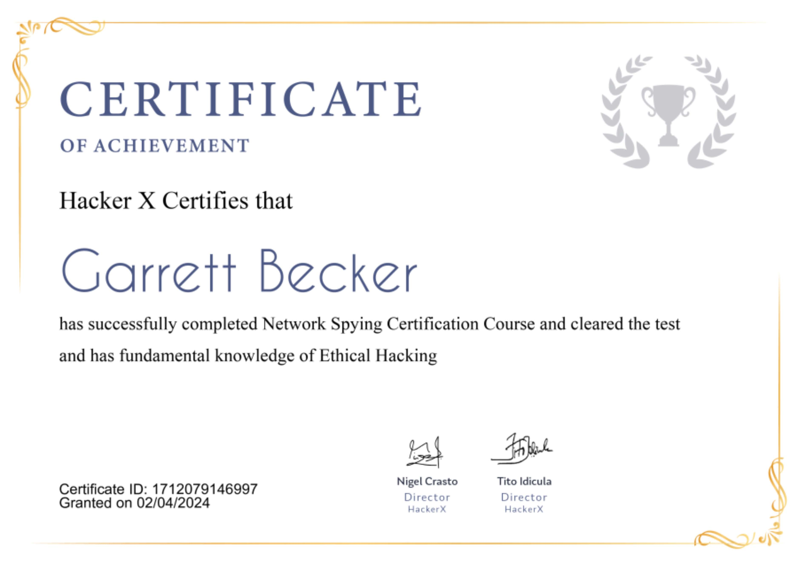

## 11_ Network Spying

### Certificate

### Network Spying
- It doesn't matter whether it's a WiFi network or a wired network, once you have gained access to it, you can perform various attacks on it, such as:
  - Gather sensitive info about the network
  - Can intercept data such as usernames, passwords, and other credentials
  - Spy on the network and see what the client is doing on the network
  - Modify data over the network
- All such attacks performed over the network are called Man-in-the-Middle attacks

### What are MITM (Man-in-the-Middle) Attacks?
- When you log into any website, send messages, buy something or perform a Google search, you send data from your browser to a distant server
- The info will go from your device to your Internet Provider, and then to many other locations before it will arrive at the server of the website you are trying to access
- The "man in the middle" is the person that can intercept that info you are sending
- They can steal your info if the data is not protected, and there are many ways but mostly they will hack the WiFi connection that you use or break into the network of your Internet Provider
- Even during a 10 minute Internet session, you can do a lot of things, like visiting multiple websites, sending photos, chatting, etc
- But smart attackers can sort this info and find important information like passwords or credit card info easily
- The information that you send on the Internet is transmitted via a protocol called HTTP; info like passwords, logins, credit cards are not sent encrypted with HTTP, and so anyone can read it if they obtain it

### MITM
- MITM are attacks where attackers relay and possibly alter the communication between two parties who believe they are communicating directly
- This allows the attacker to relay communication, listen in, and even modify what each party is saying
- MITM attacks enable eavesdropping between people, clients, and servers
- This can include HTTP connections to websites, other SSL/TLS connections, WiFi network connections, and more

### What is ARP?
- Address Resultion Protocol (ARP) is a stateless protocol used for resolving IP addresses to machine MAC addresses
- All network devices that need to communicate on the network, broadcast ARP queries in the system to find out other machines' MAC address
- ARP poisoning is also called ARP spoofing

### How does ARP work?
- When one machine needs to communicate with another, it looks up its ARP table
- If the MAC address is not found in the table, the ARP request is broadcasted over the network
- All machines on the network will compare this IP address to the MAC address
- If one of the machines in the network identifies this address, then it will respond to the ARP request with its IP and MAC address
- The requesting computer will store the address pair in its ARP table and communication will take place

### ARP Spoofing
- ARP packets can be forged to send data to the attacker's machine
- ARP spoofing constructs a large number of forged ARP requests and reply packets to overload the switch
- The switch is set in forwarding mode and after the ARP table is flooded with spoofed ARP responses, the attackers can sniff all network packets
- Attackers flood a target computer ARP cache with forged entries, which is also known as poisoning
- ARP poisoning uses MITM attacks to poison the network
- So once using this, they can open a gateway and intercept the network

### What is Bettercap?
- Framework to run network attacks
- It can be used for ARP spoofing the targets, sniff data, bypass HTTPS, inject code in loaded pages, and more
- To run Bettercap, run this command:
  - "bettercap -iface eth0"
  - "eth0" -> network interface connected to the target network
- To get a list of various Bettercap modules, run this command:
  - "help"
- To get details of a specific module, run this command:
  - "help <name of the module>"

### Using Arp.spoof
- To perform ARP spoofing using Bettercap, we will be using one of its modules called arp.spoof
- Run this command to get details and options for the module:
  - "help arp.spoof"
- Executing attacks
  - Setting the full-duplex mode to execute it on both targets and on your machine:
    - "set arp.spoof.fullduplex true"
  - Setting the target's IP address
    - "set arp.spoof.targets <IP address of the target>"
  - Changing the mode of the module to "ON"
    - "arp.spoof on"
- Now the target router MAC will change to your Kali's MAC, and this will enable all routing of all data through your network
- This means, whenever the target sends anything over the network, it will go through your machine since it will think of you as the router
- And since the full-duplex mode is on, this means the router also thinks the same and will send the data to you, thinking of you as the client

### Spying on the network
- Once you are the MITM, all the requests/responses will pass through your system. This will allow us to spy on all the activities of the target and fetch all kinds of sensitive info
- Once arp.spoof is running in Bettercap, the next step is to tell Bettercap to capture all the data passing through and analyze it
- To do this we will use the net.sniff module
- Capturing and analyzing data
  - Command: "net.sniff on"
  - This will start capturing the data and start displaying and analyzing it
  - Once the client sends some requests on the network and performs some operations, all of that will be displayed on Kali
  - It will contain all sites visited, any credentials passed through, and much more

### What is HTTPS?
- Hypertext Transfer Protocol Secure
- Secure version of HTTP which is the primary protocol used to send data back and forth between a web browser and website
- HTTPS is encrypted in order to increase the security of data transfer
- Important for bank account transactions, email services, health insurance providers, etc
- So everything we've done so far will only work against HTTP pages
- Most websites use HTTPS now because HTTP uses plain text, making it too easy to steal information
- HTTPS relies on TLS or SSL to encrypt data and this will be very difficult to break
- Therefore in order to bypass this, the easiest method is to downgrade HTTPS connections to HTTP
- So if we are the MITM, we can check if the target is requesting the HTTPS website
- And instead of giving them the HTTPS version, we will give them the HTTP version so info will be in plain text

### Bypassing HTTPS
- Run this command:
  - "caplets.show"
- This will show the various caplets which are the small programs that Bettercap comes with
- Load and run hstshijack caplet, run this command:
  - "hstshijack/hstshijack"
- Now our Bettercap is already running the arp.spoof and net.sniff, and it's already capturing and analyzing the data - so if the target is now opening any website that's HTTPS secured, it will automatically open in HTTP which is what we wanted
- This happens because our caplet hstshijack is running - this downgrades HTTPS to HTTP

### Prevent MITM Attacks
- Avoiding WiFi connections that aren't password protected
- Paying attention to browser notifications reporting a website being unsecured
- Immediately logging out of a secure application when it's not in use
- Not using public networks (like coffee shops, hotels) when conducting sensitive transactions
- For website operators, secure communication protocols, including TLS and HTTPS, help mitigate spoofing attacks by robustly encrypting and authenticating transmitted data
- Doing so prevents the interception of site traffic and blocks the decryption of sensitive data, such as auth tokens
- It's considered best practice for apps to use SSL/TLS to secure every page of their site and not just the pages that require users to login
- Doing so helps decrease the chance of an attacker stealing session cookies from a user browsing on an unsecured section of a website while logged in

### Real life cases
- Three British private equity firms were duped into making bank transfers worth 1.1 million pounds (around $1.3 million) following a sophisticated Business Email Compromise (BEC) attack, according to Check Point's newly released report
- Hackers tried to lure the target into clicking on a link that lets them download malware onto their devices ot trick into entering usernames and passwords that allow the attacker to steal credentials
- Once the hackers gained control over the officials' emails, they continued the attacks for weeks to gain control of other email accounts and carry out reconnaissance to understand the financial picture of the companies
- With this set up, the hackers inject fraudulent bank account info (associated with accounts located in Hong Kong and the UK) in the emails, to divert money transfers and initiate new transfer requests