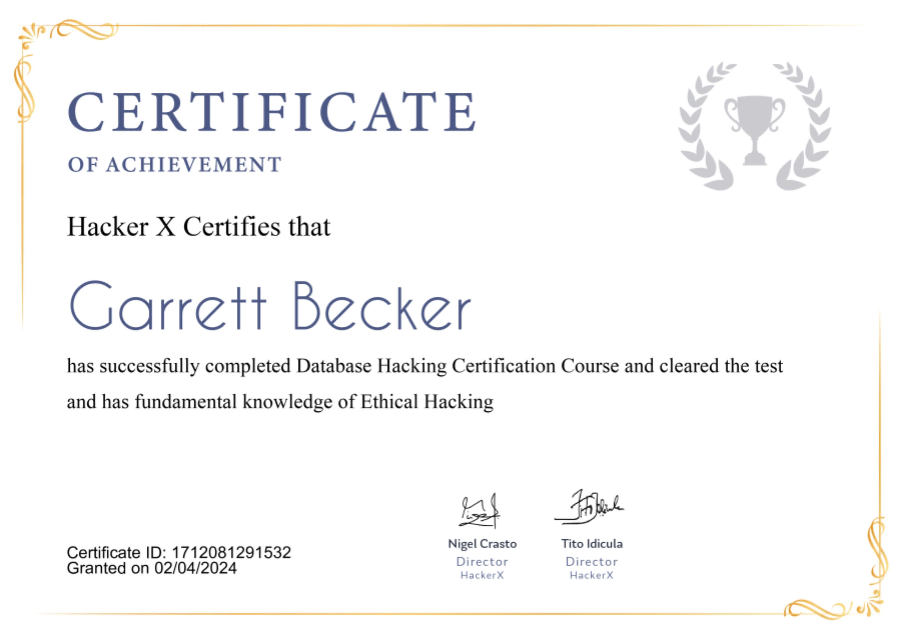

## 12_ Database Hacking

### Certificate

### Database hacking
- A database is an organized collection of data, generally stored and accessed electronically from a computer system
- Hackers can extract your login credentials, your personal info and such other sensitive data stored in that database
- This can be done with an attack called SQL Injection
  - SQL Injection = technique where an attacker executes malicious SQL queries that control a web app's database

### What is SQL?
- Structured Query Language
- Computer language for storing, manipulating, and retrieving data stored in a relational database
- SQL is the standard language for the relational database system
- All the relational database management systems (RDMS) like MySQL, MS Access, Oracle, Sybase, Informix, Posgres, and SQL Server use SQL as their standard database language

### What is SQL Injection?
- Set of SQL commands that are placed in a URL string or in data structures, in order to retrieve a response that we want from the databases that are connected with the web applications
- This type of attack generally takes place on web pages developed using PHP or ASP.NET
- Can be done with the following intentions:
  - To dump the whole database of a system
  - To modify the content of databases
  - To perform different queries that are not allowed by the application
- This type of attack works when the applications don't validate the inputs properly, before passing them to an SQL statement
- Injections are normally placed in address bars, search fields, or data fields

### Why are SQL injections dangerous?
- Because you can find them everywhere - a lot of big websites have these kinds of exploits (such as Yahoo or Google)
- They are very hard to be protected against and it's very easy to make a mistake and to make these exploits available for exploitation
- They give you access to the database
  - You can get a lot, like usernames and passwords
- In many scenarios we actually use a PHP shell to gain access to the database and see if we can read it
- For example, if you managed to upload a PHP shell on the server, the next step is to gain access to the database to access info
- If you find an SQL injection in a website that you are not targeting, but other resources are on the same server, you can use it to read files outside the WW route (URL path)
- So similar to file inclusion vulnerabilities, you can use it, you can use the admin username and password for the admin and see if you can upload stuff
- Usually the admin can upload a lot of things instead of just images, and then you can upload a PHP shell or a backdoor from there
- SQL injections can be used as file inclusion vulnerabilities

### What is SQLMap?
- SQLMap is one of the most popular and powerful SQL injection automation tools
- Given a vulnerable HTTP request URL, sqlmap can exploit the remote database and do a lot of hacking like extracting database names, tables, columns, all the data in the tables, etc
- It can even read and write files on the remote file system under certain conditions
- Written in Python, it's one of the most powerful hacking tools
- SQLMap is the Metasploit of SQL injections
- Works best when the website is PHP based

### Installation
- Comes pre-installed with Kali Linux
- Can install on other Debian-based Linux systems with this command: "apt-get install sqlmap"

### Using SQLMap
- Command: "sqlmap -h"
- We have to enter the web URL that we want to check along with the -u parameter
- We may also use the -tor parameter if we want to test the website using proxies
- Typically we would want to test whether it's possible to gain access to a database, so we use the -dbs option to do so
- Command: "sqlmap -u http://testphp.vulweb.com/listproducts.php?cat=1 --dbs"
- To try and access any of the databases, now use the -D parameter to specify the name of the database that we want to access and once we have access, we would see if we can access the tables
- Command: "sqlmap -u http://testphp.vulweb.com/listproducts.php?cat=1 -D acuart --tables"
- If we want to view the columns of a specific table, we can use this command with the -T parameter
- Command: "sqlmap -u http://testphp.vulweb.com/listproducts.php?cat=1 -D acuart -T artists --columns"
- Access the data in a specific column, we can use this command with the -C parameter
- Command: "sqlmap -u http://testphp.vulweb.com/listproducts.php?cat=1 -D acuart -T artists -C aname --dump"

### Prevent SQL Injections
- Trust no one: assume all user-submitted data is evil, so use input validation via a function such as MySQL's mysql_real_escape_string(), to ensure that any dangerous charcters are not passed into an SQL query in data. You should also sanitize everything by filtering user data by context
- Update and patch: vulnerabilities in apps and databases that hackers can exploit using SQL injection are regularly discovered, so it's vital to apply patches and updates as soon as it's available. A patch management solution might be worth the investment
- Firewall: consider a web app firewall (WAF), either software or appliance-based to help filter out malicious data. Good ones will have a comprehensive set of default rules, and make it easy to add new ones whenever necessary. A WAF can be particularly useful to provide some security protection against a new vulnerability before a patch is available
- Use appropriate privileges: Don't connect to your database using an account with admin-level privileges, unless there is some compelling reason to do so. Using a limited access account is far safer, and can limit what a hacker is able to do
- Keep your secrets secret: Assume that your app is not secure and act accordingly by encrypting or hashing passwords and other confidential data, including connection strings
- Continuously monitor SQL statements from database-connected apps: this will help identify rogue SQL statements and vulnerabilities. Monitoring tools that utilize machine learning and/or behavioral analysis can be useful

### Real life cases
- Anti-virus solutions provider Sophos recently revealed that cybercriminals exploited an SQL injection vulnerability in the management interface of XG firewall to exfiltrate user data such as usernames, passwords, and local device admins
- Hackers behind the activity compromised usernames and hashed passwords associated with user accounts that were being used for remote access
- Sophos also revealed that hackers may have exfiltrated local device admins, user portal accounts, and accounts used for remote access