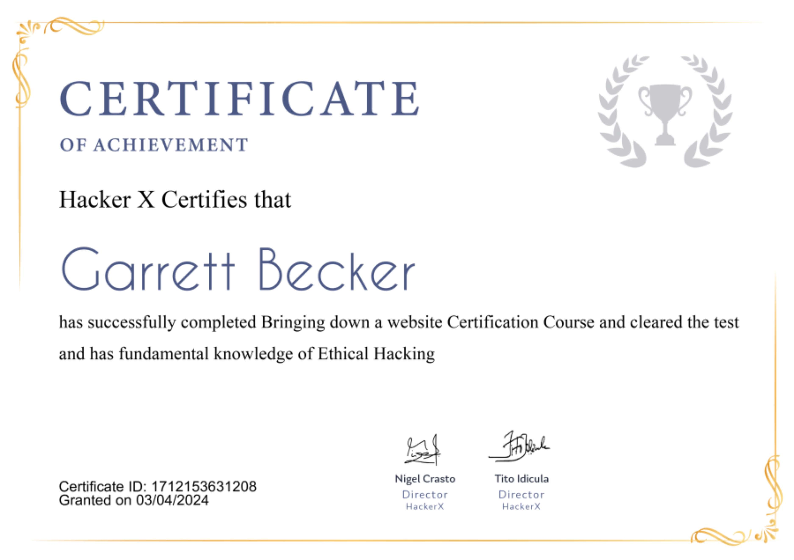

## 14_ Bringing Down a Website

### Certificate

### Bringing down a website
- Whenever there is a big sale on some e-commerce site, at the moment of sale, you might have noticed that the site gets slow or stops working
- This happens because there are a lot of requests coming to the site, which is also its server at the same time
- This similar thing we can do as a hacker and deny the service of the application to its legitimate users

### Denial of Service attacks
- DoS is an attack used to deny legitimate users access to a resource such as accessing a website network, emails, etc or making it extremely slow
- DoS = Denial of Service
- This type of attack is usually implemented by hitting the target resource such as a web server with too many requests at the same time
- This results in the server failing to respond to all the requests. The effect of this can either be crashing the servers or slowing them down
- Two types:
  - DoS: performed by a single host
  - Distributed DoS: performed by a number of compromised machines that all target the same victim. It floods the network with data packets

### Ping of Death
- The ping command is usually used to test the availability of a network resource
- It works by sending small data packets to the network resource
- The ping of death takes advantage of this and sends data packets above the max limit (65,536 bytes) that TCP/IP allows
- TCP/IP fragmentation breaks the packets into small chunks that are sent to the server
- Since the sent data packages are larger than what the server can handle, the server can freeze, reboot, or crash

### Smurf
- This type of attack uses large amounts of Internet Control Message Protocol (ICMP) ping traffic target at an Internet Broadcast Address
- The reply IP address is spoofed to that of the intended victim
- All the replies are sent to the victim instead of the IP used for the pings
- Since a single Internet Broadcast Address can support a max of 255 hosts, a smurf attack amplifies a single ping 255 times
- The effect of this is slowing down the network to a point where it's impossible to use it

### Buffer Overflow
- A buffer is a temporary storage location in RAM that's used to hold data so that the CPU can manipulate it before writing it back to the disc
- Buffers have a size limit
- This type of attack loads the buffer with more data than it can hold
- This causes the buffer to overflow and corrupt the data it holds
- Example: sending emails with filenames that over 256 characters

### Teardrop
- This type of attack uses larger data packets
- TCP/IP breaks them into fragments that are assembled on the receiving host
- The attacker manipulates the packets as they are sent so that they overlap each other
- This can cause the intended victim to crash as it tries to re-assemble the packets

### Requirements to bring down websites
- Need these tools:
  - EtherApe
  - Tor
  - Anonsurf
  - Goldeneye
- Getting EtherApe
  - EtherApe is a graphical network monitor for Unix modeled after etherman. Featuring link layer, IP and TCP modes, it displays network activity graphically
  - Hosts and links change in size with traffic 
  - Color-coded protocols display
  - It supports Ethernet, FDDI, Token Ring, ISDN, PPP, SLIP, and WLAN devices, plus several encapsulation formats
  - It can filter traffic to be shown and can read packets from a file as well as live from the network
  - To install, use this command: "apt-get install etherape"
- Service Tor
  - It can route data to and from onion services, even those hosted behind firewalls or network address translators (NAT) while preserving the anonymity of both parties
  - Tor is necessary to access these onion services, so no one can recognize the requests that are coming from during the attack
  - To install, use this command: "apt-get install tor"
- Anonsurf
  - Tool that will help you stay anonymous by routing every packet through the TOR relay
  - When you use Anonsurf for ethical hacking, all the traffic from your system goes through a TOR proxy server due to which your IP address is changed
  - To install, use this command: "git clone https://github.com/Und3rf10w/kali-anonsurf"
  - Once installed, browse to its directory and hit command: "./installer.sh"
- Goldeneye
  - One of the popular HTTP Denial of Service tools
  - It uses KeepAlive (and Connection:keep-alive) paired with Cache-Control options to persist socket connection busting through caching (when possible) until it consumes all available sockets on the HTTP/S server
  - To install, use this command: "git clone https://github.com/jseidl/GoldenEye"
- Time for attack
  - We need to start the EtherApe tool so that we can visualize the packet flow on the network
  - Start etherape: "etherape"
  - Then: "service tor start"
  - Then: "anonsurf start"
  - Once tor and anonsurf are running, we are ready for the attack
  - Browse to the directory where GoldenEye is installed and run this command: "proxychains ./goldeneye.py https://www.example.com"
  - Once the above attack is running, you can visit the target site and you will notice that either it will not load or will give you 505 error

### More DoS Tools
- Nemesy
  - Used to generate random packets; works on Windows
  - If you have an antivirus program, it will probably detect this as a virus
- Land and LaTierra
  - Used for IP spoofing and opening TCP connections
- Panther
  - Used to flood a victim's network with UDP packets
- Botnets
  - Multitudes of compromised computers on the Internet that can be used to perform a distributed denial of service attack

### Distributed DoS
- A Distributed DoS (DDoS) attack is an attempt to make an online service or a website unavailable by overloading it with huge floods of traffic generated from multiple resources
- Unlike a DoS, in which one computer and one Internet connection are used to flood a targeted resource with packets, a DDoS uses many computers and many Internet connections, often distributed globally in what is referred to as a botnet

### What are Botnets?
- Attackers build a network of hacked machines which are known as botnets, by spreading a malicious piece of code through emails, websites, and social media
- Once these computers are infected, they can be controlled remotely, without their owners' knowledge, and used as an army to launch an attack against any target
- A DDoS flood can be generated in multiple wys:
  - Botnets can be used for sending more connection requests than a server can handle at a time
  - Attackers can have computers send a victim resource huge amounts of random data to use up the target's bandwidth
- Due to the distributed nature of these machines, they can be used to generate distributed high traffic which may be difficult to handle
- It finally results in a complete blockage of a service

### Types of DDoS attacks
- Volume-based attacks
  - Include TCP floods, UDP floods, ICMP floods, and other spoofed packet floods
  - These are also called Layer 3 and 4 Attacks
  - Here, an attacker tries to saturate the bandwidth of the target site
  - The attack magnitude is measured in bits per second (bps)
- Protocol attacks
  - Include SYN floods, Ping of Death, fragmented packet attacks, Smurf DDoS, etc
  - Consumes actual server resources and other resources like firewalls and load balancers
  - Attack magnitude is measured in packets per second
- Application layer attacks
  - Include Slowloris, Zero-day DDoS attacks, DDoS attacks that target Apache, Windows, or OpenBSD vulnerabilities, and more
  - Here the goal is to crash the web server
  - The attack magnitude is measured in requests per second

### Prevention
- Buy more bandwidth
  - Make sure you have enough bandwidth to handle spikes in traffic that may be caused by malicious activity
  - In the past, it was possible to avoid DDoS attacks by ensuring you had more bandwidth at your disposal than any attacker was likely to have
  - But with the rise in amplification attacks, this is no longer practical
  - Instead, buying more bandwidth now raises the bar which attackers have to overcome before they can launch a successful DDoS attack, but by itself, purchasing more bandwidth is not a DDoS attack solution
- Configure your network hardware against DDoS attacks
  - There are a number of simple hardware configuration changes you can take to help prevent a DDoS attack
  - For example, configuring your firewall or router to drop incoming ICMP packets or block DNS responses from outside your network (by clocking UDP port 53) can help prevent certain DNS and ping-based volumetric attacks
- Deploy a DDoS protection appliance
  - Many security vendors including NetScout Arbor, Fortinet, Check Point, Cisco, and Radware offer appliances that sit in front of network firewalls and are designed to block DDoS attacks before they can take effect
  - They do this using a number of techniques, including carrying out traffic behavioral baselining and then blocking abnormal traffic, and blocking traffic based on known attack signatures
- Protect your DNS server
  - Don't forget that a malicious actor may be able to bring your web servers offline by DDoSing your DNS servers
  - For that reason, it's important that your DNS servers have redundancy, and placing them in different datacenters behind load balancers is also a good idea
  - A better solution may even be to move to a cloud-based DNS provider that can offer high bandwidth and multiple points-of-presence in datacenters around the world
  - These services are specifically designed with DDoS prevention in mind

### Real life cases
- On Feb 28, 2018, Github was hit with a sudden onslaught of traffic that clocked in at 1.35 terabits per second
- According to Github, the traffic was traced back to "over a thousand different autonomous systems (ASNs) across tens of thousands of unique endpoints"
- What's worse is that Github was not entirely unprepared for a DDoS attack - they simple had no way of knowing that an attack of this scale would be launched