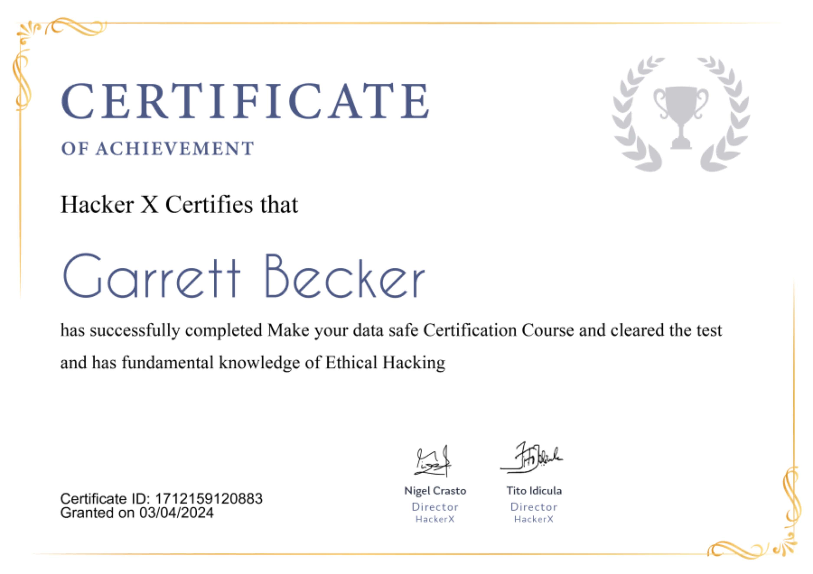

## 16_ Make Your Data Safe

### Certificate

### Make your data safe
- In our day to day lives, the use of cryptography is everywhere
- We know that data flows from the client to the server literally in the air
- If it's not encrypted, a hacker might have access to the network and can easily grab this sensitive information, causing privacy and confidentiality to be at stake
- We use the concept of cryptography to encrypt this data
- Cryptography is an essential way of preventing data hacks from happening. It secures info and communications, using a set of rules that allows only those intended - and no one else - to receive the info to access and process it

### Cryptography
- The study and application of techniques that hide the real meaning of info, by transforming it into non-readable formats for humans and vice versa
- The art and science of making a cryptosystem that's capable of providing info securely
- It deals with the actual securing of digital data
- It refers to the design of mechanisms, based on mathematical algorithms that provide fundamental information security services

### Cryptanalysis
- The art and science of breaking the ciphertext
- The sister branch of cryptography and they both co-exist
- The cryptographic process results in the ciphertext for transmission or storage. It involves the study of cryptographic mechanisms with the intention of breaking them
- It's also used during the design of the new cryptographic techniques, to test their security strengths

### Cryptography Types
- Symmetric
  - The same key is used for both encryption and decryption
  - A sender and recipient must already have a shared key that's known to both
  - Key distribution is a tricky problem and was the impetus for developing asymmetric cryptography
- Asymmetric
  - Two different keys are used for encryption and decryption
  - Every user in an asymmetric cryptosystem has both a public and private key
  - The private key is kept secret at al times, but the public key may be freely distributed

### Cryptography Fundamental Objectives
- Confidentiality
  - Fundamental security service provided by cryptography
  - It's a security service that keeps the information from an unauthorized person
  - It's sometimes referred to as privacy or secrecy
  - Can be achieved through numerous means, starting from physical security to the use of mathematical algorithms for data encryption
- Data integrity
  - Security service that deals with identifying any alteration to the data. The data may get modified by an unauthorized entity intentionally or accidentally
  - Confirms whether data is intact or not since it was last created, transmitted, or stored by an authorized user
  - Cannot prevent the alteration of data but provides a means for detecting whether data has been manipulated in an unauthorized manner
- Authentication
  - Provides the identification of the originator. It confirms to the receiver that the data received has been sent only by an identified and verified sender
  - Has two variants:
    - Message: identifies the originator of the message without any regard to the router or system that has sent the message
    - Entity: assurance that data has been received from a specific entity, say a particular website
- Non-repudiation
  - Security service that ensures that an entity cannot refuse the ownership of a previous commitment or an action
  - It's an assurance that the original creator of the data cannot deny the creation or transmission of the said data to the recipient or third party
  - It's a property that's most desirable in situations, where there are chances of a dispute over the exchange of data

### Terms to know
- Cryptography
  - Art and science of making a cryptosystem that's capable of providing information security
  - Deals with the actual securing of digital data
  - Refers to the design of mechanisms, based on mathematical algorithms that provide fundamental information security services
- Plaintext
  - Data to be protected during transmission; simple text in a readable format
- Ciphertext
  - Scrambled version of the plaintext produced by the encryption algorithm using a specific encryption key
- Encryption algorithm
  - Mathematical process that produces a ciphertext for any given plaintext and encryption key
  - It's a cryptographic algorithm that takes plaintext and an encryption key as input and produces a ciphertext
- Decryption algorithm
  - Mathematical process that produces a unique plaintext for any given ciphertext and decryption key
  - It's a cryptographic algorithm that takes a ciphertext and decryption key as input and outputs a plaintext
  - Essentially reverses the encryption algorithm
- Encryption key
  - Value that's known to the sender
  - Sender inputs the encryption key into the encryption algorithm along with the plaintext in order to complete the ciphertext
- Decryption key
  - Value known to the receiver
  - Related to the encryption key but not always identical to it
  - Receiver inputs the decryption key into the decryption algorithm along with the ciphertext in order to complete the plaintext

### Encryption algorithms
- MD5
  - Message-Digest 5
  - Used to create 128-bit hash values; theoretically, hashes cannot be reversed into the original plain text
  - MD5 is used to encrypt passwords as well as check data integrity
  - It's not collision-resistant
  - Collision resistance is the difficulty in finding two values that produce the same hash values
- SHA
  - Secure Hash Algorithm
  - Used to generate condensed representations of a message (message digest)
  - Various forms:
    - SHA-0: produces 120-bit hash values. Withdrawn from use due to significant flaws and replaced with SHA-1
    - SHA-1: produces 160-bit hash values. It's similar to earlier version of MD5. It has a cryptographic weakness and is not recommended for use since 2010
    - SHA-2: it has two hash functions namely SHA-256 and SHA-512. SHA-256 uses 32-bit words while SHA-512 uses 64-bit words
    - SHA-3: formerly known as Keccak
- RC4
  - Used to create stream ciphers
  - Mostly used in protocols such as Secure Socket Layer (SSL) to encrypt internet communication and Wired Equivalent Privacy (WEP) to secure wireless networks

### Caesar Cipher
- It's a mono-alphabetic cipher wherin each letter of the plaintext is substituted by another letter from the ciphertext
- Simplest form of substitution cipher scheme
- Generally referred to as the Shift Cipher
- Concept is to replace each alphabet by another alphabet, which is 'shifted' by some fixed number between 0 and 25
- Both sender and receiver agree on a 'secret shift number' for shifting the alphabet
- Number of shifting is between 0 and 25

### CrypTool
- Open source educational tool for cryptological studies
- Uses RC4 algorithm

### Creating the RC4 stream cipher
- Encrypt this phrase: "Never underestimate the determination of a kid who is time-rich and cash-poor"
- Encryption key: "00 00 00"
- Step 1: Open CrypTool
- Step 2: replace the text with the phrase above
- Step 3: Click on Encrypt/Decrypt menu
- Step 4: Point to Symmetric (modern) and then select RC4 
- Step 5: Select 24 bits as the encryption key and set the value to "00 00 00"
- Step 6: Click on the Encrypt button to get the stream cipher

### Real life cases
- Whatsapp End to End encryption is one of the best use cases of cryptography
- Whatsapp uses the 'signal' protocol for encryption which uses a combination of asymmetric key cryptographic algorithms
- The symmetric key algorithm ensure confidentiality and integrity whereas the asymmetric key cryptographic algorithms help in achieving the other security goals, namely authentication and non-repudiation