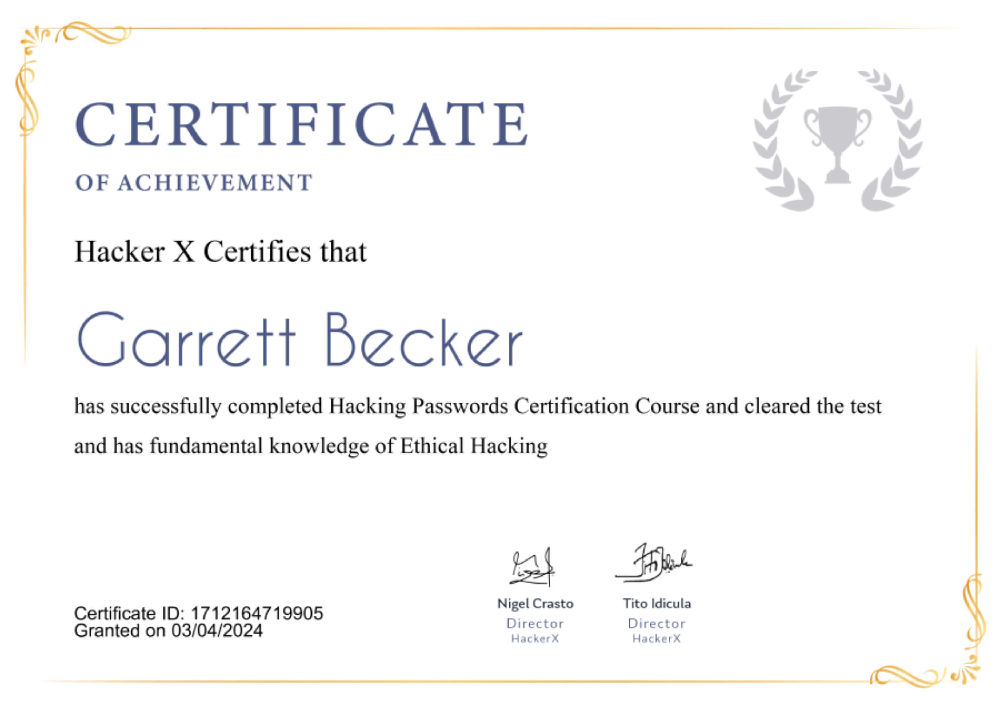

## 17_ Hacking Passwords

### Certificate

### Password hacking
- As password is a string of characters used for authenticating a user on a computer system
- Most passwords consist of several characters, which can typically include letters, numbers, and most symbols, but not spaces
- While it is good to choose a password that is easy to remember, you should not make it so simple that others can guess it

### Password cracking
- Refers to various measures used to discover computer passwords
- Usually accomplished by recovering passwords from data stored in, or transported from, a computer system
- Done by either repeatedly guessing the password, usually through a computer algorithm, in which the computer tries numerous combinations until the password is successfully discovered
- This is the process of attempting to gain unauthorized access to restricted systems using common passwords or algorithms that guess passwords

### Password strength
- Measure of a password's efficiency to resist password cracking attacks
- Determined by:
  - Length: how many characters does it have?
  - Complexity: does it use a combo of letters, numbers, and symbols?
  - Unpredictability: is it something that can be easily guessed by an attacker?

### Few small practicals
- Whenever a password is stored in the database of an app, first it's hashed and then stored
- Can be encrypted using an algorithm such as MD5, RSA, etc
- When you hack databases to get passwords, good chance they're hashed
- It's necessary to identify which algorithm is used to generate the hash
- Figure out the hash algorithm, then use an appropriate tool to try to decrypt it
- Have I been pwned? https://haveibeenpwned.com/
- Visit pwned passwords: https://haveibeenpwned.com/Passwords

### Password cracking techniques
- Dictionary attack
  - Uses a wordlist to compare against user passwords
  - There is a dictionary file that contains random passwords that can be generally used
- Brute force attack
  - Similar to dictionary attacks
  - Tries every possible password exhaustively 
  - Use algorithms that combine alpha-numeric characters and symbols to come up with passwords for the attack
- Rainbow tables attack
  - Uses pre-computed hashes. Let's assume that we have a database that stores passwords as MD5 hashes
  - We can create another database that has MD5 hashes of commonly used passwords
  - We can then compare the password hash we have against the stored hashes in the databases
  - If a match is found, we've found the password
- Guessing
  - Passwords such as qwerty, password, admin, etc are commonly used or set as default passwords
  - If they have not been changed or if the user is careless when selecting passwords, then they can be easily compromised
- Spidering attack
  - Most organizations use passwords that contain company info
  - This information can be found on company websites, social media, etc
  - Spidering gathers info from these sources to come up with wordlists
  - The wordlist is then used to perform dictionary and brute force attacks

### Tools to know
- John the Ripper
  - Uses the command prompt to crack passwords
  - Makes it suitable for advanced users who are comfortable working with commands
  - Uses a wordlist
  - It's free, but the wordlist has to be purchased. It has free alternative wordlists you have can use
- Cain and Abel
  - Runs on Windows
  - Used to recover passwords for user accounts, recover Microsoft Access passwords, network sniffing, etc
  - Unlike John the Ripper, Cain and Abel uses a GUI
  - Very common among newbies because of its simplicity
- Ophcrack
  - Cross-platform Windows password cracker that uses rainbow tables
  - Runs on Windows, Linux, and macOS
  - Also has a module for brute force attacks, among other features

### Using Cain and Abel
- Can be used for these attack types:
  - Dictionary
  - Brute force
  - Cryptanalysis
- Download from https://goo.gl/W46b80
- Assume we have an account called Accounts, with password "qwerty"
- Step 1: open Cain and Abel
- Step 2: make sure the cracker tab is selected. Click on the Add button on the toolbar
- Step 3: the local user accounts will be displayed as follows. Note the results shown will be of the user accounts on your local machine
- Step 4: right-click on the account you want to crack. For ths example, use Accounts as the user account. Right-click on the dictionary section and select Add to list the menu
- Step 5: Browse to the 10k most common.txt file that you just downloaded. Click on the start button
- Step 6: if the user used a simple password like "qwerty" then you should be able to get successful results

### Password cracking prevention
- Use a password generator
  - A dictionary attack is a common and efficient password cracking technique. That's because humans are simply not good at coming up or remembering random strings of letters, numbers, and cymbols
  - There are plenty of free, random password generators that will do the work for you. Simply choose the password length (the longer the better) and any special requirements you have
- Don't use the same password twice
  - Data breaches are a lot more common than many people think. Even big websites, which you'd expect to have top-notch security, suffer from frequent hacker attacks
  - That's why it's so important to never use the same password for more than one account
  - And now that you've got a password generator, there's really no excuse
- Know when you've been pwned
  - https://haveibeenpwned.com/
- Turn on two-factor authentication
  - Combo of something you know (password) and something you have (like your phone or security key)
  - Using SMS texts is generally considered the weakest strategy for 2FA
    - Hackers can use social engineering to redirect the victim's texts to a different SIM card
  - Using an authenticator app on your phone or a physical security key is much more secure

### Real life cases
- Ethical hackers were able to access building control system for Google Australia'a HQ in 2013, after finding the specific office location on Shodan, a search engine on which hackers search for their favorite type of cyber vulnerabilities
- Google's system was exposed to a public IP, meaning it was directly connected to the web, rather than being hidden behind a firewall
- The hackers used this access to find admin passwords for control panels