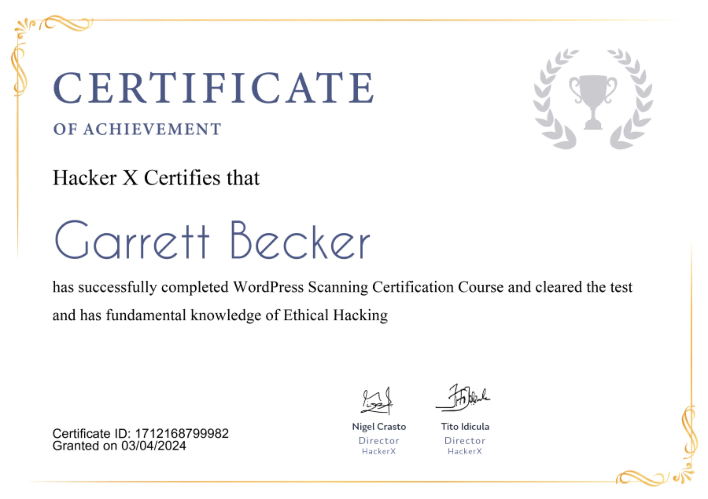

## 18_ WordPress Scanning

### Certificate

### WordPress Scanning
- WordPress is a Content Management System that uses the most widely used coding stack
- Millions of websites are powered by WordPress and holding the number one position, with 62% of the market share in the CMS world
- While the security vulnerability patched by 4.2.1 was real and dangerous when you take into account the absurd levels of ignorance needed to make your website vulnerable
- So it's necessary to scan WordPress for possible bugs and vulnerabilities
- It's necessary to know that your WordPress site is vulnerable and patch it

### What is CMS?
- CMS = content management system
- Software that helps users create, manage, and modify content on a website without the need for specialized technical knowledge
- Tool that helps you build a website without needing to write all the code from scratch
- You can also find CMS for other functions like document management

### What is WordPress?
- Simplest and most popular way to create your own website or blog
- Powers over 35.2% of all the websites on the internet
- Open-sourced content management system licensed under GPLv2 which means that anyone can use or modify the WordPress software for free
- Makes building a website accessible to anyone

### What is WPScan?
- Free software that helps you to identify the security related problems on your WordPress site
- Does several things including:
  - Check if the site is using a vulnerable WP version
  - Check if a theme or plugin is up to date or known to be vulnerable
  - Check Timthumbs
  - Check for configuration backup, DB exports
  - Brute force attack
  - And more
- Installing on Kali
  - Command: "wpt install wpscan -y"

### WPScan Help
- Command: "wpscan -h"

### Running the scan
- Command: "wpscan -u examplesite.com"
- It will provide info about these issues:
  - Website url
  - robots.txt file and its location with interesting entries
  - Version info about the WordPress site
  - Server name and version info
  - XML-RPC info and related url
  - Plugins list and more info life version and url location

### Enumerating user id's
- We can use wpscan for enumerating user related ids
- Command: "wpscan -e u[1-200] -u examplesite.com"
  - Enumerates user ids from 1 to 200

### Using Proxy
- In enterprise environments, we may need to use a proxy
- Another cause for using a proxy is hiding ourselves from the target and using intermediate proxies
- We will provide proxy info with the --proxy option
- Command: "wpscan --proxy sock:192.168.1.10 -u examplesite.com"

### HTTP Authentication
- For the auth mechanisms, we can provide HTTP basic authentication, username, and password like below
- Command: "wpscan --basic-auth johnl:123456 -u examplesite.com"

### Multiple Threads
- Scan time may change according to provided parameters and the size of the WordPRess site. We can lower the scan time by using a multi-thread option
- Multi-thread will run multiple jobs concurrently to scan the WordPress site. We will provide thread count with --threads or -t parameters
- Command: "wpscan -t 8 -u examplesite.com"

### Brute force
- We can use wpscan to brute force against the WordPress site
- We will provide the username with --username and a list of passwords with --wordlist
- Command: "wpscan -u www.examplesite.com --wordlist pass.txt --username admin"

### WordPress Security Guide
- Keep WordPress updated
  - WordPress automatically installs minor updates but you'll need to manually initiate major security updates
  - Make sure plugins you install from other developers get updated
- Use strong passwords and user permissions
  - Most common WordPress hacking attempts are for stealing passwords
  - Make that difficult by using stronger passwords unique for your site
  - Not just for the WordPress admin area, but also for FTP accounts, databases, WordPress hosting accounts, and your custom email addresses which use your site's domain name
- Good WordPress hosting
  - WordPress hosting plays the most important role in the security of your site
  - Here is how a good hosting company works to protect your websites and data:
    - They continuously monitor their network for suspicious activity
    - All good hosting companies have tools in place to prevent large scale DDoS attacks
    - They keep their server software and hardware up to date, to prevent hackers from exploiting a known security vulnerability in an old version
- Backups
  - Your first defense against any WordPress attack. Remember that nothing is 100% secure. If government sites can be hacked then so can yours
  - Backups allow you to quickly restore your WordPress site in case something bad were to happen
  - There are many free and paid WordPRess backup plugins you can use. Most important thing you need to know when it comes to backups is that you must regularly save full-site backups to a remote location (not your hosting account)

### Real life cases
- A hacked WordPress site can cause serious damage to your business revenue and reputation
- Hackers can steal user info, passwords, and install malicious software, and can even distribute malware to their users
- In March 2016, Google reported that more than 50 million website users have been warned about a website they're visiting may contain malware or steal info