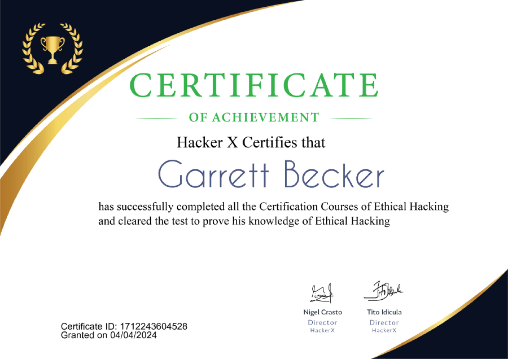

# Hacker X Ethical Hacking Course

[Hacker X Ethical Hacking course on Apple App Store](https://apps.apple.com/us/app/hackerx-learn-ethical-hacking/id1542444199)

Ethical Hacking and Cybersecurity courses created by renowned hackers around the globe. Master hacking in an all-new and beginner-friendly way. And get certified!

Want to become an ethical hacker to make your career in hacking? Learn cybersecurity and hacking basics and advanced skills using this amazing app - Learn Ethical Hacking - Ethical Hacking Tutorials.

On this Ethical Hacking Learning app, you will be able to start with the basics of cybersecurity and hacking so that you can build your skills around it. You can build your hacking skills on the go from Hacking Tutorials on this app.

### Course Content
- Understand the basics of Hacker
- Know who is known as a Hacker and what is Hacking?
- Introduction of security
- Types of Hackers
- Know about malware
- What is Virus - Trojans & Worms

You will be able to uncover a lot about the world of cybersecurity and potential vulnerabilities that can exist in computer systems and computer networks of today's world.

Learn hacking skills online for free with Learn Ethical Hacking app. This ethical hacking learning app is a free IT and cyber security online training network offering in-depth hacking courses for noobs, intermediate and advanced hackers. With a course library spanning topics such as ethical hacking, advanced penetration testing and digital hacking forensics, this app is the best place to learn hacking skills online.

With this app, anyone can take a hacking course. Our app-based learning platform is free and open to all who wish to learn. This is because our app's goal is to make IT, cyber security, penetration testing, and ethical hacking available to everyone, regardless of circumstance. As you start out on your hacking journey It is important to understand what it means to be an ethical hacker. Ethical hackers are hackers who penetrate networks with the goal of uncovering that network’s weaknesses on the owner’s behalf. This way the network owner is better able to secure their system from malicious attacks. If this sounds like something you are interested in pursuing, then you have come to the right place.