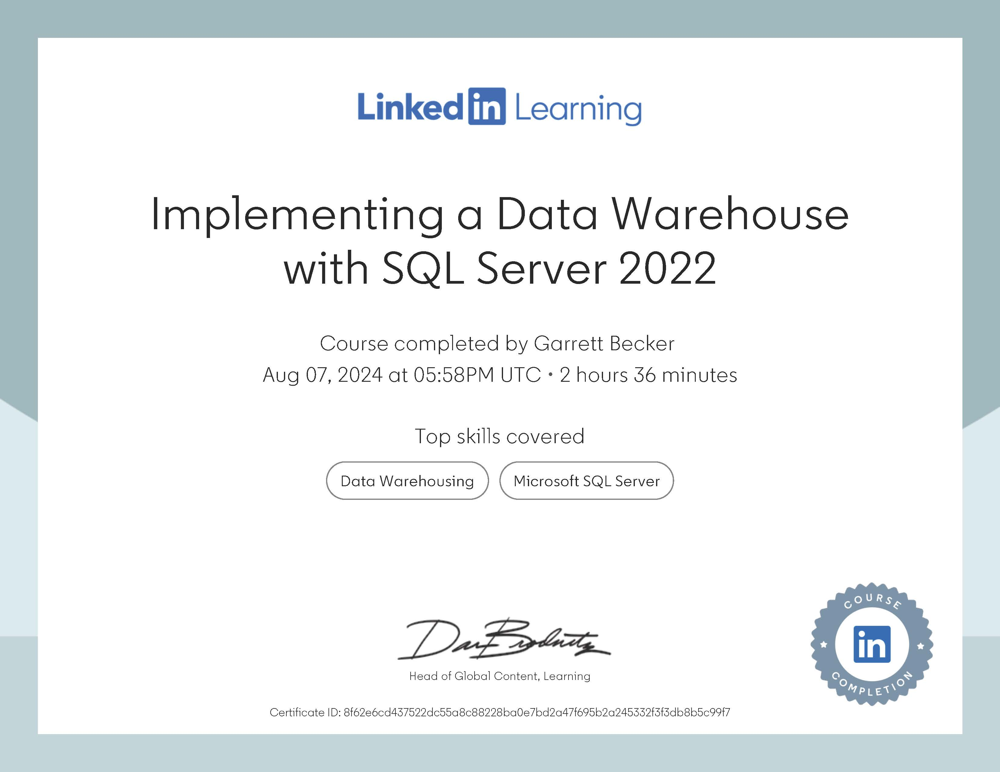

# LinkedIn Learning - Implementing a Data Warehouse with SQL Server 2022

Projects and learning from Adam Wilbert's [Implementing a Data Warehouse with SQL Server 2022 course on LinkedIn Learning](https://www.linkedin.com/learning/implementing-a-data-warehouse-with-sql-server-2022/).

### [Certificate](https://www.linkedin.com/learning/certificates/8f62e6cd437522dc55a8c88228ba0e7bd2a47f695b2a245332f3f3db8b5c99f7?trk=share_certificate)

### Course Details

#### Description
Data warehouses solve fundamentally different problems than a traditional transactional database, and SQL Server Data Warehouses provide a different model for storing valuable data. In this course, database expert Adam Wilbert guides you through the process of developing data warehouses in SQL Server 2022 to provide a robust, trustworthy platform to serve all your business intelligence reporting and analysis workloads. Explore data warehouse foundations, then get started creating a data warehouse in SQL Server. Learn about columnstore indexes, as well as how to automate the tasks associated with integrating multiple data sources together into a warehouse. Find out how to implement an Azure Synapse Analytics Dedicated SQL Pool and enforce data quality using Data Quality Services. Discover ways to use Master Data Services, plus learn how to consume data from your warehouse with business intelligence applications.
