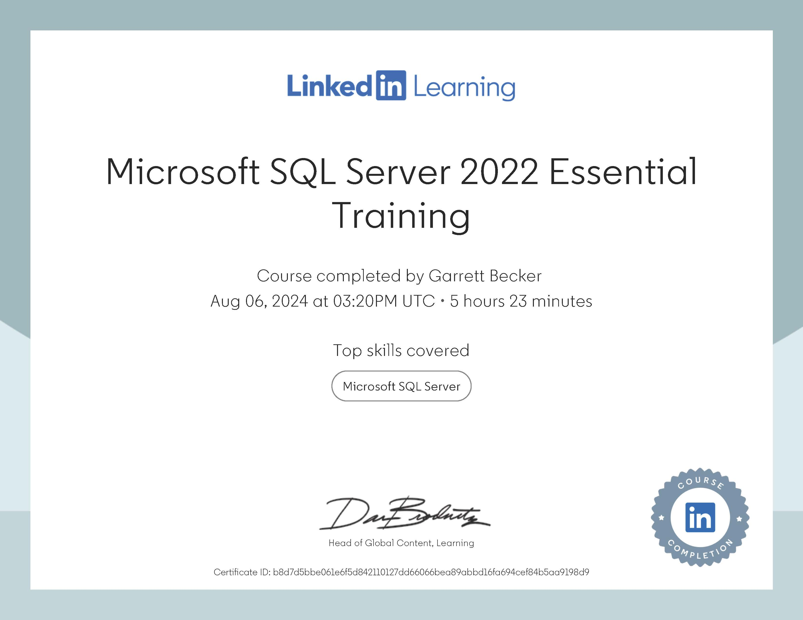

# LinkedIn Learning - Microsoft SQL Server 2022 Essential Training

Projects and learning from Adam Wilbert's [Microsoft SQL Server 2022 Essential Training course on LinkedIn Learning](https://www.linkedin.com/learning/microsoft-sql-server-2022-essential-training).

### [Certificate](https://www.linkedin.com/learning/certificates/b8d7d5bbe061e6f5d842110127dd66066bea89abbd16fa694cef84b5aa9198d9?u=75626930)

### Course Details

#### Description
This course with database expert Adam Wilbert introduces you to creating relational databases with SQL Server and the graphical interface, SQL Server Management Studio. Adam walks you through your first steps in the newest edition of Microsoft's database management system. He takes a detailed look at creating efficient tables and adding rows of data, importing existing tabular data from spreadsheets, and writing queries to view and process that data. Adam also covers important database management tasks such as creating backups, securing access to sensitive information, and leveraging the capabilities of Microsoft’s Azure cloud infrastructure.
