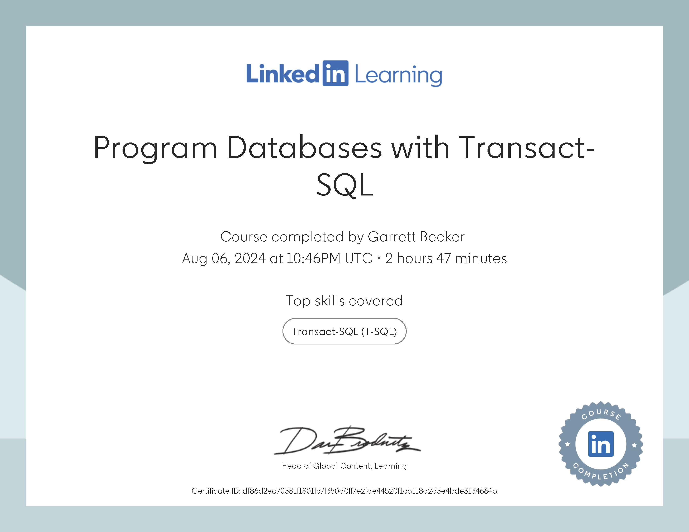

# LinkedIn Learning - Program Databases with Transact-SQL

Projects and learning from Adam Wilbert's [Program Databases with Transact-SQL course on LinkedIn Learning](https://www.linkedin.com/learning/program-databases-with-transact-sql).

### [Certificate]()

### Course Details

#### Description
This course focuses on a single category of objects within a SQL Server database: Programmability objects. With these objects, database developers can automate systems with triggers, ensure consistent user experiences with stored procedures, protect database integrity with transactions, and implement error-handling routines that enhance the database’s functionality. Join instructor Adam Wilbert as he takes a deep dive into the Programmability folder in a SQL Server database. Using real-world examples, he explores the types of objects that can be deployed to automate systems and maintain database integrity. To follow along, you just need some familiarity with the functionality of a relational database, as well as how to write Transact-SQL (T-SQL) queries.
