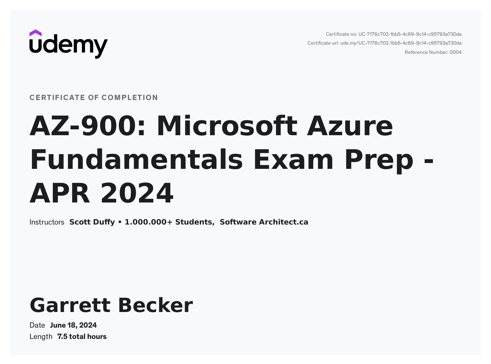

# Udemy - AZ-900: Microsoft Azure Fundamentals Exam Prep

Projects and learning from Scott Duffy's [AZ-900: Microsoft Azure Fundamentals Exam Prep course on Udemy](https://www.udemy.com/course/az900-azure/).

### [Certificate](https://www.udemy.com/certificate/UC-7176c702-1bb5-4c69-9c14-c95793a730da/)

### [Azure Credential](https://learn.microsoft.com/api/credentials/share/en-us/BeckerGarrett-9863/345A78C18580CD56?sharingId=7E8B1D00C3817BDF)

### Course Details

#### What you'll learn
- Pass the Microsoft AZ-900 Azure Fundamentals test
- Earn the Microsoft Certified Azure Fundamentals badge
- Learn the main concepts of cloud computing
- Understand what services and solutions Azure offers
- Includes latest changes! Always up-to-date.

#### Requirements
- Excitement to learn Microsoft's constantly growing cloud platform
- No Azure account or subscription required

#### Description
LEARN THE FUNDAMENTALS OF AZURE IN ONE DAY!

Best-selling Udemy course on AZ-900, with over 430,000 students. Thank you!

New course, completely re-recorded. Up to date with the latest published exam requirements.

The course includes the following free bonuses:
- BONUS #1: All lectures closed-captioned in English
- BONUS #2: Quiz questions to reinforce learning throughout the course
- BONUS #3: Downloadable 24-page study guide PDF for the exam that covers the contents of the course
- BONUS #4: Two 50-question practice tests
- BONUS #5: Downloadable audios for the course so that you can listen to the course on the go

Version 3.0 course is now live! It contains a 24-page study guide, complete audio re-mastering, audio files can be downloaded, slides can be downloaded. Quizzes added. New 50-question practice test was added. This course is continually improved.

Updated for the January 2024 exam updates. The course was completely re-recorded in 2024.

Bonus student study guide!

Complete preparation for the new AZ-900 Azure Fundamentals exam. AZ-900 is a great foundation for the basics of Microsoft Azure, but you don't have to be a beginner to find value with it. AZ-900 is great for people with no technical background, as well as learners who are interested in a career in cloud computing and want a solid foundation before moving on to higher certifications. This is a complete course on the core concepts of Microsoft Azure.

This always-up-to-date course thoroughly covers the AZ-900 exam from start to finish. Always updated with the latest requirements. This course goes over each requirement of the exam in detail. If you have no experience in Azure, this is the course that will get you up to speed.

Microsoft Azure is still the fastest-growing large cloud platform. The opportunities for jobs in cloud computing are still out there, and finding well-qualified people is the #1 problem that businesses have.

If you're looking to change your career, this would be a good entry point into cloud computing.

Sign up today!

#### Who this course is for:
- Candidates with non-technical backgrounds who are interested in learning about the cloud
- Candidates with technical backgrounds who are interested in getting more advanced certs in the future