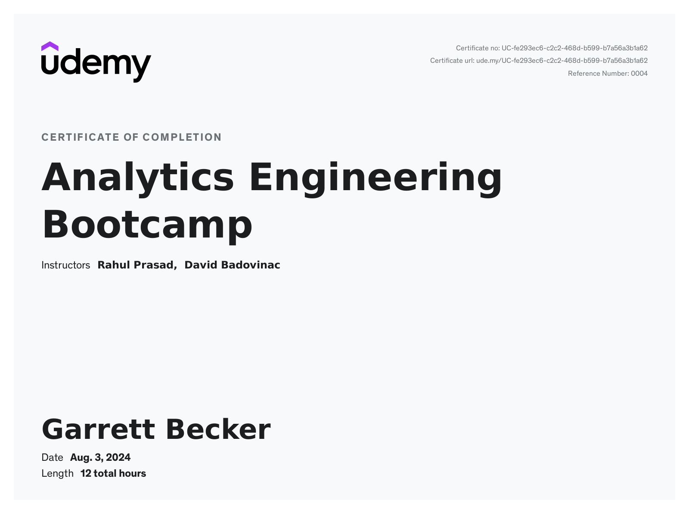

# Udemy - Analytics Engineering Bootcamp

Projects and learning from Rahul Prasad's [Analytics Engineering Bootcamp course on Udemy](https://www.udemy.com/course/analytics-engineering-bootcamp/).

### [Certificate](https://www.udemy.com/certificate/UC-fe293ec6-c2c2-468d-b599-b7a56a3b1a62/)

### Course Details

#### What you'll learn
- Learn all the skill sets that is required to become an Analytics Engineer
- In-depth understanding of data modelling techniques
- Ability to participate in architectural decision making and be able to create one
- Data modelling techniques using DBT
- Learn hands-on skills required to build a Data Warehouse from scratch
- Boost your resume with most in-demand Analytics Engineer skills
- Design & Implement a data warehouse
- Create Data Warehouse Architecture
- Design Conceptual, Logical & Physical Models
- Learn various modelling methodologies (Inmon, Kimball, Data Vault, OBT)
- Apply principles of dimensional data modeling in a hands-on
- Learn all the concepts and terms such as the OLTP, OLAP, Facts, Dimensions, Star Schema, Snowflake Schema

#### Requirements
- No prior experience is required, however, if you have some basic understanding of SQL it'll help you understand this course better

#### Description
Welcome to the Analytics Engineering Bootcamp course. the only course you need to become an amazing Analytics Engineer.

This complete Analytics Engineering Bootcamp will take you step-by-step through engaging and fun lectures and teach you everything you need to know on how to succeed as an Analytics Engineer. Throughout this course you’ll get an in depth insight into all the various tools, technologies and modelling concepts.

Students will learn how to design and implement a Data Warehouse solution using DBT (Data build tool) & BigQuery.

Each section contains scenario based quiz questions that help solidify key learning objectives for each concept & theory..

By the end of the course, you'll learn and get really good understanding of:
- Differences between database and a data warehouse
- Concepts between OLTP & OLAP systems
- Normalisation & De-Normalisation methods
- Data Modelling methodologies such as (Inmon, Kimball, Data Vault & OBT)
- Difference between ETL & ELT
- Data modelling techniques especially using dbt
- Hands-on experience building dimensional data warehouse

RECENT UPDATES:
- Mar2023 - Updated Glossary and added more contents
- Mar2024 - New: dbt Power User accelerated development lectures (Including usage of Data Pilot, Generative AI driven workflow assistant)

Who this course is for:
- Data Analyst, BI Analysts or Data Warehouse developers who are looking to become Analytics Engineers or looking to improve existing skills
- For data professionals who wants to get a refresher on all the concepts and terms surrounding OLTP & OLAP systems
- Students or recent graduates who are looking to get a job as an Analytics Engineer
- Anyone who is interested in Analytics Engineer Career Path

#### Who this course is for:
- Anyone who is interested in becoming an Analytics Engineer
- Anyone who want's to understand more about data modelling and data transformation