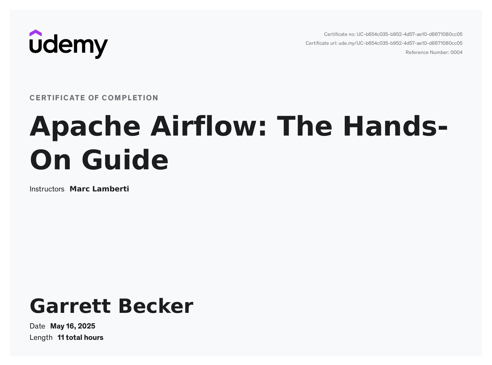

# Udemy - Apache Airflow: The Hands-On Guide

Projects and learning from Marc Lamberti's [Apache Airflow: The Hands-On Guide course on Udemy](https://www.udemy.com/course/the-ultimate-hands-on-course-to-master-apache-airflow/).

### [Certificate](https://www.udemy.com/certificate/UC-b654c035-b952-4d57-ae10-d8671080cc05/)

### Course Details

#### What you'll learn
- Coding Production Grade Data pipelines by Mastering Airflow through Hands-on Examples
- How to Follow Best Practices with Apache Airflow
- How to Scale Airflow with the Local, Celery and Kubernetes Wxecutors
- How to Set Up Monitoring with Elasticsearch and Grafana
- How to Secure Airflow with authentication, crypto and the RBAC UI
- Core and Advanced Concepts with Pros and Limitations
- Mastering DAGs with timezones, unit testing, backfill and catchup
- Organising the DAG folder and keep things clean

#### Requirements
- Notions of Docker and Python
- Docker Desktop installed and running
- The course "The Complete Hands-On Introduction to Apache Airflow" can be a nice plus.

#### Description
Apache Airflow is a platform created by the community to programmatically author, schedule and monitor workflows.

It is scalable, dynamic, extensible, and modulable.

Without any doubt, mastering Airflow is becoming a must-have and an attractive skill for anyone working with data.

What you will learn in the course:
- Fundamentals of Airflow are explained such as what Airflow is, how the scheduler and the web server work
- The Forex Data Pipeline project is an incredible way to discover many operators in Airflow and deal with Slack, Spark, Hadoop, and more
- Mastering your DAGs is a top priority, and you can play with timezones, unit test your DAGs, structure your DAG folder, and much more.
- Scaling Airflow through different executors such as the Local Executor, the Celery Executor, and the Kubernetes Executor will be explained in detail. You will discover how to specialize your workers, add new workers, and what happens when a node crashes.
- A Kubernetes cluster of 3 nodes will be set up with Rancher, Airflow, and the Kubernetes Executor local to run your data pipelines.
- Advanced concepts will be shown through practical examples such as templating your DAGs, how to make your DAG dependent on another, what are Subdags and deadlocks, and more.
- You will set up a Kubernetes cluster in the cloud with AWS EKS and Rancher to use Airflow and the Kubernetes Executor.
- Monitoring Airflow is extremely important! That's why you will know how to do it with Elasticsearch and Grafana.
- Security will also be addressed to make your Airflow instance compliant with your company. Specifying roles and permissions for your users with RBAC, preventing them from accessing the Airflow UI with authentication and password,  data encryption, and more.

In addition:
- Many practical exercises are given along the course so that you will have occasions to apply what you learn.
- Best practices are stated when needed to give you the best ways of using Airflow.
- Quiz are available to assess your comprehension at the end of each section.
- Answering your questions fast is my top priority, and I will do my best for you.

I put a lot of effort into giving you the best content, and I hope you will enjoy it as much as I wanted to do it.

At the end of the course, you will be more confident than ever in using Airflow.

I wish you a great success!

Marc Lamberti

#### Who this course is for:
- Data Engineers
- Inspiring Data Engineers
- DevOps
- Software Engineers
- Data Scientists