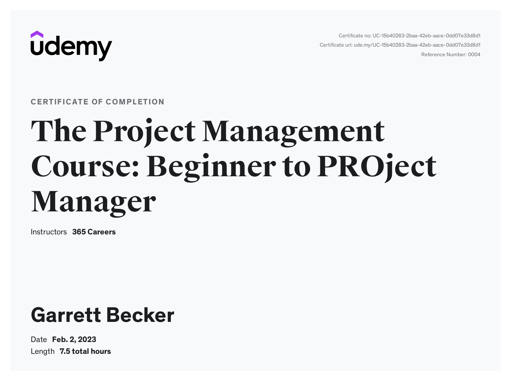

# Udemy - The Project Management Course: Beginner to PROject Manager

Projects and learning from 365 Careers's [Beginner to PROject Manager course on Udemy](https://www.udemy.com/course/the-project-management-course-beginner-to-project-manager/).

### [Certificate](https://www.udemy.com/certificate/UC-15b40283-2baa-42eb-aace-0dd07e33d8d1/)

### Course Details

#### What you'll learn
- Gain the project management knowledge and skills, necessary to manage an entire project
- Perform a complete case study of a project from the beginning to the end, observing real-life project scenarios
- Receive 15+ project management templates and valuable documents to help you structure and manage projects
- Understand the project manager role and acquire the skills needed to become successful in the profession
- Study Waterfall and Agile project management, performed with Scrum
- Learn the fundamental theory and best practices of project management
- MS Excel: learn how to use MS Excel to create the five most crucial project management documents

#### Requirements
- No prior experience is required. We start from the basics
- You'll need access to Microsoft Office (Word, PowerPoint, Excel) to download and practice with the supplemental course materials

#### Description
Project management is an exciting profession. Moving from one project to another, a project manager continually faces new businesses, new processes and systems, new people, and new situations. Such a dynamic environment helps you learn more all the time, and advances your skills than traditional jobs.

Developing the ability to structure chaos into a project with solid project management knowledge and skills, will make your endeavors more successful — whether it's the performance of a large organization, your career progression, a new business start-up, or even your personal life projects!

It’s no surprise that the demand for project managers is expected to be substantial in the years to come.

Our program is carefully designed to help anyone build knowledge and skills, grow the needed confidence, and start managing projects!

This online course uniquely combines the following critical lessons a PM should learn:
- Perform a complete project case study and learn what a project manager must do from the beginning to the end
- Understand the fundamental project management theory, apply best practices and avoid common mistakes in your next project
- Learn how to use Gantt charts, Critical Path Method, Project Plan, Budget, and many other tools (Receive 15+ project management templates). A brief tutorial on how to use MS Project is also included.
- Gain the professional and personal skills needed to become an excellent project manager
- Learn how to create the five most crucial project management documents with MS Excel 
- Learn Agile project management
- Master SCRUM and apply this project management methodology
- Learn the main differences between Watefall and Agile, compare the pros and cons, and understand which philosophy to apply in your next project
- Get promoted and apply what you learn here to the real business world, regardless of the industry

##### Why precisely this course?

Reason #1: The instructor
- Ivan, the course instructor, is a professional project manager (PMP, PRINCE2) who was honored as "Project Manager of the Year" by the Project Management Institute (PMI). In this course, he brings together his extensive experience leading multinational projects and programs across a variety of industries, and his passion for project management. This combination provides students with a profound understanding of the field through practical lessons and insightful reflections. In addition, Ivan serves as a project management consultant, tutor and mentor to junior PMs. He is also a guest lecturer on project management at several universities.

Reason #2: 365 Careers
- 365 Careers is one of the most popular course providers on Udemy, with high-quality practice material and continued support for our students. The average time we spend creating a course is between five and six months.The average amount of time we spend creating a course is between 5 and 6 months. We take pride in our high-quality production, practice materials, and continued support to our students.

Reason #3: Udemy
- Udemy is the leading global marketplace for online courses—where you’ll find updated content, enjoy a seamless course-taking experience, and discover the best value-for-money deals on the internet.

This course is for anyone! Our content is highly appreciated those new to project management, and those with practical experience in the field looking for a way to refresh and strengthen their knowledge and skills.

As we named it - Beginner to PROject manager!

Our Project Management course covers all the fundamental knowledge, concepts, tools, and techniques you need to understand, including how a project works and how to manage it best. 

We start from the theoretical basics and progressively build upon that knowledge. Each step adds real-life practical examples, case studies, and exercises.

Compared to similar material, what is unique about this course is that we’ll review and analyze a complete project from the beginning to the end. We’ll examine the tasks a PM should take at each stage of that process. In addition, you’ll receive more than 15 project management templates to help you lead projects in various industries.

##### What sets this course apart from the rest of the Business courses out there?
- High-quality production, including Full HD video and animations
- Uniquely engaging and fun content — not a collection of boring lectures
- Professional PMP certified instructor with years of experience on the job
- Complete training covering all major topics and skills necessary to become a successful project manager
- Extensive case studies that help you reinforce everything that you’ve learned
- Excellent support for when you don’t understand a concept or want to drop us a line — you’ll receive an answer within 1 business day
- Dynamic learning curve, where the instructor keeps a steady tempo throughout the course
- Bonus prizes - upon completion of 50% and 100% of the course, you will receive two bonus gifts

##### Why do you need project management skills?
- Promotions – Project managers acquire valuable technical skills, which makes them the leading candidates for senior roles within corporations
- Salary/Income – A project manager salary in the US starts from $60k and gradually rises as they move up the ladder
- Secure Future - There's a high demand for skilled project managers, and you won’t need to be concerned about finding a job
- Growth - This isn’t a tedious job. Every day you'll face various challenges that will enhance your existing skills and abilities
- This course comes with Udemy's 30-day money-back guarantee. So, you have nothing to lose.

Make one of the best decisions of your professional career. Click the 'Buy now' button.

#### Who this course is for:
- Anyone who wants to learn how to manage an entire project on their own
- Young professionals and university graduates interested in a project management career
- Anyone who wants to develop or enhance their project management knowledge and skills