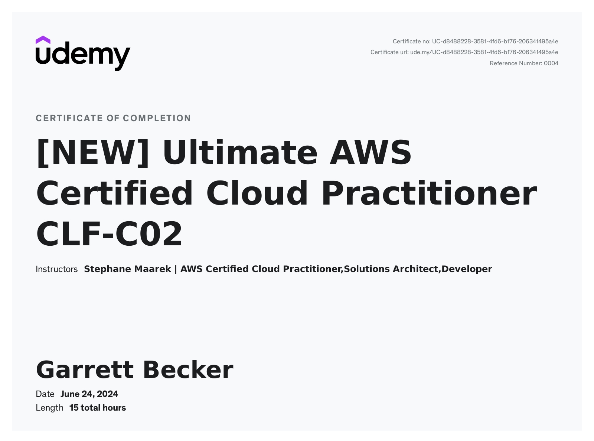

# Udemy - Ultimate AWS Certified Cloud Practitioner CLF-C02

Projects and learning from Stephane Maarek's [Ultimate AWS Certified Cloud Practitioner CLF-C02 course on Udemy](https://www.udemy.com/course/aws-certified-cloud-practitioner-new/).

### [Certificate]()

### Course Details

#### What you'll learn
- FULLY UPDATED FOR CLF-C01 & CLF-C02: Pass the AWS Certified Cloud Practitioner Certification
- Full Practice Exam with Explanations included!
- Learn the AWS Fundamentals (EC2, ELB, ASG, RDS, ElastiCache, S3)
- All 300+ slides available as downloadable PDF

#### Requirements
- No AWS Cloud experience is necessary, we'll use the AWS Free Tier
- No IT prerequisites required

#### Description
This course covers the newest CLF-C02 exam.

Beginners welcome: no need to know anything about AWS!

The AWS Certified Cloud Practitioner certification is a great entry-level certification for AWS. It's great at assessing how well you understand AWS, its services, and its ecosystem.

I want to help YOU pass the AWS Certified Cloud Practitioner certification with flying colors.

This AWS Certified Cloud Practitioner course is different from the other ones you'll find on Udemy. Dare I say, better (but you'll judge!)
- It covers in-depth all the new topics on the AWS Certified Cloud Practitioner CLF-C02 exam
- It's packed with practical knowledge on how to use AWS inside and out
- We are going to learn by doing
- It teaches you how to prepare for the AWS exam
- It's a logical progression of topics, not a laundry list of random services
- It's fast-paced and to the point
- It has professional subtitles
- All 300+ slides available as downloadable PDF

This AWS Certified Cloud Practitioner course is full of opportunities to apply your knowledge:
- There are many hands-on lectures in every section
- There are quizzes at the end of every section
- There's an AWS Certified Cloud Practitioner practice exam at the end of the course
- We'll be using the AWS Free Tier most of the time
- I'll be showing you how to go beyond the AWS Free Tier (you know... the real world!)

##### Instructor

My name is Stéphane Maarek, I am passionate about Cloud Computing, and I will be your instructor in this course. I teach about AWS certifications, focusing on helping my students improve their professional proficiencies in AWS.

I have already taught 1,500,000+ students and gotten 500,000+ reviews throughout my career in designing and delivering these certifications and courses!

With AWS becoming the centerpiece of today's modern IT architectures, I've decided it's time for students to learn how to be an AWS Cloud Practitioner. So, let’s kick start the course! You are in good hands!

This course also comes with:
- Lifetime access to all future updates
- A responsive instructor in the Q&A Section
- Udemy Certificate of Completion Ready for Download
- A 30 Day "No Questions Asked" Money Back Guarantee!

Join me in this course if you want to pass the AWS Certified Cloud Practitioner Exam and master the AWS platform!

#### Who this course is for:
- Anyone wanting to acquire the knowledge to pass the AWS Certified Cloud Practitioner Certification