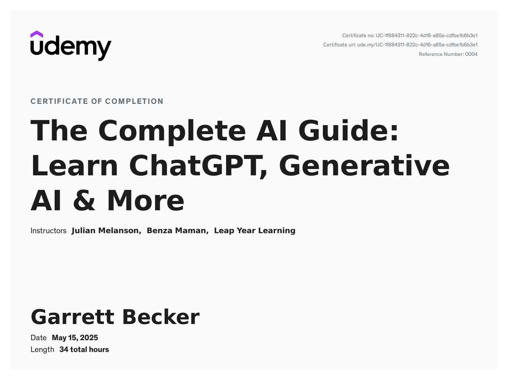

# Udemy - The Complete AI Guide: Learn ChatGPT, Generative AI & More

Projects and learning from Julian Melanson and Benza Maman's [The Complete AI Guide: Learn ChatGPT, Generative AI & More course on Udemy](https://www.udemy.com/course/complete-ai-guide/).

### [Certificate]()

### Course Details

#### What you'll learn
- Generative AI: Create content, synthesize information, and learn faster than ever with effective prompt engineering!
- ChatGPT: Turn your creativity into paid work, generate fresh ideas, reach new audiences, and scale your projects!
- Productivity: Achieve goals faster with artificial intelligence, manage time, prioritize tasks, and create an optimized daily schedule!
- Marketing: Generate targeted content with generative AI, capitalize on trends, create ads, newsletters, specialized content, and media campaigns!
- Soft Skills: Improve your communication, leadership, problem-solving, and social skills with personalized ChatGPT feedback!
- AI Voice Tools: Easily create AI-generated speech for any use case and even clone your own voice entirely!
- AI Video Tools: Create an AI avatar that transforms scripts into presentations and quickly generate social media content!
- AI Photo Tools: Add motion to images, dynamically enhance image aesthetics, and create custom images in bulk!
- AI Writing Tools: Automate writing tasks, generate effective copy, and integrate with Google Sheets/Excel!
- AI Music Tools: Create unique compositions for any types of video and save time with a streamlined creative process.
- Branding: Develop a visual identity, design logos, and generate content to establish a strong online presence!
- AI Art Generation: Create photos from prompts, fill in or remove elements of images using inpainting and outpainting techniques!
- Business: Streamline your AI workflow, automate repetitive tasks, and gain insights that help you make data-driven decisions for your business!
- Multimodal: Combine multiple AI tools to create immersive and engaging content that would have previously taken an entire team to create!
- Midjourney: Use prompts, parameters, and modifiers to create amazing images that showcase your personal style and creativity!
- Coding: Combine the power of ChatGPT with programming fundamentals, algorithms, debugging, and documentation!
- Custom GPTs & AI Assistants: Build and optimize your workflows for business and personal use, tailoring AI to specific needs!
- AI Automation: Task automating with Zapier, Make, and OpenAI APIs, integrating AI in efficient and scalable ways!.

#### Requirements
- No prior experience with AI or programming is needed, but an eagerness to learn and explore new technologies is a plus!

#### Description
Have you heard about the amazing things people and businesses are doing with AI, but you don’t know where to start?

Are you ready to unlock the power of AI and instantly create AI integrations, workflow automations, video scripts, presentations, online courses, targeted ads, social media posts, newsletters, podcasts, project outlines, E-books, personalized emails, job proposals, articles, lesson plans, language translations, SEO keywords, meal plans, custom schedules, summaries, startup ideas, market insights, mock interviews, personal bios, essays, quizzes, E-commerce copy, content ideas, to-do lists, branding guidelines, financial plans, company slogans, contracts, creative stories, blogs, code, business plans, song lyrics, resumes, cover letters, tutorials, reviews, product descriptions, advertisements, marketing campaigns, and so much more?

Perfect! You’ve found Udemy’s bestselling Generative AI course—your complete guide to achieving more in less time and unlocking new levels of success with AI.

[ NEW 2025 UPDATE: We've added 16+ hours of new content, 35+ downloadable resources, and 170+ video lessons! ]

Seamless. Effortless. Instantly Transformative. This course is your AI easy button—no complexity, no wasted time, just immediate results. With game-changing tools like ChatGPT alongside 50+ of the most powerful AI tools, you’ll automate tasks, amplify creativity, and multiply productivity—all while being expertly guided every step of the way.

By the end of this course, you’ll effortlessly...

1. ChatGPT and Generative AI Essentials for All Learners
   1. Build a strong foundation in generative AI by understanding how it all works, crafting effective prompts, and navigating its most essential features. By the end of this section, you'll confidently apply AI in your daily routine, unlocking new ways to enhance creativity, efficiency, and problem-solving.
      1. Master ChatGPT’s interface and key features in minutes
      2. Generate structured responses 3x faster with optimized prompts
      3. Boost creativity with AI-driven ideas
      4. Identify AI’s limitations and effective workarounds
      5. Automate writing tasks and save 15+ hours weekly
      6. Apply AI problem-solving in hands-on activities
2. Beginner to Advanced Prompt Engineering
   1. Learn how to structure prompts that guide AI toward clear, relevant, and high-quality responses, moving from basic techniques to advanced strategies like chain-of-thought and contextual refinement. After completing this section, you’ll have the skills to fine-tune AI outputs, generate sharper insights, and optimize responses for any use case.
      1. Improve AI response quality by 70% with better prompts
      2. Boost reasoning accuracy using prompting frameworks
      3. Double response relevance with strategic reframing
      4. Create structured content in under 60 seconds
      5. Improve content quality 2x with refined prompts
      6. Use Reverse and Comparative Prompting for deeper insights
3. AI-Powered Research, Collaboration, and Business Integration
   1. Transform how you gather, analyze, and apply information using AI-driven research and collaboration tools. By the end of this section, you’ll have the ability to streamline workflows, improve team productivity, and leverage AI for smarter, data-driven choices.
      1. Cut research time 60% with AI-powered analysis
      2. Process large datasets in minutes
      3. Summarize large reports 3x faster with AI insights
      4. Improve productivity with AI-assisted collaboration
      5. Improve market predictions 50% with AI-driven data patterns
      6. Organize complex information faster with AI automation
4. AI-Powered Content Creation, Marketing, and Productivity
   1. Use AI to create compelling content at scale—whether it's blog posts, social media updates, marketing copy, or video scripts. You’ll walk away with the skills to craft high-quality content faster, boost audience engagement, and maximize efficiency across your personal and professional projects.
      1. Create SEO-optimized blog posts in under 3 minutes
      2. Write AI-generated ads that boost CTR 25%
      3. Automate 50% of content repurposing
      4. Increase engagement with AI-personalized messaging
      5. Draft scripts for videos and podcasts 3x faster
      6. Generate full eBooks in under 1 hour
      7. Boost organic reach with AI-driven content analytics
5. AI-Powered Automation, Efficiency, and Workflows
   1. Revolutionize your workflow by integrating AI-powered automation into daily tasks and business operations. Learn how to streamline project management, eliminate repetitive tasks, and enhance decision-making with AI-driven efficiency. After this section, you'll be able to optimize your time, focus on high-impact work, and build scalable systems that drive long-term success.
      1. Automate 80% of manual data entry
      2. Cut email response time with AI based replies
      3. Auto-generate meeting notes in under 30 seconds
      4. Save 10+ hours weekly by automating work related tasks
      5. Optimize scheduling and task management 2x faster
      6. Cut project planning time in half
      7. Improve CRM response time 40% with automation
6. Integrating AI Into Business Operations, Teams, and Strategy
   1. Discover how AI is transforming modern businesses by improving collaboration, streamlining operations, and driving innovation. You’ll leave this section with a deeper understanding of AI-driven business strategies, equipping you to make informed decisions and future-proof your organization.
      1. Speed up decision-making with AI insights
      2. Cut hiring time 50% with AI automation
      3. Increase workflow efficiency with AI collaboration
      4. Automate customer inquiry responses with AI chatbots
      5. Generate business strategies in minutes
      6. Improve financial forecasts 30% with AI models
      7. Reduce supply chain delays with AI automation
7. Multimedia AI for Audio, Video, and Creative Projects
   1. Unlock the potential of AI-powered tools for voice generation, AI avatars, video creation, music production, and digital storytelling. This section will equip you with the ability to bring ideas to life faster, streamline multimedia production, and create stunning content in minutes rather than days.
      1. Create AI voiceovers in under 2 minutes
      2. Complete voiceover videos 5x faster with AI avatars
      3. Edit and enhance images in 30 seconds
      4. Produce AI-generated music in minutes
      5. Create social media videos 3x faster with AI
      6. Become a one person production company
      7. Monetizing AI for Freelancing, Side Hustles, and Business
      8. Turn AI into a revenue-generating asset by exploring freelancing, digital products, and scalable online business opportunities. By the end of this section, you’ll have actionable strategies to grow profitable AI ventures, whether through freelancing, consulting, or launching a business built around AI tools.
      9. Automate 40% of freelance content creation
      10. Scale digital product sales with AI
      11. Quickly workshop AI-assisted products
      12. Instantly write proposals and client outreach
      13. Automate 80% of customer support with AI chatbots
      14. Create more passive income streams
      15. Generate content for projects 2x faster

Easily learn how to make these AI tools do the hard work for you...

AI for Writing, Productivity, and Content
1. ChatGPT (OpenAI) 2. ChatGPT Mobile App (Mobile AI chat) 3. ChatGPT Desktop App (Desktop AI chat) 4.OpenAI Playground (Model testing) 5. DALL-E 3 (AI image generation) 6. GPT Store (Custom GPTs) 7. Notion AI (Writing & organization) 8. Perplexity AI (AI research) 9. NotebookLM (AI research assistant) 10. Tome AI (AI presentations) 11. Grammarly (Writing assistant) 12. Copyleaks (Plagiarism detection) 13. CopyGenius (Content rewriting) 14. Longshot (AI writing tool) 15. Browse AI (Data extraction) 16. Phind (Coding assistant) 17. Claude (AI writing & research)

AI for Business, Collaboration, and Automation
18. Bing AI (AI search) 19. Google Gemini (Google AI) 20. Loom (Video messaging) 21. Fireflies AI (Meeting transcripts) 22. Mendable AI (AI chat support) 23. Vertex AI (AI model training) 24. Microsoft Copilot (Business AI) 25. Zapier (Workflow automation) 26. Make .com (Advanced automation) 27. Wolfram Alpha GPT (AI computation) 28. Gamma AI (Business presentations)

AI for Audio, Photo, Video, and Design
29. Midjourney (AI art) 30. Dream by Wombo (AI image tool) 31. Playground AI (Photo editing) 32. Lexica (Image search) 33. Adobe Firefly (Generative art) 34. Photoshop AI (AI image editing) 35. D-ID .com (Talking photos) 36. PicFinder (Bulk images) 37. WatermarkRemover (Remove watermarks) 38. REImagine AI (Interior design) 39. Synthesia (AI avatars) 40. Vidyo AI (Short video edits) 41. Runway (AI video editing) 42. TryReplay (Voice transformation) 43. ElevenLabs (Voice cloning) 44. HeyGen (AI avatars) 45. Murf AI (AI voiceovers) 46. Wellsaid Labs (Text-to-speech) 47. Play HT (AI voice generator) 48. Soundraw (AI music) 49. MusicLM (Google AI music) 50. Wavtool (Music production) 51. Aiva (AI composition)

Our biggest goal for you...

This course is your shortcut to effortlessly harnessing AI, giving you the tools and guidance to revolutionize the way you approach creativity, tasks, and work.

You'll have lifetime access to:
- 470 individual video lessons
- 17-page prompt engineering guide
- 32.5 hours of learning content
- 116 downloadable assets
- 38 external resources
- 22 online articles
- 180 gigabytes of streamable content
- Lifetime access to the tutorials and assets
- Updates to all future course materials
- One-on-one with our team in the Q&A section

If you want to create content like never before, save time, automate tasks, take your efficiency to a new level, open up new income streams, or create more effectively than ever... then this is the course for you.

#### Who this course is for:
- This course is designed for anyone interested in using AI tools like ChatGPT to create amazing content, regardless of their background or experience.
- Whether you're an entrepreneur, student, professional, or just a curious learner, this course is accessible, engaging, and empowering for everyone.