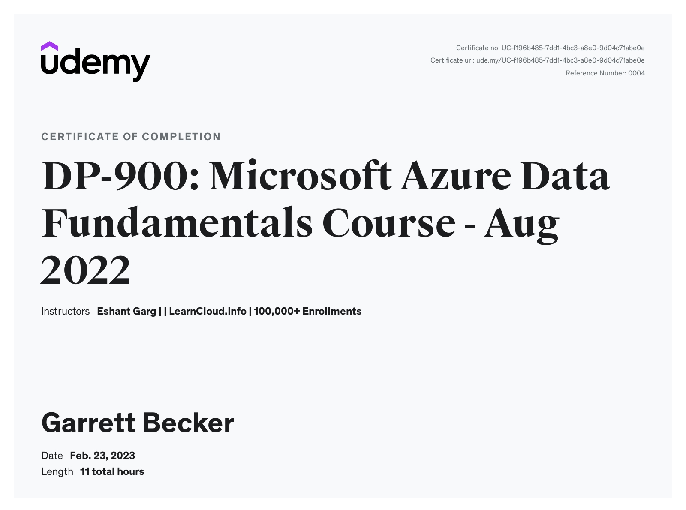

# Udemy - DP-900: Microsoft Azure Data Fundamentals

Projects and learning from Eshant Garg's [DP-900: Microsoft Azure Data Fundamentals course on Udemy](https://www.udemy.com/course/azure-dp-900/).

### [Certificate](https://www.udemy.com/certificate/UC-f196b485-7dd1-4bc3-a8e0-9d04c71abe0e/)

### Course Details

#### What you'll learn
- Students will be prepared for the DP-900 certification exam
- Learn types of core data workloads concepts
- Learn basics of 4 types of NoSQL databases and implementation NoSQL on Azure Platform (Cosmos DB APIs, Table, Blob and File storage)
- Learn diff Relational databases and implementation on Azure (Azure SQL Database and Managed Instance)
- Learn analytics workloads, including data warehouses, data ingestion and processing on Azure
- Describe data visualization in Microsoft Power BI, including reports and dashboards

#### Requirements
- This is basic course and so no prerequisite is required
- However previous database knowledge or experience would help student to understand course quickly

#### Description
The Microsoft Azure DP-900 exam is the best example of a basic level of qualification to prove your knowledge of core data services and Microsoft Azure data services. Applicants are looking for accurate information on the preparation of DP-900 exams due to the favorable job opportunities associated with Microsoft Azure details.

1. Exam Name:  Exam DP-900: Microsoft Azure Data Fundamentals
2. Exam Duration: 60 Minutes
3. Exam Type: Multiple Choice Examination
4. Number of Questions: 40 - 60 Questions
5. Exam Fee: $99 (Depends on Country)
6. Eligibility/Pre-requisite: None
7. Exam validity: Lifetime
8. Exam Languages: English, Japanese, Korean, and Simplified Chinese

##### Areas Covered
- Describe types of core data workloads, batch and streaming data, and core concepts of data analytics.
- Describe relational data workloads, relational Azure data services such as comparing PaaS, IaaS, and SaaS delivery models.
- Identify basic management tasks for relational data including provisioning and deployment of relational data services and describing query techniques for data using SQL language.
- Describe non-relational data workloads and non-relational data offerings on Azure and describe provisioning and deployment of non-relational data services.
- Describe analytics workloads and components of a modern data warehouse
- Describe data ingestion and processing on Azure and data visualization in Microsoft Power BI

##### Domains Covered in DP-900 Exam

Another significant factor that all candidates should consider for the successful training of the DP-900 exam is the overview of the exam skills. Applicants with a better understanding of the exam topics and weighting of the exam domains can gain a general impression of the exam prior to their preparation. The following topics can be found in the DP-900 certification test.

- Describing core data concepts - 15% to 20%
- Describe the approaches to work with relational data on Azure - 25% to 30%
- Describing approaches to work with non-relational data on Azure - 25% to 30%
- Description of an Azure analytics workload - 25% to 30%

The preparation guide for the DP-900 exam can become better with an outline of the subtopics covered in each domain. Here is a reflection on the subtopics you can find in different domains of the DP-900 certification exam.

###### Domain 1: Describing core data concepts
The subtopics in this domain are:
- Describing types of core data workloads.
- Describing core concepts of data analytics.

###### Domain 2: Describe the approaches to work with relational data on Azure
The subtopics in this domain are:
- Description of relational data workloads.
- Description of relational Azure data services.
- Identification of basic management tasks for relational data.
- Description of query techniques for data by leveraging SQL language.

###### Domain 3: Describing approaches to work with non-relational data on Azure
The subtopics in this domain are:
- Describing non-relational data workloads.
- Describing non-relational data offerings on Azure.
- Identification of basic management tasks for non-relational data.

###### Domain 4: Description of an Azure analytics workload
The subtopics in this domain are: 
- Describing analytics workloads.
- Describing the components of a modern data warehouse.
- Description of data ingestion and processing on Azure.
- Describing data visualization in Microsoft Power BI.

#### Who this course is for:
- Those who want to pass the Microsoft exam DP-900
- Those who want to enter in to Azure Cloud Data related profiles like Data Engineer, Data Scientist, Data Analyst etc