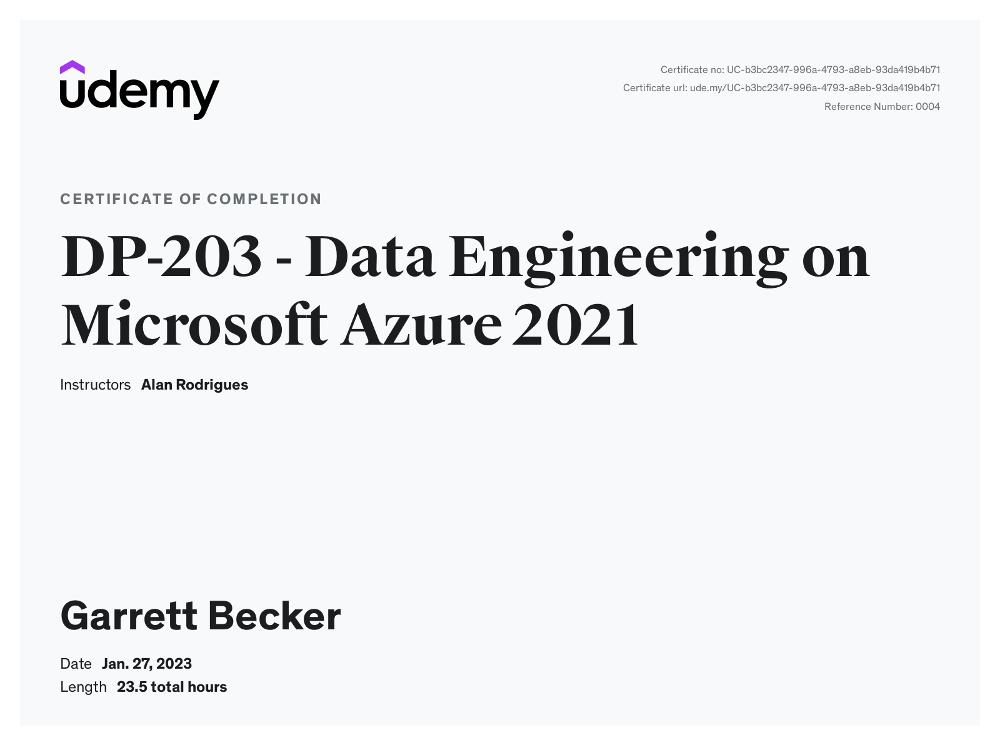

# Udemy - DP-203 - Data Engineering on Microsoft Azure

Projects and learning from Alan Rodrigues's [DP-203 - Data Engineering on Microsoft Azure course on Udemy](https://www.udemy.com/course/data-engineering-on-microsoft-azure/).

### [Certificate](https://www.udemy.com/certificate/UC-b3bc2347-996a-4793-a8eb-93da419b4b71/)

