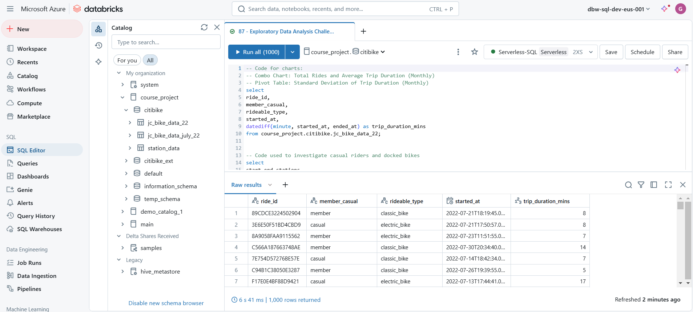

# Udemy - Databricks SQL for Data Analysts

Projects and learning from Malvik Vaghadia's [Databricks SQL for Data Analysts course on Udemy](https://www.udemy.com/course/databricks-sql-for-data-analysts/).

### [Certificate](https://www.udemy.com/certificate/UC-c3e578f9-0888-4c6d-bc60-b0a06145a89f/)

### Course Details

#### What you'll learn
- Azure Databricks
- SQL
- Delta Lake
- Unity Catalog
- Data Visualization
- Data Analysis
- Big Data

#### Requirements
- No prior experience needed
- Azure Account (set up instructions provided)

#### Description
Databricks is one of the most in demand big data tools around. More than 9,000 organizations worldwide — including and over 40% of the Fortune 500 — rely on the Databricks Lakehouse Platform.

We will be focussing specifically on the Databricks SQL Platform.

Databricks SQL is a powerful tool used for querying and analyzing large datasets, making it highly relevant in today's data-driven world. Learning this skill can enhance your employability and career prospects.

This course can be taken by experienced data analysts who are interested in learning about Databricks or even aspiring Data Analysis with no prior experience. I will teach you everything you need to know including how to code in SQL!

It can also be taken as a guide for students who are aiming to achieve the Databricks Data Analyst Certification.

The course is packed with lectures and hands-on development. This should be more than enough to keep you engaged and learning!

The course is aimed at teaching you Data Analysis on Databricks, Unity Catalog and the Databricks Lakehouse Architecture.

The curriculum is extensive and will cover a variety of areas including:
- Set Up and Overview
- Databricks Queries
- Storing and Managing Data with Databricks
- External and Managed Tables
- Data Analysis with SQL
- Data Lakehouse Architecture
- Delta File Format
- Data Visualization and Dashboards
- Access Control and Data Governance
- Unity Catalog

#### Who this course is for:
- Anyone wanting to learn Databricks SQL
- Students studying for the Databricks Data Analyst Certification
- Aspiring Cloud Data Analysts

### Databricks Workspace during the course
