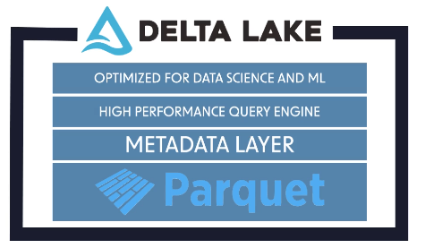

## 11_ Databricks Data Lakehouse / Delta Lake

### Databricks Lakehouse Architecture
- Traditionally, data has been stored in data warehouses
  - Pros
    - ACID-compliant transactions (Atomicity, Consistency, Isolation, Durability)
    - Define a schema up front
    - Good for analyzing structured data
  - Cons
    - Cannot work with unstructured data
    - Expensive
    - Do not support Data Science / AI
- Data Lakes were then developed
  - Pros
    - Can work with structured, unstructured and semi-structured data
    - Suitable for Big Data, analytics and Data Science / AI workflows
    - Cheaper than data warehouses
  - Cons
    - Not ACID-compliant
- Databricks Data Lakehouse
  - Pros
    - Combines the best elements of a Data Lake and Data Warehouse
    - ACID transaction support
    - Delta Lake is the optimized storage layer; open-source file type

### Delta Lake Data Files
- [DataFrameReader.format](https://spark.apache.org/docs/latest/api/python/reference/pyspark.sql/api/pyspark.sql.DataFrameReader.format.html#pyspark.sql.DataFrameReader.format)
- [DataFrameWriter.format](https://spark.apache.org/docs/latest/api/python/reference/pyspark.sql/api/pyspark.sql.DataFrameWriter.format.html#pyspark.sql.DataFrameWriter.format)
- Key features
  - ACID transactions
  - Scalable metadata
  - Time travel
  - Open source
  - Unified batch/streaming
  - Schema evolution/enforcement
  - Audit history
  - DML operations

### Deleting and Updating Records
- [Delta Lake files: Table Deletes, Updates, and Merges](https://docs.delta.io/0.5.0/delta-update.html)

### Merge Into
- [Merge Into](https://learn.microsoft.com/en-us/azure/databricks/sql/language-manual/delta-merge-into)
- [Delta Lake files: Table Deletes, Updates, and Merges](https://docs.delta.io/0.5.0/delta-update.html)

### Table Utility Commands
- [Delta Lake files: Table Utility Commands](https://docs.delta.io/0.4.0/delta-utility.html)