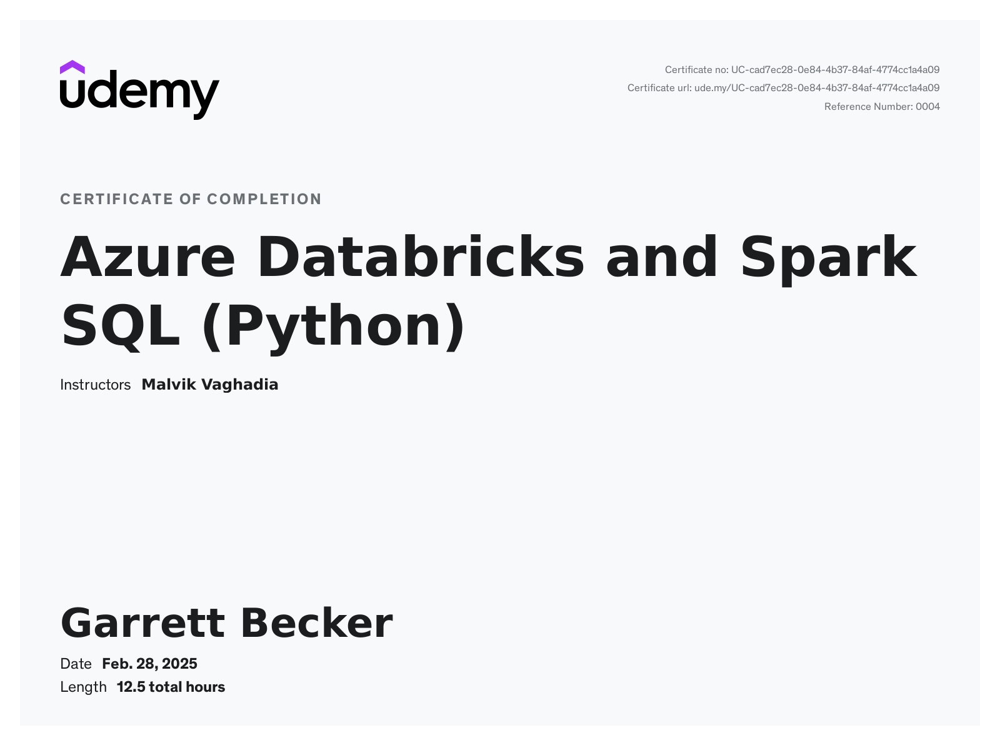

# Udemy - Azure Databricks and Spark SQL (Python)

Projects and learning from Malvik Vaghadia's [Azure Databricks and Spark SQL (Python) course on Udemy](https://www.udemy.com/course/azure-databricks-and-spark-sql-python/).

### [Certificate](https://www.udemy.com/certificate/UC-cad7ec28-0e84-4b37-84af-4774cc1a4a09/)

### Course Details

#### What you'll learn
- Azure Databricks
- Data Lakehouse
- Delta Lake
- Spark SQL
- PySpark
- Big Data
- Real World Scenarios
- CI/CD on Databricks
- Source Control with Databricks Repos

#### Requirements
- Basic SQL
- Basic Python

#### Description
Databricks is one of the most in demand big data tools around. It is a fast, easy, and collaborative Spark based big data analytics service designed for data science, ML and data engineering workflows.

The course is packed with lectures, code-along videos and dedicated challenge sections. This should be more than enough to keep you engaged and learning! As an added bonus you will also have lifetime access to all the lectures… and I have provided detailed notebooks as a downloadable asset, the notebooks will contain step by step documentation with additional resources and links.

I have ensured that the delivery of the course is engaging and concise, the curriculum is extensive yet delivered in an efficient way. The course will provide you with hands-on training utilising a variety of different data sets.

The course is aimed at teaching you PySpark, Spark SQL in Python and the Databricks Lakehouse Architecture.

You will primarily be using Databricks on Microsoft Azure in addition to other services such as Azure Data Lake Storage Gen 2,  Azure Repos and Azure DevOps.

The course will cover a variety of areas including:
- Set Up and Overview
- Azure Databricks Notebooks
- Spark SQL
- Reading and Writing Data
- Data Analysis and Transformation with Spark SQL in Python
- Charts and Dashboards in Databricks Notebooks
- Databricks Medallion Architecture
- Accessing Data in Cloud Object Storage
- Hive Metastore
- Databases, Tables and Views in Databricks
- Delta Lake / Databricks Lakehouse Architecture
- Spark Structured Streaming
- Delta Live Tables
- Databricks Jobs
- Access Control Lists (ACLs)
- Databricks CLI
- Source Control with Databricks Repos
- CI/CD on Databricks

#### Who this course is for:
- Anyone interested in working with Big Data and Spark
- Anyone interested in working with Databricks
- Anyone interested in working with cloud platforms
- Aspiring Azure Data Engineers

### Databricks Workspace during the course
