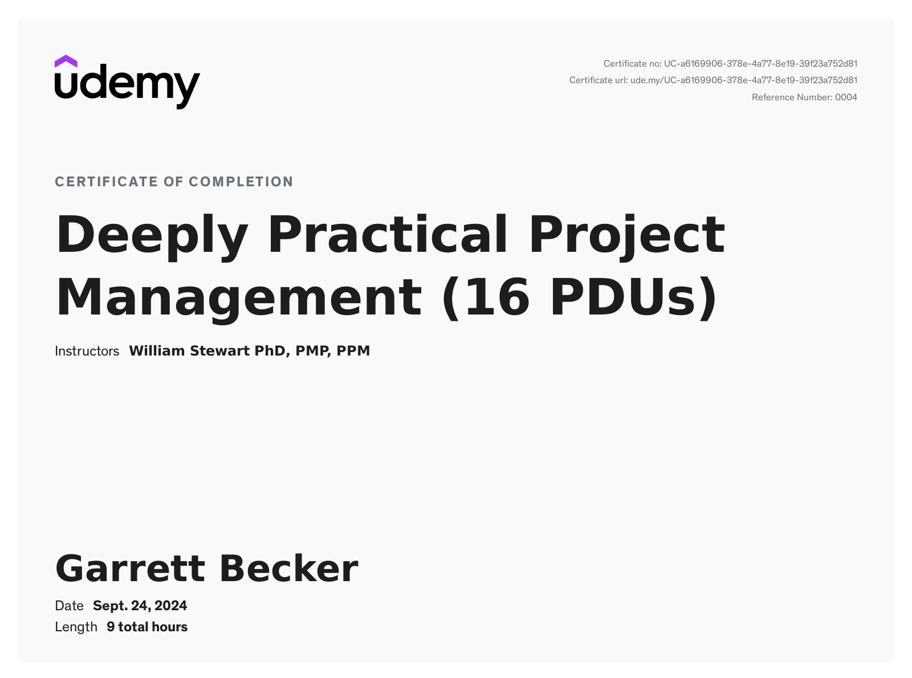

# Udemy - Deeply Practical Project Management

Projects and learning from William Stewart's [Deeply Practical Project Management course on Udemy](https://www.udemy.com/course/deeply-practical-project-management/).

### [Certificate]()

### Course Details

#### What you'll learn
- "Finally an online course that teaches the 'how' of project management from an experienced veteran." – Karin Brame
- One comprehensive course that covers the entire PM process, with a realistic, complete, professional $44M example.
- How to get stakeholder and senior management support at the beginning of your project, and maintain it throughout.
- The practical essentials of Project Manager communication, team management, negotiation, and leadership.
- How to plan your project with less than 5% (!) of the overall effort, so everyone has realistic expectations before you start.
- How to avoid the top three causes of project failure, and manage the top three drivers of project success.
- The critical importance of the project requirements, with best practices for documentation, review, and approval.
- Practical advice on building your work breakdown structure (WBS), and when to break it down further.
- Why the precedence diagram is your most important PM tool, even more important than the Gantt schedule.
- Five techniques for estimating, the tricks to estimating within +/- 10%, and how to handle estimating error.
- A complete, animated example of how to calculate the critical path, and why schedule is almost always more important than budget.
- How to decide whether to build or buy, the best type of contract structure, and the best way to make the award.
- How to prepare the final project plan, brief management, provide options, stay truthful, and protect your career.
- The essentials of building the best project team, and delegation, motivation, and resolution of personnel conflicts.
- How to manage scope so you find the things inevitably missed, but don’t let scope creep blow up your project.
- Use the critical path to focus on the most important items, intelligently reallocate resources, and make the PM’s job easier and easier.
- Track the budget and manage its key drivers to obtain the best cost performance possible.
- Identify the risks up front, mitigate them early, and manage your project to stay within the risk budget.
- The most effective things you can do to manage quality and ensure the customer is happy with the project result.
- Use earned value management (EVM) to objectively estimate future cost and schedule performance.
- Ask the stakeholders for guidance when your project is in trouble in the most productive and constructive way.
- Use scenario based verification to sign off requirements and make sure the customer is happy with the project result.
- Best practices for gathering lessons learned to find both what went well and what can be improved, and easily gather them as you go.
- Close your project, write a final report, and hold a project celebration so everyone can transition to their next challenge.
- A complete example of professional project management documentation for the $44M “Magical Devices Version 3” project.
- The document “Project Planning With MS Office” describing how to use Miscrosoft apps to document your scope, schedule, and budget.
- Six practice quizzes, nine project management document templates, a 250 page slide deck, and six summary checklists.
- Gain a deeply practical understanding of the PMI process for those that wish to write an exam and obtain a certification.

#### Requirements
- No prior knowledge needed: covers the project management process from end to end, while providing a wealth of practical tips for those already experienced in project management.

#### Description
"Finally, an online course that teaches the 'how' of project management from an experienced veteran." – Karin Brame

Based on 30 years of PM experience managing projects up to $55M, and working on PM teams on projects up to $3B, this course is your practical companion to the PMI PMBOK, describing how project management is done in real life by the most professional organizations.  At the end of the course, you will not only understand project management, you will be able to implement it as efficiently as we know how.  You will also receive a certificate that gives you the credential Practical Project Manager with the right to append PPM after your name.  Thousands of people are now listing their PPM credential as a career differentiator on their LinkedIN profiles.  It's one thing to be a professional project manager.  It's even better to be able to implement project management in the simplest and most deeply practical way.

First an overview is provided of all the fundamental concepts every Project Manager needs to know.  Then the critically important role of the Project Manager and the keys to team management and leadership are described.  Then the essential PM processes that apply to any project are mapped across the project time-line.  The specific actions you need to take at each step are explained in an easy to follow thread, along with examples.  The use of software tools to support the PM process is explained.  The course provides one complete resource with everything you need to become an expert project manager, and earn your PPM certification.

You will also receive the following resources:
- Professional example.  A complete set of PM documentation for a complex, realistic $44M example project that you can reuse as a model for your own projects.  Includes a Project Charter, Stakeholder Register, Requirements Baseline, Work Breakdown Structure, Precedence Diagram, Project Management Plan, Gantt Schedule, Risk Register, and more.
- Templates.  Microsoft Office templates for all the key PM documents, from Stakeholder Register to Project Plan to Final Report.
- MS Office Guide.  An invaluable guide "Project Planning With MS Office" that describes how to use Microsoft Office applications as simply as possible to prepare your project scope, schedule, and budget.
- If you need to manage a project right now, are preparing for a PMI PMP exam, or just want a solid grounding in the PM best practices to enhance your career, this course will really help.  You will also earn 16 Professional Development Units (PDU's).

##### Instructor

William Stewart is a PMI certified Project Management Professional (PMP) who has managed projects for more than 30 years, from just a few thousand dollars to $55M, worked in senior roles on PM teams on projects up to $3B, and helped governments and non-profits with projects as small as one person, in the domains of system integration, software development, business process, construction, real estate, research, and others.  He has delivered this course live more than 330 times to more than 3,300 people.  He has worked for aerospace, government, academia, and founded a software startup.  He has deep experience with project management, risk management, systems integration, software engineering, and negotiating.  He earned his Ph.D. in Computer Science for discovery of an algorithm that builds multi-dimensional geodesic domes in optimum space and time, which to his knowledge has never been used for anything practical ;-)

##### Student Feedback
- "Over the course of a 20 year career I have purchased many training materials, video courses, study guides, etc, and this was hands down the best material I have ever used." – Christopher Irons
- "I am interviewing for a PM position in two days, and this course gave me valuable insight into key areas I haven't considered since I received my PMI certification in 2012.  I’m also able to improve my resume since I now understand how PM functions I've been performing for years are much more valuable than I thought.  Great course." – Dan Bischoff, PMP
- "I have been a PMP since 2006 and learned so much from this course, truly outstanding." – Mark Thorogood, PMP
- "This is by far the best project management course I have ever taken!" – Susan Steigler, PMP
- "This is the best real-world practical PM course on the web. Valuable knowledge and insight, clear, and hands on.  A great investment when your time is really valuable and you don't want to waste a minute of it." – Sarah Hajipour
- "This course offers some of the most valuable material I've consumed as a Project Manager." – Philip Kohler
- "This is a very, very useful resource for both Project Managers and team members.  The best PM course I have taken online." – Marcelo Palenzuela
- "Excellent course -- easy to understand -- wish I had reviewed this resource before I took my PMP exam!" – Thomas Flores
- "The only course you will need.  Walks you through all the phases of project management.  With examples, anecdotes, and most importantly - templates.  Highly recommend!" – Allan Madhuram
- "I took this course after earning my PMP certification, and am stunned by the practical insights it provides.  Thank you! I definitely recommend for both newbies and experienced Project Managers." – Raj Bidika
- "This was the best project management course that I have taken.  I recommend to anyone interested in project management.  Really above and beyond what I expected." – Mark April
- "Really straightforward and clear.  Wish I had taken this before I sat for my PMP test." – Alexander Feravich
- "Great course, perfectly delivered.  The PMBOK Guide applied to reality. I plan to repeat this course over and over again." – Alain Yeno
- "Not only does this course teach you practical project management, it also teaches you life skills you will keep for a lifetime.  Exceptional. I couldn't have asked for anything better." – Saad Faruqui
- "Crisp and direct, no blabbing.  Wise to go with this first before consulting any other material." – Rufus Okomhanru
- "The course was amazing.  A lot of real life examples.  In my 17 years of PM experience I have never taken a more concise, informative, and easy to understand PM walk-through." – Vladimir Mitev
- "I've been managing projects for several years, and picked up key points which will improve my work in the future, and would have made previous projects significantly better if I'd known them sooner.  Highly recommended." – David Morrison
- "This turned out to be the best money I ever spent.  My only regret is I didn't take this course sooner." – Nicholas Ikpi
- "One of the greatest courses I have ever had.  Short videos you can digest at your own pace.  A warm environment, seems that you are talking with him." – Francisco Zapata

#### Who this course is for:
- Those that need to manage projects, and want a deeply practical description of how to use the project management best practices across the life-cycle.
- Anyone involved in projects that wants to understand the practical essentials of the PM best practice process.