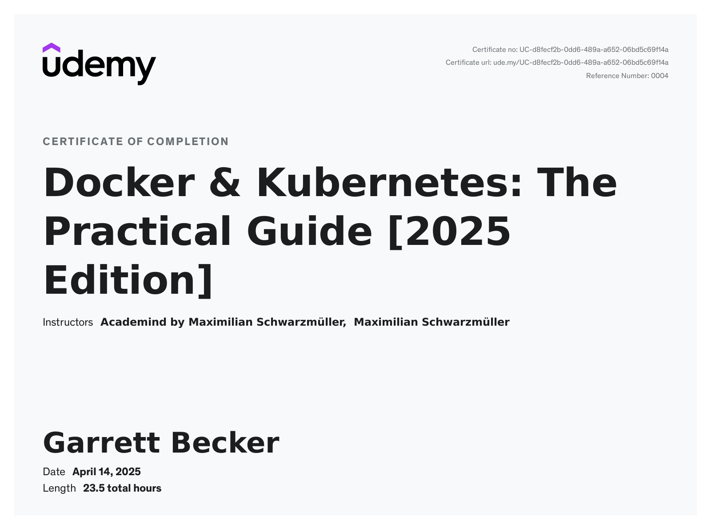

# Udemy - Docker & Kubernetes: The Practical Guide [2025 Edition]

Projects and learning from Maximilian Schwarzmüller's [Docker & Kubernetes: The Practical Guide [2025 Edition] course on Udemy](https://www.udemy.com/course/docker-kubernetes-the-practical-guide).

### [Certificate](https://www.udemy.com/certificate/UC-d8fecf2b-0dd6-489a-a652-06bd5c69f14a/)

### Course Details

#### What you'll learn
- Learn what Docker and Kubernetes are and why you might want to use them
- Learn how to install and use Docker on any system (macOS, Windows, Linux)
- Learn how to create and use Images & Containers with Docker
- Understand complex topics like managing and persisting data with Volumes
- Learn about Container Networking with Docker Networks and DNS Service Discovery
- Learn how to deploy Docker applications - manually, with managed services or with Kubernetes

#### Requirements
- NO prior Docker or Kubernetes experience is required!
- Basic (web) development knowledge is required - you don't need to know a specific language though
- AWS (used in a couple of deployment examples, ~4 hours of the course) requires a credit card - you can also follow along passively though

#### Description
Join this bestselling Docker & Kubernetes course and learn two of the most important development technologies from the ground up, in great detail!

Docker & Kubernetes are amongst the most in-demand technologies and topics you can learn these days.

Why?

Because they significantly simplify the development and deployment process of both simple and complex software projects. Especially in web development (though not limited to that), Docker can really take you to the next level!

With Docker, you create and manage so-called "Containers" - basically packages of code and tools required to run that code. These containers allow you to run your programs in a predictable, environment-independent way - no matter where you need to run it.

For modern DevOps (Development Operations) but also for local development - on your own or in a team - this is a winner feature since you will no longer have any "but it worked on my machine" discussions. It works inside of a container, hence it works everywhere!

This course will teach you both Docker & Kubernetes from the ground up with all the required theory and tons of examples and demos!

We'll explore all key concepts in detail and with practical examples and demos - from images and containers, over volumes and networking all the way up to deployment and Kubernetes Cluster: This course has it all!

In detail, this course includes the following topics:
- A thorough introduction to Docker, containers and why you might want to use Docker
- Detailed setup instructions for macOS and Windows
- A deep-dive into the core concepts you need to know: Containers & images
- Learn how to create custom images, use existing images and how to run containers based on such images
- Get a detailed overview of the core commands you need when working with Docker
- Learn how to work with data and how to persist data with volumes
- Explore container networking - with the outside world and between multiple containers
- Learn how to work with both single and multi-container projects
- In-depth deployment instructions: Manual deployment and deployment with managed services like AWS ECS
- Understand Kubernetes core concepts & architecture
- Learn how to create Kubernetes resources, deployments, services and how to run your containers with Kubernetes
- Dive deeply into working with data in Kubernetes projects - with different types of volumes
- Kubernetes networking and DNS service discovery
- Learn how to deploy your Kubernetes project (at the example of AWS EKS)
- And much more!

All these topics are taught in great detail with slides and theory but also, most importantly, with many examples and demo!

You'll find tons of demo projects throughout the course - using programming languages like NodeJS, Python or PHP (with Laravel). You don't need to know these languages to follow along though, no worries!

#### Who this course is for:
- Everyone who has NOT worked with Docker or Kubernetes at all
- Everyone who is struggling with understanding what exactly Docker is (and why you might want to use it)
- (Web) developers who want to explore modern DevOps and Docker