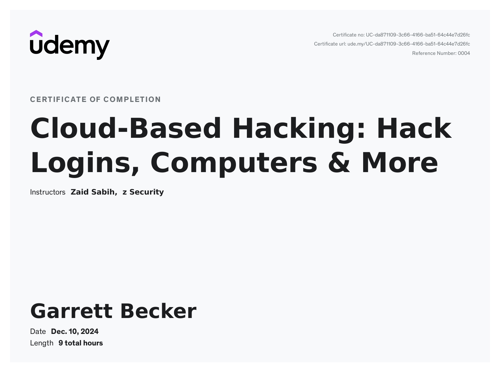

# Udemy - Learn Ethical Hacking Using the Cloud from Scratch

Projects and learning from Zaid Sabih's [Learn Ethical Hacking Using The Cloud From Scratch course on Udemy](https://www.udemy.com/course/learn-ethical-hacking-using-the-cloud-from-scratch/).

### [Certificate](https://www.udemy.com/certificate/UC-da871109-3c66-4166-ba51-64c44e7d26fc/)

### Course Details

#### What you'll learn
- 80 videos (8:45 hours) teaching you how to use the cloud for hacking.
- Generate phishing pages & Bypass 2FA / MFA.
- Hack any account with web interface such as whatsapp, email accounts, etc.
- Hack all operating systems from the cloud (Windows, Linux, Apple Mac OS).
- 60+ hands-on real-life hacking examples.
- No prior knowledge required
- Understand cloud concepts and use them for hacking.
- Hack web browsers on all operating systems and devices.
- Create trojans for Windows, Linux and Apple Mac OS.
- Hack Windows using Discord.
- Install & use Kali Linux from the cloud.
- Deliver malware like an expert hacker using specialised cloud services.
- Create a custom cross-platform download page to serve the right malware based on the target's OS.
- URL manipulation to include convincing words such as Facebook.
- Generate convincing download links with safe extensions such as .pdf.
- Launch ransomware attacks.
- Find exact location of anyone using a link.
- Clone / replicate any website on the internet.
- Read, write download, upload and execute files on compromised systems.
- Capture keystrikes on a compromised system.
- Steal sensitive info from hacked computers.
- Access webcam and keyboard of hacked computers
- Steal Windows passwords
- Install a GUI on cloud servers and access their desktop.
- Understand DNS and the different record types.
- Use Amazon's cloud service AWS.
- Link a domain name to cloud servers.
- Enable HTTPS on cloud hacking tools.
- Botnet basics and concepts.
- Use C2 / C&C to Hack Windows, Linux and Apple Mac OS
- PHP basics.
- Javascript basics
- AI Basics
- Linux basics.
- Linux commands.
- How to use the Linux terminal.

#### Requirements
- Basic IT Skills
- No Linux, programming or hacking knowledge required.
- Computer with a minimum of 4GB ram/memory.
- Operating System: Windows / Apple Mac OS / Linux.

#### Description
Welcome to my comprehensive course that will teach you how to use the cloud for hacking. With NO prior knowledge required, this course takes you from a beginner  to an expert at launching advanced attacks from the cloud. Giving you the ability to hack online accounts, web browsers, bypass two or multi factor authentication, and gain full remote control over all operating systems (Windows, Linux and Apple Mac OS) from within the cloud. That's not all, you'll also be able to use the cloud knowledge you acquire in this course to host your own websites and your own cloud applications.

This course is highly practical but it won't neglect the theory. We'll start with basics of ethical hacking and cloud computing. Then we'll dive and start using the cloud for hacking straight away. You'll learn everything by example, by hacking online accounts, computers, and browsers, no boring dry lectures. By the end of the course you will have a strong foundation in cloud computing and ethical hacking.

To achieve this the course is divided into a number of sections, each aims to teach you a specific hacking technique! You'll first learn the cloud concepts related to this technique, then you'll learn how to use the cloud to hack computers, phones, browsers, online accounts and much more. As we do this I will also introduce you to different hacking concepts, tools and techniques. Everything will be taught through examples and hands-on practicals, there will be no useless or boring lectures!

All the techniques in this course are practical and work against real systems, you'll understand the whole mechanism of each technique first, then you'll learn how to use it to hack from the cloud. Therefore by the end of the course you'll be able to modify these techniques to launch more powerful attacks, and adopt them to suit different situations and different scenarios .

As mentioned this course will will teach you both ethical hacking and cloud computing at the same time, here are some of the topics that will be covered in the course:

Hacking topics
- Phishing basics + advanced.
- Clone / replicate any website on the internet.
- Bypass two or multi factor authentication (2FA / MFA).
- Hacking online accounts such as Whatsapp accounts, email accounts, etc.
- Hacking Windows, Apple Mac OS and Linux from the cloud.
- Creating backdoors for Windows, Apple Mac OS and Linux.
- Creating trojans for Windows, Apple Mac OS and Linux.
- Hacking web browsers on all operating systems  and devices.
- Stealing credentials using fake prompts .
- Stealing sensitive info from hacked computers.
- Accessing system resources such as the keyboard and camera from the cloud.
- Advanced malware delivery using specialised cloud services.
- Cross-platform download page to serve the right malware based on the target's OS.
- URL manipulation to include convincing words such as Facebook.
- Generating convincing download links with safe extensions such as .pdf.
- Launching ransomware attacks from the cloud.
- Tracking any device from the cloud using a link.
- Read, write download, upload and execute files on compromised systems.
- Botnet basics and concepts.

Cloud topics
- Install & use Kali Linux from the cloud.
- Cloning websites on the internet.
- Install a GUI on cloud servers and access their desktop.
- Hosting your own websites and cloud applications.
- Enabling HTTPs.
- Understand DNS and the different record types.
- Use Amazon's cloud service AWS.
- Configuring firewall rules.
- Link a domain name to cloud servers.
- SSH basics.
- FTP and SFTP basics.
- Apache2 basics.
- Novnc.

Other topics
- PHP basics.
- Javascript basics
- AI Basics
- Linux basics.
- Linux commands.
- How to use the Linux terminal.

Throughout the course you'll learn how to use use the following tools to achieve the above
- Kali Linux
- AWS.
- SSH.
- Certbot
- Evilginx.
- Pwndrop.
- Filezilla.
- Openvnc.
- Empire.
- Starkiller
- Distopia
- Netcat.
- BeEF.

Checkout the curriculum and the course teaser for more info!

With this course you'll get 24/7 support, so if you have any questions you can post them in the Q&A section and we'll respond to you within less than 15 hours.

Notes
- This course is created for educational purposes only and all the attacks are launched in my own lab or against devices that I have permission to test.
- This course is totally a product of Zaid Sabih & zSecurity, no other organisation is associated with it or a certification exam. Although, you will receive a Course Completion Certification from Udemy, apart from that NO OTHER ORGANISATION IS INVOLVED.

#### Who this course is for:
- Anybody interested in ethical hacking or red teaming or penetration testing
- Hackers who want to learn how to use the cloud for hacking.
- Anybody interested in cloud comuting