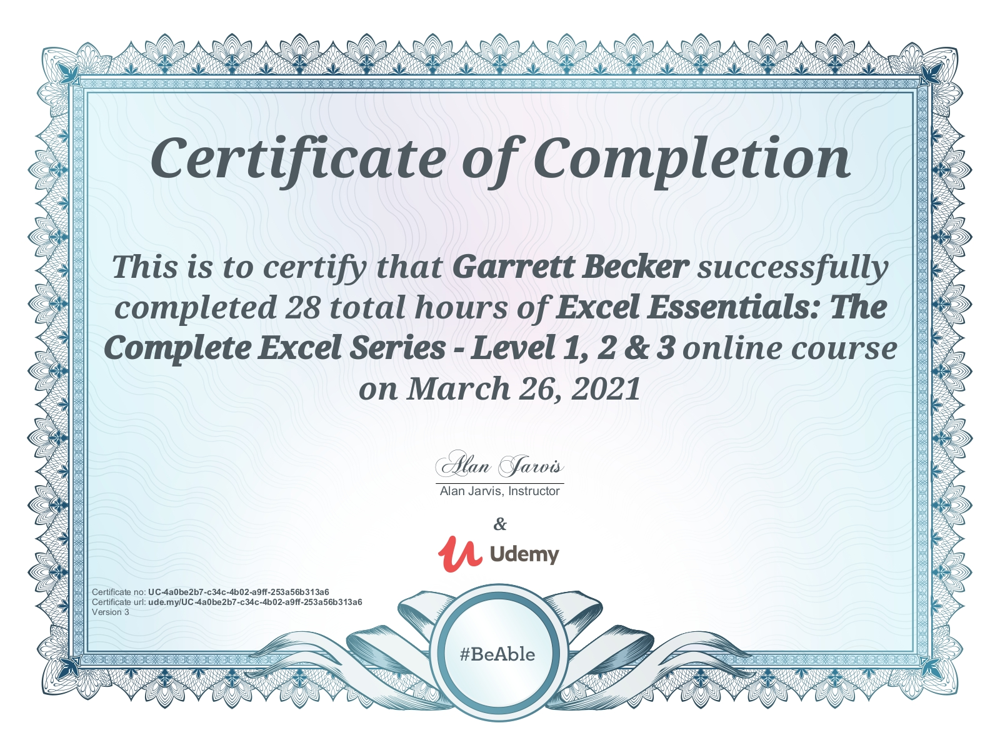

# Udemy - Excel Essentials: The Complete Excel Series - Level 1, 2 & 3

Projects and learning from Alan Jarvis's [Excel Essentials course on Udemy](https://www.udemy.com/course/excel-essentials-the-complete-series-levels-1-2-3/).

### [Certificate](https://www.udemy.com/certificate/UC-4a0be2b7-c34c-4b02-a9ff-253a56b313a6/)

### Course Details

#### What you'll learn
- By the end of Level 1:
  - Master all the basics of Excel, even if you've never seen a spreadsheet before!
  - Build your own spreadsheets from scratch, and actually understand how they work!
  - You will be able to build your own simple, AND complex formulas (and know what the difference is!), and use some of Excels built in functions.
  - Do in seconds, what a lot of seasoned users take minutes to do!
  - Increase your chances of promotion, or a better paying job by understanding the most widely used business software in the world
 - By the end of Level 2:
   - Learn To Use Excel Like The Professionals
   - Get Streets Ahead Of Your Competition
   - Build Powerful Advanced Excel Projects From Scratch
   - Create a fully functioning relational database using Excel
   - Create a simple data entry screen to auto-populate complex templates
   - Build Gantt charts in Excel for project planing
   - Expoit Excels built in advanced functions to do things "regular" users think are impossible!
- By the end of Level 3:
  - Learn to program in VBA from scratch
  - Complete routine tasks thousands of times faster! (Yes, see the demo!)
  - Confidently tackle any programming project
  - Understand coding, and the thought process behind it
  - Fully automate Excel using Visual Basic for Applications
  - Fully automate report generation
  - Program simple "helper" solutions
  - Develop complex full blown applications from scratch
  - Control other Microsoft applications like Outlook, Word, PowerPoint and even Windows itself!
  - Create emails and send them automatically!
  - Create Word documents using VBA code right from Excel!
  - Create PowerPoint presentations in seconds automatically
  - Create entire folder directories in Windows automatically!

#### Requirements
- All you need is a PC, a copy of Excel 2010. 2013, 2016, or Office 365 and a willingness to learn!
- No other knowledge is required, as each step is explained fully in the course.

#### Description
Over 165,000 students in 201 countries are becoming Excel masters with THIS series. Check out the FREE PREVIEW LECTURES and SEE WHY!

This COMPLETE* course is one of the HIGHEST RATED courses anywhere on Excel, with almost 15,000 5 STAR REVIEWS:

*Why buy 5 individual Excel courses, when this one complete course will give you everything you'll ever need?

What other students are saying:
- "This course is so detailed, yet so simple and structured. Did not know a thing about excel before joining this and now i am learning how to code on excel. Loved each and every bit of the course. I recommend this course to anyone wanting to learn excel. I bet you wont find a course better than this on the whole of internet ;-)" - Anukarsh Singh (August 2022)
- "This may be the single, greatest course on Excel in existence. It is that good. Concise, yet comprehensive and informative. The instructor has a gift for teaching in an old-world, grade school type of way, which I find particularly useful. He explains each new concept quite clearly and then builds upon the concepts to establish a very strong foundation. Remarkable class and presentation. I highly recommend this instructor. Brilliant." - Kevin Ward (May 2020)
- "Course is more than I expected. Instructor provides in depth knowledge of Excel and is effective at communicating it. This course, practice and effort are making me an Excel WIZ ! Thanks Alan." – Tom Howard (April 2020)
- "This course is by far the best course on Excel. Alan is a great instructor and has an art of teaching from the grassroots level and gradually building up to the advanced level which I think is a great way for the concepts of Excel to sink in the brain.” - Kshipra Jawdekar (April 2020)

Excel is the most in commonly used and in demand tool for making sense of data. When you can harness that power, you will be a sought after employee and YOU CAN EARN MORE MONEY!.

If you run a business, being proficient in Excel can help you see your business in a completely different light.

Congratulations!

If you are reading this, you have already taken your first important step. You want to learn Excel from the ground up, and go from a complete beginner, to super user, to being part of the few Excel Elite, and being able to program your very own full blown applications using VBA (including automating not only Excel, but Outlook, Word, Powerpoint and even Windows itself!).

This complete course contains all the lectures, quizzes, projects, and downloadable resources contained in Levels 1, 2 and 3. In fact, everything you will need to go from novice to coder! There's no need to buy one course after another to become an Excel master...it's all here!

Yes, but 27 hours, Alan?

Don't worry! We have a very (very) active student forum, so new lectures are regularly added in the SQA Sections (Student Questions Answered). If I can't explain something in a post, or I get a particularly interesting question, I'll make a video for you to walk you through your own specific sticking point!

You can find the detail of each section below, but here's a summary of how it breaks down:
- Level 1 Beginners: Base course - 3 hours, SQA - I hours
- Level 2 Advanced: Base course - 6.5 hours, SQA - 2 hours
- Level 3 VBA Programming: Base course - 11.5 hours, SQA - 3 hours

The course is structured so you can dip in and out whenever you want...you don't have to do it all at once :)

Here's what you get inside...
- In Excel Essentials: Level 1 Basics - Master Excel Step-By-Step
  - Average review HIGHER than the other Microsoft courses on Udemy!
  - Average minutes viewed 27% HIGHER than other Microsoft course!
  - New students join THIS Excel course EVERY DAY!
  - Great news! I have added a new bonus section to this course "Student Questions Answered"!

In this section you will find custom made tutorials to answer YOUR specific questions! Just drop a message in the discussion board, and if I can't answer it in a simple message, I'll make a video just for you!

What other students are saying:
- "This is the most comprehensive course I've seen on Udemy..." - Renato Ferreira
- "This course is a must and it could be the only one you need, if you want to master Excel for any reason. It is well organized, it covers all topics of Excel, from the fundamentals (formatting, writing data, put that data to use, etc...), continuing to a more advance use of the program, like applications for the formulas included in the app. But the part that outstands in the course, is the macro-programming part. It helps you to start programming in VBA in a step by step fashion. The instructor explains every lesson quite well, he is easy to follow, and you can notice he knows the app and have lots of experience with it. He is also very responsive and will reach you as soon as he can in case you have any doubt about the topics covered in the course. For me is a five stars course, thumbs up for a well roundup course." - David Garcia Silvarrey
- "This is the best Excel course ever! I like that the topics are broken down into few minutes at a time". - Sheryl Blosel
- "This course is wonderful. If you were and absolute beginner like I was, this is the course that you should take. This course starts at the absolute beginning and shows you in detail how to use the program and how to make it do what you need it to. I am almost through section 2 and I cant believe how much I have learned and I couldn't imagine taking an Excel course from anyone else. If you are thinking about getting an Excel course for refreshing your skills, or just starting from the beginning, this is the course for you" - Jake Rose

Next to soft skills, being able to use Microsoft Excel well is probably one of the most sought after skills employers are looking for in today’s competitive market. Make sure you can compete…

Do you want to master one of the must have skills for any work place?

Are you willing to invest a little time now for your own future?

Want to learn powerful, little known tools most users don't know about?

Do you want to get ahead of your competition?

If you are a complete beginner looking to master Excel, or you just want to brush up on the basics, you've come to the right place. If you want to earn more money by developing a skill set that today’s employers demand, this is the course is for you!

Getting to grips with Excel will give you a distinct advantage in whatever work you currently do, and can open the door to new opportunities.

Many of my students have gone on to get better paying jobs, change career, or even start their own businesses, using the very skills you will soon master.

“I spent over 30 years mastering Excel, so you don't have to!”

In this course we cover in detail all of the basic functions of Excel, and you will learn not only how to use it, but some powerful tools to allow you understand how it works. There is a difference between repeating something and understanding it.

Who is this course aimed at?
- Complete beginners, and those who want to build a solid foundation upon which to build their skills.

How is it structured?
- Together we concentrate on building a single complete project from beginning to end, using all the basic functions and give you a thorough understanding.
- I know your time is valuable, so most lectures are between 3-5 minutes, allowing you to dip in and out when it's convenient for you. This also maximizes your learning, and makes it easy if you ever need to go back to refresh your memory...no need to click through a 40 minute lecture to find the part you're looking for!
- There are screencasts, lots of quizzes, presentations, pdfs, downloadable files...all designed to optimize your learning.

What do I get with this course?
- Lifetime access to over 4 hours of HD content.
- Over 50 bite-size lectures, each covering a specific topic in detail. Some of which I have never seen taught before!
- Multiple quizzes to ensure you cement your learning!
- Downloadable source file, practice file, and pdf cheat sheets that you can take with you and quickly refer back to if you are away from home.
- Access to the Q&A forum, so if you have any questions, you can ask me!

What other students are saying:
- "This course is exactly what I was looking for. Simply explained, and in a level of detail I could follow. I really enjoyed it, and will recommend it to all my friend"s – Beatrice
- "This course [Level 1] gives a solid foundation for a beginner who wants to develop their skills...To sum up Folks, this is a HIGHLY RECOMMENDED course. I will be shortly enrolling myself in the next course with Alan of course" – Alex
- "Fantastic course! The instructor is extremely knowledgeable and the way he organized the course makes it extremely easy to follow. I highly recommend this course to anyone looking to increase their knowledge of Excel." – Dan Hughes

So, Why take THIS course?
- I have been using Excel for over 20 years, but there is a difference between being good at something and being able to teach it. In that time I have taught thousands of people how to master its power. Because I have taught so many people, I know not to assume you already understand something, and I have probably already heard every question you are likely to have.
- This course took over 4 months to produce, and has been tested extensively with hundreds of people. If something didn't work, or wasn't clear, it was revised until it did, to make this the best possible course on Excel.
- Of course, we never stop learning, and I will continue to develop this course, and your skills, with your feedback. And remember, if you have a question, post it in the Q&A and I will answer it for you personally.

---

In Excel Essentials: Level 2 - Intermediate/Advanced:
- THIS course will take your Excel skills to the next level!
- New "Student Questions Answered" added
- The HIGHEST RATED Excel Level 2 course on Udemy!
- Average minutes viewed almost triple that of other Microsoft courses!

So, you have an understanding of the basics, but would you like to use Excel like the professionals? If so, read on…

For students who have already completed Level 1 in this series, or already have a good basic understanding of Excel, what you will learn in this course will supercharge your skills... and your career.

So, What’s inside?
- Over 90 bite-sized lectures
- 8.5 hours of quality HD content
- 41 downloadable resources
- All the source files for each project
- Access to me (in case you have any questions)!
- You will learn powerful and little known techniques to enable you to build your own powerful spreadsheet solutions. We will do this by creating multiple projects together, step-by-step, and in depth to guarantee your understanding. Each project builds on the last, so your skills develop cumulatively.

What other students are saying:
- "This is a great course for anyone wishing to learn or brush up on the basics. The presentations are easy to follow!" – Pamela Reyna
- "This is a very simple, clear and concise and easy to follow course that is perfect for beginners" – Sean Loftus
- "The author of this course takes you through it one simple step at a time, and it is really easy to follow. I like that the lectures are short, and focus on one thing at a time, which was perfect for me. I actually now feel confident using Excel. Well done and thank you!"– Nickie Student

You will learn how to combine multiple functions in a simple way to create powerful solutions that most users believe can't be done in Excel!

Each project in the course is designed to introduce a range of concepts that showcase the true power of Excel, and show you what is really possible.

In Project One:
- The fastest way to create powerful dynamic templates (by cheating!)
- Custom formatting
- Manipulating calculations with time and dates
- Conditional formatting
- Simple and nested logical testing
- Building complex and dynamic text strings
- ActiveX controls (and how to customize them)

In Project Two:
- Building a fully functional complex relational database
- A Masterclass in Vlookups (WAY beyond the basics here!)
- Importing data from multiple sources
- Controlling user entry

In Project Three:
- Creating named ranges (and why you would want to)
- Building dynamic named ranges
- Getting Excel to create them for you!
- A powerful trick very few users know about!

In Project Four:
- Hyperlinking (so it ALWAYS works!)
- Creating Macros, and using them to automate your work!
- Executing Macros from buttons
- Dropdown lists
- Building dynamic formulas using Excel’s Indirect function

In Project Five:
- Project management made simple with Gantt charting!
- Have your chart timeline ALWAYS begin at the best date
- Nesting multiple logical tests (simply!)
- Making your timeline completely dynamic by changing a single cell!

This isn't just a course with a bunch of formulas, it's hands on guide through real life projects. You will learn how to build complex solutions using the very same methods I use.

---

In Excel Essentials: Level 3 - VBA Programming:
- If you really want to harness the full power of Excel, then learning how to program in VBA is ESSENTIAL!
- If you got this far, it's because:
  - You want to join the Excel elite, and program your own solutions?
  - Maybe you want to automate most of your work, do more in less time with less effort?
  - Could be you want to earn more money?
  - Perhaps you may even fancy a career change?

If you answered yes to any of the above, I want you in my student community!

In this course you will learn everything you need to know about coding in VBA, even if you've never looked at a line of code before!

What other students are saying:
- "This is a great course! ...I can't wait to start using it. I will certainly be using the emailing program! And reports. My mind is reeling!" - Nickie Student!
- "Taught in easy bite size chunks makes the learning fun as well as informative" – Joe Long
- "If you are serious about learning how to make excel work for you, you should take this course" - Beatrice

Introducing Visual Basic For Applications
- Visual Basic for Applications, or VBA, is included with Excel, so there's nothing more to buy. If you have Excel, you already have access to VBA.
- VBA is the powerhouse. It's the code that lives under the hood where the magic happens.
- A lot of people can record a Macro, but being able to program in VBA is quite a different thing. It separates the good from the truly amazing, and I want you to be amazing!
- Now, one of those words in "Visual Basic for Applications" carries more weight than the others. And no, it's not "Basic" (though coding the way I will teach you is simple!).
- No, it's "Applications". In fact, it's the "s" at the very end. The significance is that VBA works across ALL MICROSOFT APPLICATIONS! Word, Outlook, Access, PowerPoint, Internet Explorer, and even WINDOWS ITSELF!

In this course I will not only teach you how to code for Excel, there are even THREE, no...FOUR Bonus Sections:
- Controlling Word
- Controlling Outlook
- Yes, even controlling Windows
- and now...Automating PowerPoint!

What Makes Me Qualified To Teach You?
- Well, I'm a regular guy. I don't have a University degree, but what I do have is the drive to learn new things and never be beaten by a problem...a lot like you, I guess.
- What I also have is over 20 years of experience in using Excel, and programming solutions with VBA.
- I have built simple helper systems to make life easier for my colleagues. I've programmed complete MRP systems to run the procurement division of a £1.3b company, and everything in between.

So, I can do it, does that mean I can teach you?

You bet! I have taught hundreds of students one on one, and even more in groups. Many of my students have gone on to better paying jobs, start their own businesses, or at the very least made their work lives less stressful! One of my most recent students got a promotion and a 15% pay rise just 16 weeks after learning how to code! Not bad, hey?

Why Is Your Course Different, Alan?

I'm glad you asked!

If you got this far, you already know you get:
- Over 15 hours of HD video lectures
- 72 downloadable resources
- Quizzes
- All the source code for the course + more!
- Programming projects

There are lots of great courses on coding in VBA. There are even lots of free videos on YouTube. Many of them show you all the basics in kind of a "little bit of everything" approach. I looked at what was available, and I knew I had to create something different. Of course, I still cover all the basics, just like the other courses, but we will go beyond the basics, and cover in depth the "missing bits".

In addition, I will teach you my step-by-step process, the actual methods I use to build powerful solutions easily and quickly. I'm sure programming can be difficult, but not the way I do it!

You will learn how streamline your code for efficiency (and make it execute faster!) from the beginning. After we've covered all the basics, we will go on to create 6 separate projects using those very tools and techniques, where we will pull together all of your earlier learning, and give you the confidence to program your own solutions as soon as you finish the course!

What other students are saying:
- "I'm coming close to finishing this course...This course has given me the knowledge and confidence to succeed, get promoted and think seriously about building a career based on what I can learn from great teachers like Alan." - Thomas Heaton
- "Alan is an excellent tutor, goes very deep into every single thing, and he is not bothered to repeat even the smallest tricks and tips along the way. I feel like I got amazing new skill, this course has opened my eyes on how I should "see" excel from now on. Definitely the best course I have ever taken on Udemy" - Aleksandar Stankovic

With So Much Power, What Will You Create?

With the skills you will learn in this course you will be limited only by your imagination.

If you can describe it, you can most likely code it. What will YOU create?

Let's see. Enroll now, and I look forward to welcoming you to the course!

#### Who this course is for:
- This course is aimed at complete beginners, or those who want to get a thorough knowledge of Excel
- No prior knowledge is needed!
