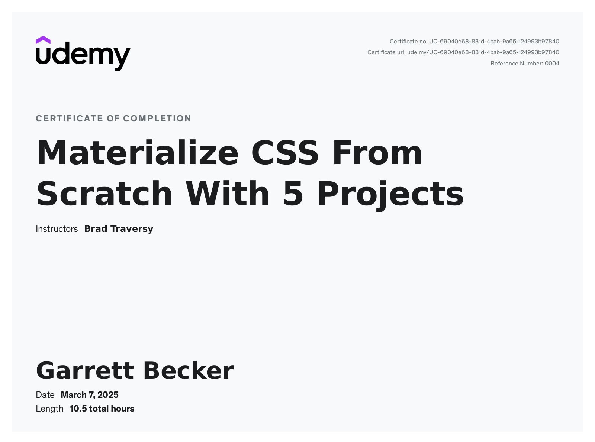

# Udemy - Materialize CSS From Scratch With 5 Projects

Projects and learning from Brad Traversy's [Materialize CSS From Scratch With 5 Projects course on Udemy](https://www.udemy.com/course/materialize-css-from-scratch-with-5-projects/).

### [Certificate](/)

### Course Details

#### What you'll learn
- Learn to correctly structure HTML 5 documents with semantic tags and attributes
- Learn and create amazing high quality Materialize themes and UIs from scratch
- Learn the Materialize utilities, classes, components & JS widgets using a custom sandbox environment
- Learn some custom JavaScript/JQuery to make your themes more interactive

#### Requirements
- Basic HTML & CSS

#### Description
This course is for anyone that knows basic HTML and a little CSS that wants to take their frontend website and UI creation to the next level using the Materialize CSS framework which is based off of Google's Material Design scheme. You will learn all of the CSS and JavaScript components, animations/transitions and build 5 beautiful and completely responsive, real world themes from absolute scratch.

**Custom Materialize Sandbox**
I have created a completely custom HTML learning environment for the first few sections of this course. Each lecture has an html page associated with it and has a start state. As we move along through the lectures, you code along with me learning all that Materialize offers including CSS components, utilities, JS widgets and more.

**5 Real Projects/Themes**
We will create the following projects from scratch..
- **Travelville** -  A travel agency website/theme  (Carousel slider, autocomplete, scrolling navigation)
- **Quazzu** - Cloud hosting theme (SideNav, cards, CSS overlays)
- **Madmin** - Interactive admin theme (Working todo list, charts, preloader, counter script)
- **BizLand** - Business consultation theme with a full screen landing page (Scrollfire, Google maps integration)
- **Galappear** - Graphic design portfolio (Uses Sass and scrollfire for scroll animations)

#### Who this course is for:
- Anyone that wants to learn & master Materialize CSS and build real world themes