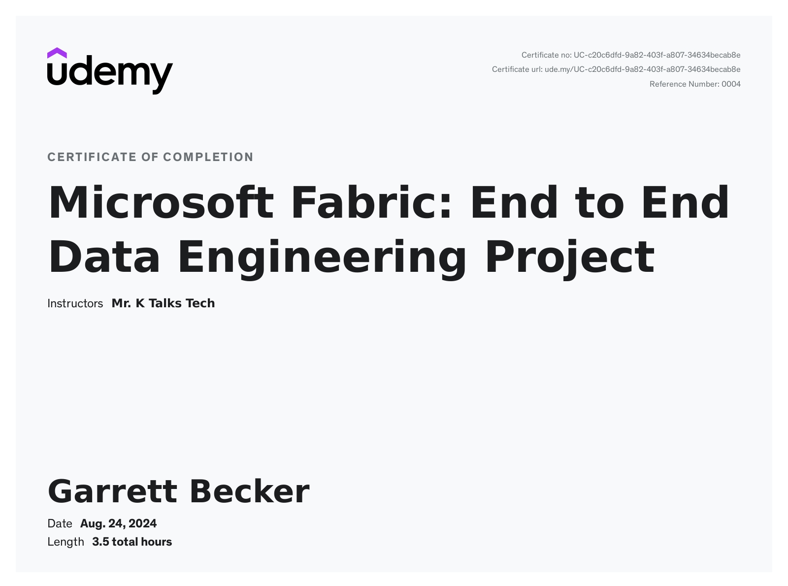

# Udemy - Microsoft Fabric: End to End Data Engineering Project

Projects and learning from Mr. K Talk Tech's [Microsoft Fabric: End to End Data Engineering Project course on Udemy](https://www.udemy.com/course/microsoft-fabric-end-to-end-data-engineering-project/).

### [Certificate](https://www.udemy.com/certificate/UC-c20c6dfd-9a82-403f-a807-34634becab8e/)

### Course Details

#### What you'll learn
- You will learn to use Microsoft Fabric for building a Bing News Data Analytics platform, enabling seamless integration with Azure Data Engineering components
- You will learn the process of ingesting data from external sources, specifically utilizing Bing API, using Data Factory.
- You will learn to perform data transformation techniques to shape and refine raw JSON data into curated Delta Tables using Synapse Data Engineering component
- You will learn how to perform sentiment analysis using Synapse Data Science component
- You will learn how to orchestrate data workflows with Data Factory pipelines.
- You will learn how to perform Incremental Load using spark notebooks.
- You will learn how to visualize data effectively using Power BI.
- You will learn how to configure alerts within Power BI visuals with Data Activator.

#### Requirements
- Basic Programming Skills
- Watch the two Pre-requisite videos

#### Description
In this project,  we will build a Bing News Data Analytics platform!

This would be a complete end to end Azure Data Engineering project that's done using Microsoft Fabric. We'll pull raw data from Bing API, transform the raw data to clean data with Synapse Data Engineering, analyze sentiment with Synapse Data Science, set up workflows with Data Factory, make cool reports with Power BI, set alerts with Data Activator, and test everything well. Let's get started on Bing News Analytics! 

The Topics covered in this Project are,
1. Data Ingestion from Bing API using Data Factory: Learn how to seamlessly pull in data from external sources, setting the foundation for your analytics project.
2. Data Transformation using Synapse Data Engineering: Dive into the process of shaping and refining your raw JSON data to a curated Delta Table, including techniques like incremental loading to keep your processes efficient.
3. Sentiment Analysis using Synapse Data Science: Uncover insights hidden within the news description by predicting the sentiment of the news classified as Positive, Negative or Neutral.
4. Orchestration using Data Factory via pipelines: Discover the art of orchestrating your data workflows, ensuring smooth and efficient operations.
5. Data Reporting using Power BI: Visualize your data in a compelling and actionable manner, empowering stakeholders with valuable insights.
6. Configuring Alerts using the Data Activator: Stay ahead of potential issues by setting up alerts and notifications within your Power BI visuals using a new tool called Data Activator.
7. End to End Pipeline Testing: The complete flow will be tested right from the data ingestion to the data transformation and until the report gets updated with the incoming new data to Validate the integrity and performance of your pipelines, ensuring reliability and accuracy.

This project revolves around Bing News Data Analytics, a practical application that involves ingesting news data daily and generating insightful reports. By walking through each step in a simplified manner, I aim to make Azure Data Engineering accessible to all enthusiasts, regardless of their background.

#### Pre-requisites
You don't need to have any skills to do this project. Even if you are an absolute beginner, if you follow the entire course, you will be able to implement this project, The only pre-requisite for this project is, you need to two introductory videos of Microsoft Fabric which is included as part of this course in the section 1.

All the very best and Happy Learning!!!

#### Who this course is for:
- Are new to Azure Data Engineering and want to learn from scratch.
- Data enthusiasts looking to gain practical experience in Azure Data Engineering.
- Professionals seeking to expand their skills in data ingestion, transformation, and analysis.
- Individuals interested in building data analytics platforms using Azure services.