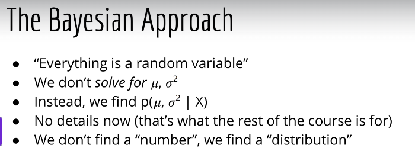
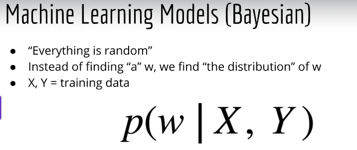
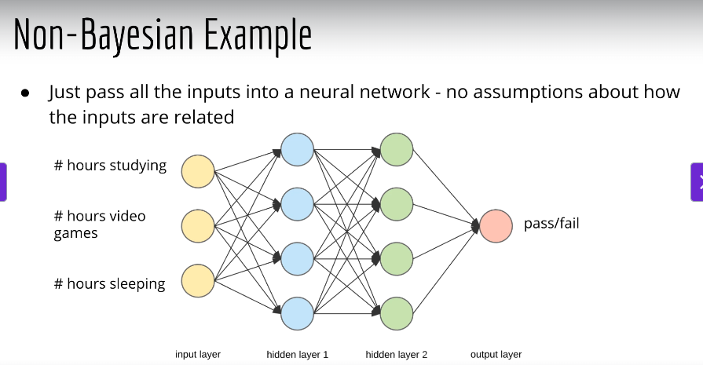
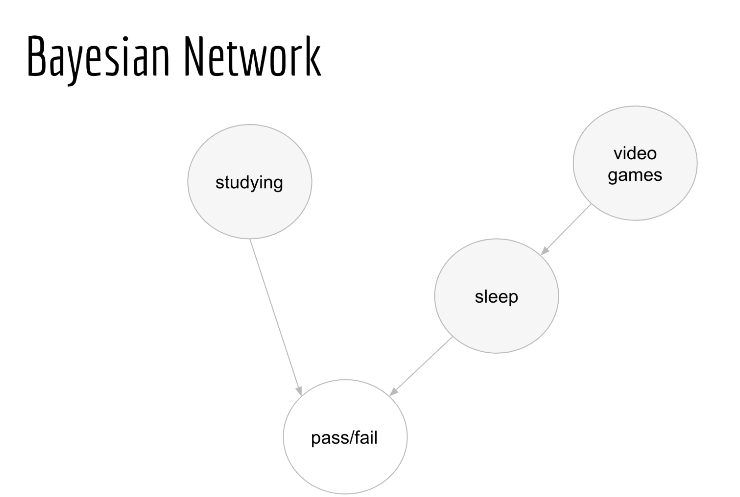
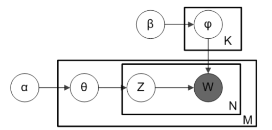

## 02_ The High-Level Picture

### Real World Examples of A/B Testing
- Medicine
  - How do we know if the new drug works?
  - Run an experiment, with control and treatment groups
  - Measure blood pressure after taking the new drug
  - There will be overlap between the two groups
  - Do some calcs to find out if the drug actually works
- Making a website
  - New website is made to sell something or get signups
  - You want conversion rates to be high or sell something
  - Max out the conversion rate
  - Make sure your site is trustworthy and attractive
  - Compare the options to see which gives you the highest conversion rate, and that requires statistics
- Local business flyers
  - Find out which flyer yields the max callbacks
- Cloud storage
  - Which is better: Seagate or Western Digital
  - They will eventually fail
  - But which will fail less/latest?
- What's the pattern?
  - Compare 2 or more items
  - Groups of items produces numbers
  - Which group has higher/lower numbers (statistically speaking)?
  - How do we detect those differences?

### What is Bayesian Machine Learning?

### This course
- This is an intro to Bayesian ML
- You want to understand why you should take the Bayesian approach over others

### The Bayesian Approach
- "Everything is random"
- More precisely: "Everything is a random variable"
- We don't solve for the mean or variance
- Instead we find the probability distributions of the mean and variance

### The Frequentist Approach
- Collect data
- Write down the likelihood
- Maximize likelihood params

### Sampling
- If you go the statistics route, you will spend a lot of time on sampling methods
- Importance sampling, MCMC, Gibbs, etc
- Main idea: numerical approximation of an integral (you'll understand why later)
- In Deep Learning, the main skill we need from calculus is differentiation (calculus 1)
- In Bayesian ML, the main skill from calculus we need is integration (calculus 2)
- Sampling itself can be an entire course!

### Machine Learning Models (Bayesian)
- We want to find the distribution of w, not just w (linear regression is only interested in finding w)

- This approach can be applied to many other models
  - Logistic regression
  - Neural networks
  - Gaussian Mixture Models
    - The more powerful k-means clustering
  - PCA
    - Principal components analysis
  - Matrix factorization
    - For recommender systems

### Bayesian Networks
- The previous models were specific models, while Bayes nets are a general model
- You can model specific dependencies based on your understanding of the system
- Ex: I want to predict whether or not a student will pass my exam
  - Inputs: hours studying, hours playing video games, hours sleeping

### Non-Bayesian Example

### Bayesian Network
- These factors might affect the final result or other factors

### Latent Dirichlet Allocation (LDA)
- Used for topic modeling
- It's a specific example of a Bayes net, but does not have its roots in a non-Bayesian model such as Logistic Regression
- Also a totally different subset of ML (NLP)

### Summary
- Bayesian ML is vast
- Bayesian ML may be even more complex than Deep Learning
- A/B testing is the most readily applicable of all ML ideas