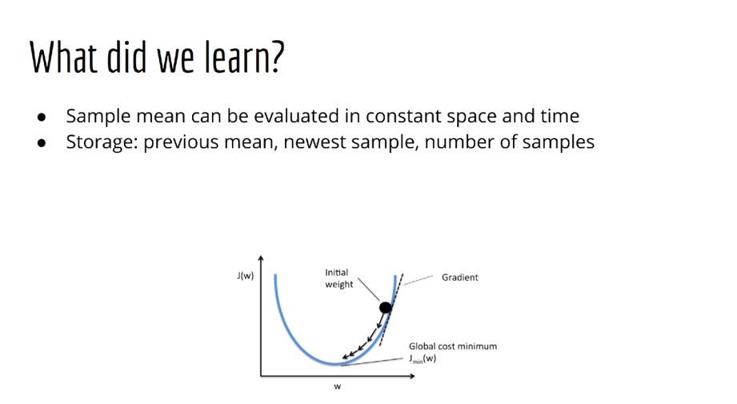
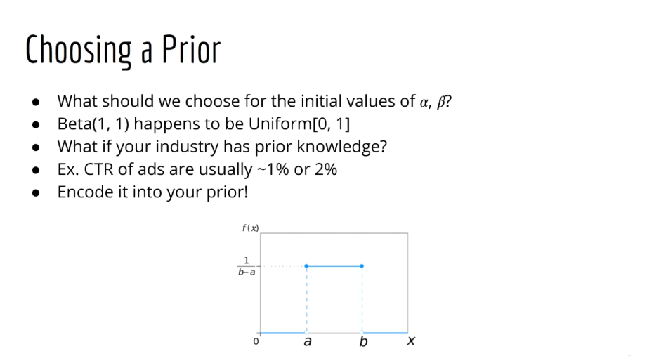
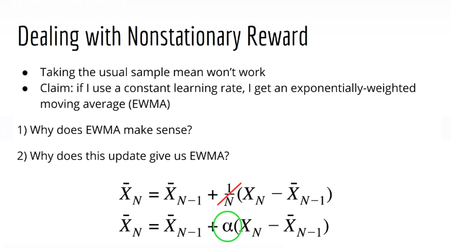
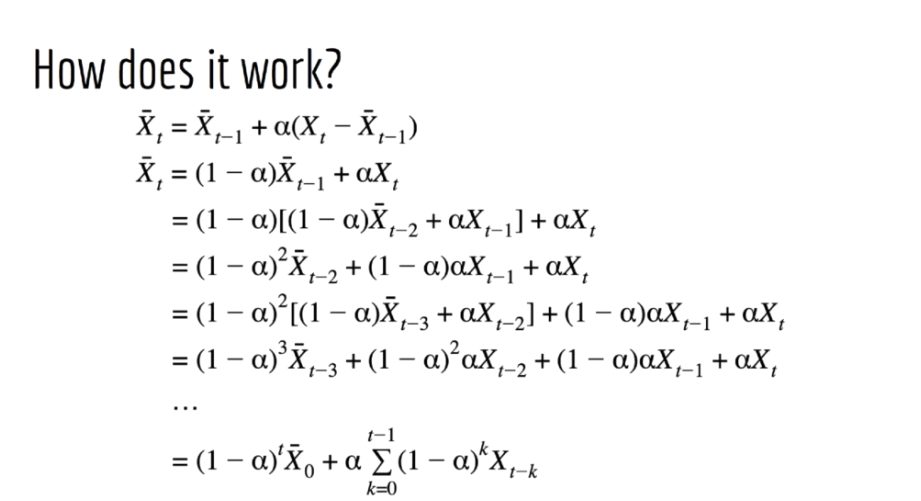
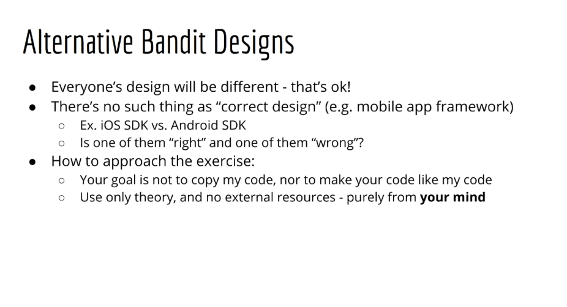
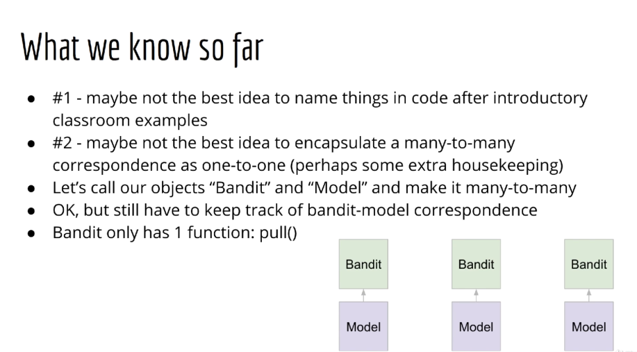

## 05_ Bayesian A/B Testing

### Section Intro

### Applications of the Explore-Exploit Dilemma

### Epsilon-Greedy Theory

### Calculating a Sample Mean

### Epsilon-Greedy Beginner's Exercise Prompt

### Designing your Bandit Program

### Optimistic Initial Values Theory

### Optimistic Initial Values Beginner's Exercise Prompt

### UCB1 Theory

### Bayesian Bandits / Thompson Sampling Theory (Part 1)

### Bayesian Bandits / Thompson Sampling Theory (Part 2)

### Thompson Sampling with Gaussian Reward Theory

### Exercise on Gaussian Rewards

### Why not just use a library?

### Nonstationary Bandits

### Bandit Summary, Real Data, and Online Learning

### Alternative Bandit Designs

