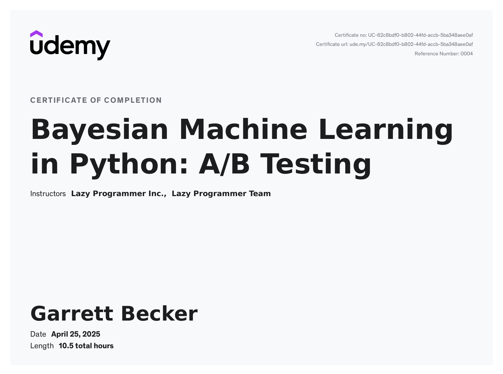

# Udemy - Bayesian Machine Learning in Python: A/B Testing

Projects and learning from The Lazy Programmer's [Bayesian Machine Learning in Python: A/B Testing course on Udemy]().

### [Certificate]()

### Course Details

#### What you'll learn
- Use adaptive algorithms to improve A/B testing performance
- Understand the difference between Bayesian and frequentist statistics
- Apply Bayesian methods to A/B testing

#### Requirements
- Probability (joint, marginal, conditional distributions, continuous and discrete random variables, PDF, PMF, CDF)
- Python coding with the Numpy stack

#### Description
This course is all about A/B testing.

A/B testing is used everywhere. Marketing, retail, newsfeeds, online advertising, and more.

A/B testing is all about comparing things.

If you’re a data scientist, and you want to tell the rest of the company, “logo A is better than logo B”, well you can’t just say that without proving it using numbers and statistics.

Traditional A/B testing has been around for a long time, and it’s full of approximations and confusing definitions.

In this course, while we will do traditional A/B testing in order to appreciate its complexity, what we will eventually get to is the Bayesian machine learning way of doing things.

First, we’ll see if we can improve on traditional A/B testing with adaptive methods. These all help you solve the explore-exploit dilemma.

You’ll learn about the epsilon-greedy algorithm, which you may have heard about in the context of reinforcement learning.

We’ll improve upon the epsilon-greedy algorithm with a similar algorithm called UCB1.

Finally, we’ll improve on both of those by using a fully Bayesian approach.

Why is the Bayesian method interesting to us in machine learning?

It’s an entirely different way of thinking about probability.

It’s a paradigm shift.

You’ll probably need to come back to this course several times before it fully sinks in.

It’s also powerful, and many machine learning experts often make statements about how they “subscribe to the Bayesian school of thought”.

In sum - it’s going to give us a lot of powerful new tools that we can use in machine learning.

The things you’ll learn in this course are not only applicable to A/B testing, but rather, we’re using A/B testing as a concrete example of how Bayesian techniques can be applied.

You’ll learn these fundamental tools of the Bayesian method - through the example of A/B testing - and then you’ll be able to carry those Bayesian techniques to more advanced machine learning models in the future.

See you in class!
- "If you can't implement it, you don't understand it"
- Or as the great physicist Richard Feynman said: "What I cannot create, I do not understand".
- My courses are the ONLY courses where you will learn how to implement machine learning algorithms from scratch
- Other courses will teach you how to plug in your data into a library, but do you really need help with 3 lines of code?
- After doing the same thing with 10 datasets, you realize you didn't learn 10 things. You learned 1 thing, and just repeated the same 3 lines of code 10 times...

Suggested Prerequisites:
- Probability (joint, marginal, conditional distributions, continuous and discrete random variables, PDF, PMF, CDF)
- Python coding: if/else, loops, lists, dicts, sets
- Numpy, Scipy, Matplotlib

WHAT ORDER SHOULD I TAKE YOUR COURSES IN?:
- Check out the lecture "Machine Learning and AI Prerequisite Roadmap" (available in the FAQ of any of my courses, including the free Numpy course)

UNIQUE FEATURES
- Every line of code explained in detail - email me any time if you disagree
- No wasted time "typing" on the keyboard like other courses - let's be honest, nobody can really write code worth learning about in just 20 minutes from scratch
- Not afraid of university-level math - get important details about algorithms that other courses leave out

#### Who this course is for:
- Students and professionals with a technical background who want to learn Bayesian machine learning techniques to apply to their data science work