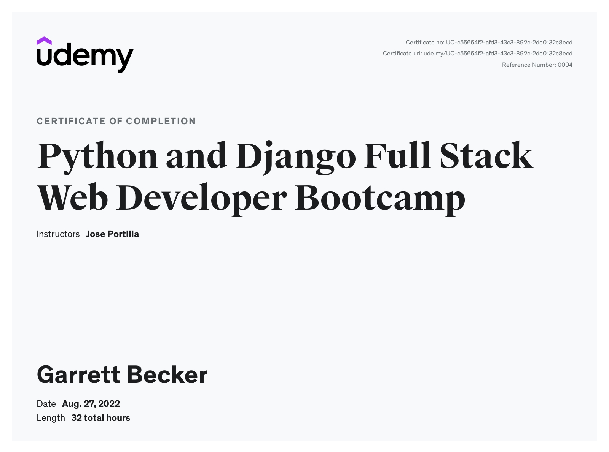

# Udemy - Python and Django Full Stack Web Developer Bootcamp

Projects and learning from Jose Portilla's [Python and Django Full Stack Web Developer Bootcamp course on Udemy](https://www.udemy.com/course/python-and-django-full-stack-web-developer-bootcamp/).

### [Certificate](https://www.udemy.com/certificate/UC-c55654f2-afd3-43c3-892c-2de0132c8ecd/)

### Course Details

#### What you'll learn
- Create a fully functional web site using the Full-Stack with Django 1.11
- Learn how to use HTML to create website content
- Use CSS to create beautifully styled sites
- Learn how to take advantage of Bootstrap to quickly style sites
- Use Javascript to interact with sites on the Front-End
- Learn how to use jQuery to quickly work with the DOM
- Understand HTTP requests
- Create fantastic landing pages
- Learn the power of Python to code out your web applications
- Use Django as a back end for the websites
- Implement a full Models-Views-Templates structure for your site

#### Requirements
- A computer with an internet connection and download privileges

#### Description
Welcome to the Python and Django Full Stack Web Developer Bootcamp! In this course we cover everything you need to know to build a website using Python, Django, and many more web technologies!

Whether you want to change career paths, expand your current skill set, start your own entrepreneurial business, become a consultant, or just want to learn, this is the course for you!

We will teach you the latest technologies for building great web applications with Python 3 and Django! But we don't just teach that, we also teach the Front End technologies you need to know, including HTML, CSS, and Javascript. This course can be your one stop shop for everything you need! It will serve as a useful reference for many of your questions as you begin your journey in becoming a web developer!

This course is designed so that anyone can learn how to become a web developer. We teach you how to program by using HD Video Lectures, Walkthrough Code Projects, Exercises, Concept Presentation Slides, Downloadable Code Notes, Reading Assignments, and much more! 

Here is just a small sampling of the topics included in this course:
- HTML5
- CSS3
- Javascript
- jQuery
- Bootstrap 3 and 4
- Document Object Model
- Python
- Django Basics
- Django Templates
- Django Forms
- Django Admin Customization
- ORM
- Class Based Views
- REST APIs
- User Authentication
- and much,much more!

You will also get access to our online community of thousands of students, happy to help you out with any questions you may have! Any questions, feel free to send me a message here on Udemy and connect with me on LinkedIn, check out my profile for other courses.

We also have a 30-day money back guarantee, so you can try out the course for an entire month, risk-free!

Always keep learning!

#### Who this course is for:
- Complete Beginners
- Professionals looking to bridge gaps in their knowledge
- Python Developers looking to get into Web Development