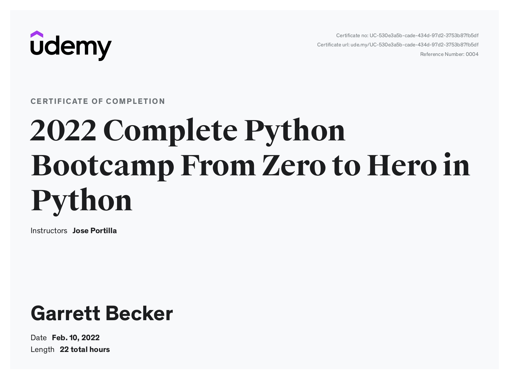

# Udemy - The Complete Python Bootcamp From Zero to Hero in Python

Projects and learning from Jose Portilla's [The Complete Python Bootcamp From Zero to Hero in Python course on Udemy](https://www.udemy.com/course/complete-python-bootcamp/).

### [Certificate](https://www.udemy.com/certificate/UC-530e3a5b-cade-434d-97d2-3753b87fb5df/)

### Course Details

#### What you'll learn
- You will learn how to leverage the power of Python to solve tasks.
- You will build games and programs that use Python libraries.
- You will be able to use Python for your own work problems or personal projects.
- You will create a portfolio of Python based projects you can share.
- Learn to use Python professionally, learning both Python 2 and Python 3!
- Create games with Python, like Tic Tac Toe and Blackjack!
- Learn advanced Python features, like the collections module and how to work with timestamps!
- Learn to use Object Oriented Programming with classes!
- Understand complex topics, like decorators.
- Understand how to use both the Jupyter Notebook and create .py files
- Get an understanding of how to create GUIs in the Jupyter Notebook system!
- Build a complete understanding of Python from the ground up!

#### Requirements
- Access to a computer with an internet connection.

#### Description
Become a Python Programmer and learn one of employer's most requested skills of 2023!

This is the most comprehensive, yet straight-forward, course for the Python programming language on Udemy! Whether you have never programmed before, already know basic syntax, or want to learn about the advanced features of Python, this course is for you! In this course we will teach you Python 3.

With over 100 lectures and more than 21 hours of video this comprehensive course leaves no stone unturned! This course includes quizzes, tests, coding exercises and homework assignments as well as 3 major projects to create a Python project portfolio!

Learn how to use Python for real-world tasks, such as working with PDF Files, sending emails, reading Excel files, Scraping websites for informations, working with image files, and much more!

This course will teach you Python in a practical manner, with every lecture comes a full coding screencast and a corresponding code notebook! Learn in whatever manner is best for you!

We will start by helping you get Python installed on your computer, regardless of your operating system, whether its Linux, MacOS, or Windows, we've got you covered.

We cover a wide variety of topics, including:
- Command Line Basics
- Installing Python
- Running Python Code
- Strings
- Lists 
- Dictionaries
- Tuples
- Sets
- Number Data Types
- Print Formatting
- Functions
- Scope
- args/kwargs
- Built-in Functions
- Debugging and Error Handling
- Modules
- External Modules
- Object Oriented Programming
- Inheritance
- Polymorphism
- File I/O
- Advanced Methods
- Unit Tests
- and much more!

You will get lifetime access to over 100 lectures plus corresponding Notebooks for the lectures!

This course comes with a 30 day money back guarantee! If you are not satisfied in any way, you'll get your money back. Plus you will keep access to the Notebooks as a thank you for trying out the course!

So what are you waiting for? Learn Python in a way that will advance your career and increase your knowledge, all in a fun and practical way!

#### Who this course is for:
- Beginners who have never programmed before.
- Programmers switching languages to Python.
- Intermediate Python programmers who want to level up their skills!