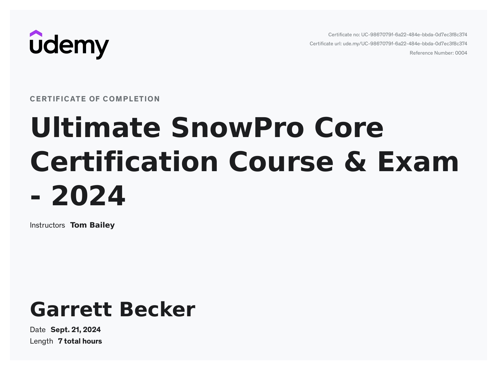

# Udemy - Ultimate SnowPro Core Certification Course & Exam - 2024

Projects and learning from Tom Bailey's [Ultimate SnowPro Core Certification Course & Exam - 2024 course on Udemy](https://www.udemy.com/course/ultimate-snowpro-core-certification-course-exam).

### [Certificate](https://www.udemy.com/certificate/UC-9867079f-6a22-484e-bbda-0d7ec3f8c374/)

### Course Details

#### What you'll learn
- Learn the fundamentals of Snowflake with a mixture of theory lectures and practical hands-on using the Snowflake platform.
- End of course mock exam including 100 questions to help you prepare for certification exam.
- End of section quizzes to solidify knowledge from each section.
- Downloadable code samples for the practical hands-on lessons.
- Learn in-depth about Snowflake’s architecture including storage concepts in the storage layer, warehouses in the compute layer and the global services layer.
- In-depth look at the Snowsight UI and the classic console and a comparison of their features.
- Learn about Snowflake’s broad set of objects including Organizations, Accounts, Databases, Schemas, Tables, Views, User-define functions (UDFs) and much more.
- Overview of high-level programmatic data processing with the Snowpark API.
- Learn about Snowflake security features including Network Policies, Multi-Factor Authentication (MFA), Federated Authentication and Single Sign-On (SSO).
- Learn about the access control schemes Snowflake use including Role Based Access Control (RBAC) and Discretionary Access Control (DAC).
- Learn about the ways you can monitor and track usage within organizations, accounts and tables programmatically and through the UI.
- Learn to optimise query performance using the Query Profile tool, Materialized Views, Clustering, the Search Optimization Service and tuning SQL code.
- Learn how to load and unload data into Snowflake. Covering bulk data loading with the COPY INTO statement and continuous data loading with Snowpipe.
- Learn how to work with structured, semi-structured and unstructured data.
- Learn about Snowflake data protection features such as Time Travel, Fail-safe, Data Encryption, Cloning and Replication.
- Learn how to share data between Snowflake accounts with Secure Data Sharing, the Data Marketplace and the Data Exchange.

#### Requirements
- Basics of SQL syntax such as selecting, inserting, and dropping data. Any SQL concepts specific to Snowflake will be explained thoroughly during the course.
- Understanding the basics of cloud computing will help but is not needed to complete this course.
- For the hands-on lessons you’ll need a free Snowflake trial account. We walk through the process of obtaining an account in one of the introductory videos!

#### Description
- January 2024 Update
  - Replication lecture updated to reflect updated list of object types able to be replicated across accounts in an organization
- September 2023 Update
  - User Interfaces lecture updated to reflect the fact that newly previsioned on-demand trial accounts no longer support the classic console, instead encouraging the use of the Snowsight UI.
- August 2023 Update
  - Provisioning a Trial Snowflake Account" lecture was updated to reflect how to connect to a trial account using the updated Snowsight URL format, which removes the region name for clarity.
- April 2023 Update
  - "Federated Authentication" lecture was updated to reflect changes to how federated authentication is enabled, now using a single security integration object instead of two account-level properties.
- March 2023 Update
  - "Tasks and Streams" lecture was updated to reflect changes to how tasks are chained together in a DAG.

Welcome to the ultimate COF-C02 SnowPro Core Certification preparation course! After completing this course you’ll have everything you need to ace the SnowPro Core certification exam. The contents have been arranged to cover everything from the Snowflake study guide (and more).

It starts with a broad look at Snowflake’s architecture and key features and moves through important topics such as account security and data protection, performance improvement, data loading and unloading, working with structured, semi-structured and unstructured data and data sharing.

This course not only provides you with a solid practical level of skill you can take into the workplace but also places you well to attempt further certifications such as the SnowPro Advanced: Data Engineer and SnowPro Advanced: Architect.

Even if you have no experience with Snowflake, this course will take you from beginner to certified. Here’s why:
- This is one of the only courses online which is geared specifically to cover the contents of the Core exam for the most recent COF-C02 version of the certification.
- As well as all the topics required for the certification exam, the course also includes extra content on advanced topics to help you truly master Snowflake.
- This is one of the most comprehensive Snowflake courses you can find on Udemy with over 7+ hours of quality HD videos, providing an engaging mixture of theory and hands-on lessons.
- Because we start with beginners in mind, and cover basic to advanced topics, it’s great even for those not intending to take the certification exam. There is enough content to drop in and out of the areas that interest you.
- Your instructor is an experienced data engineer certified in Amazon Web Services (AWS), Apache Kafka and most importantly for this course, has earned the SnowPro Core and SnowPro Advanced Data Engineer certifications.
- All lectures and hands-on have been designed from the ground up to make difficult topics easy to understand, getting straight to the point and using simple English.
- Includes personal support via the Q&A when you have questions and queries either about Snowflake concepts or assistance with making the most out of the course.

##### What do you get with this course?
- Covers in-depth all the topics required for the COF-C02 SnowPro Core Certification exam.
- Hands-on lessons using the new Snowsight Web Interface with downloadable code examples.
- Theory lectures which include architectural diagrams, graphics, code snippets and overview slides to bookmark and study from.
- Practice exam with 100 questions.
- A questionnaire at the end of each section to help solidify the theory and hands-on covered.
- The perspective of someone who has studied and passed the Core and Advanced Snowflake certifications.

##### What is covered in the course?
- Snowflake Cloud Data Platform Features & Architecture
  - Including an overview of Snowflake, the multi-cluster shared data architecture, storage, query processing and services layers, Snowflake editions and more.
- Account Access & Security
  - Including a review of RBAC and DAC access control schemes, deep-dive on roles and privileges, various types of authentication including user authentication, multi-factor authentication (MFA), federated authentication, Key Pair authentication and more.
- Performance Concepts: Virtual Warehouses:
  - Including a Virtual warehouse overview, a look at virtual warehouse sizing and billing, virtual warehouse state & properties, resource monitors and more.
- Performance Concepts: Query Optimization
  - Including a look at query performance analysis tools, SQL tuning, caching, clustering and more.
- Data Loading & Unloading
    - Including a review of simple loading methods such as INSERT, stage objects, file format objects, the serverless feature Snowpipe, bulk loading with the COPY INTO `table` statement, semi-structured functions and more.
- Data Transformations
  - Including a birds eye look at functions, deep-dive into estimation functions, table sampling, directory tables and more.
- Storage, Data Protection and Data Sharing
  - Including an overview of the storage layer, deep-dive into micro-partitions, data protection features Time Travel and Fail-safe, cloning, replication and more.

In other words, there is a lot of content in this course for you to learn from and that will help you achieve an excellent score in your certification exam!

And once you have passed (which I am sure you will) I’d love to share in your success, so please tag me in a post on LinkedIn. My LinkedIn handle: thomas-bailey-bd.

Enroll now to get lifelong access and pass the SnowPro Core Certification!

#### Who this course is for:
- Anyone wanting to know more about Snowflake or prepare for the SnowPro Core Certification.