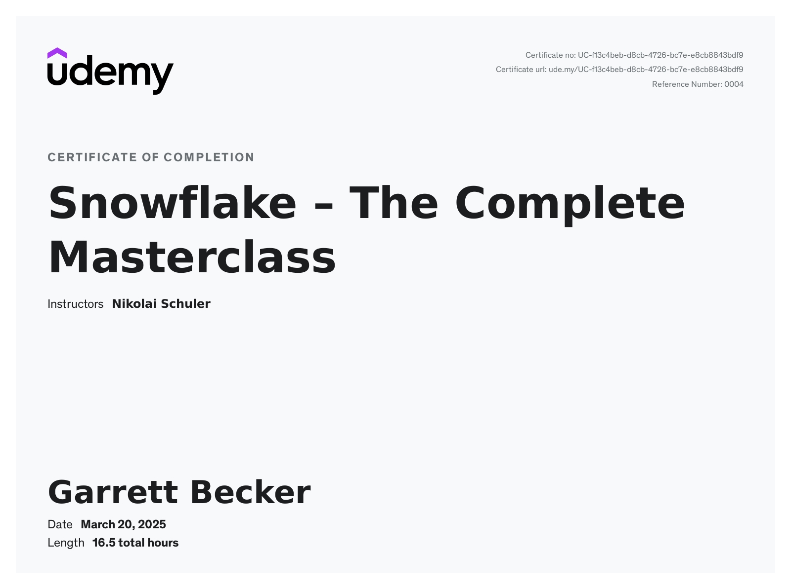

# Udemy - Snowflake: The Complete Masterclass

Projects and learning from Nikolai Schuler's [Snowflake: The Complete Masterclass course on Udemy](https://www.udemy.com/course/snowflake-masterclass).

### [Certificate](https://www.udemy.com/certificate/UC-f13c4beb-d8cb-4726-bc7e-e8cb8843bdf9/)

### Course Details

#### What you'll learn
- Master all fundamentals & advanced topics
- Helpful for snowflake certification
- Build professional-quality understanding of Snowflake
- Understand the entire Snowflake workflow from end-to end
- Apply your knowlegde in assignments & quizzes hands-on
- Learn from top-rated instructor and professional BI developer

#### Requirements
- Laptop with access to the internet & motivation to learn
- Basic knowledge of SQL is helpful

#### Description
Do you want to upgrade your skills and learn how to work with Snowflake professionally?

In this course, you will – step by step – learn everything that is important in Snowflake!

Become a master in Snowflake and learn everything from scratch!

**Why should you take this course?**
- ✓ Understand everything from scratch – step by step, very structured and practice-oriented
- ✓ Learn all the important features – know when and how to use them properly
- ✓ Clear explanations and very systematic – theory & practice
- ✓ Practice everything hands-on – practice & test your knowledge in quizzes & assignments

**What is in this course?**
In this course, you will learn everything you need to master Snowflake!
This course is giving you the chance to systematically master everything you need to know in Snowflake!
- ✓ Master all the fundamentals
- ✓ Master also all the advanced topics
- ✓ Learn the best practices hands-on
- ✓ Apply what you’ve learned in a lot of assignments & quizzes
- ✓ Personal support whenever you have questions

**This course is right for you if...**
- You have never worked with Snowflake and want to learn how to master everything hands-on in just one course.
- OR you already have some basic knowledge and want to dive deeper and become more advanced in the whole universe of Snowflake.

This is the one course that covers everything you need to Master Snowflake.

Enroll now to get lifelong access and master Snowflake!

Not provided by, affiliated with, or sponsored by Snowflake Inc.

#### Who this course is for:
- Data Architects & Data Engineers who want to expand their knowledge to new technologies
- Database Administrators who want to invest in their skills of working within new cloud technologies
- Everyone that wants to learn Snowflake from beginner to advanced
- Everyone that wants work with data and wants learn learn about the latest cloud technologies