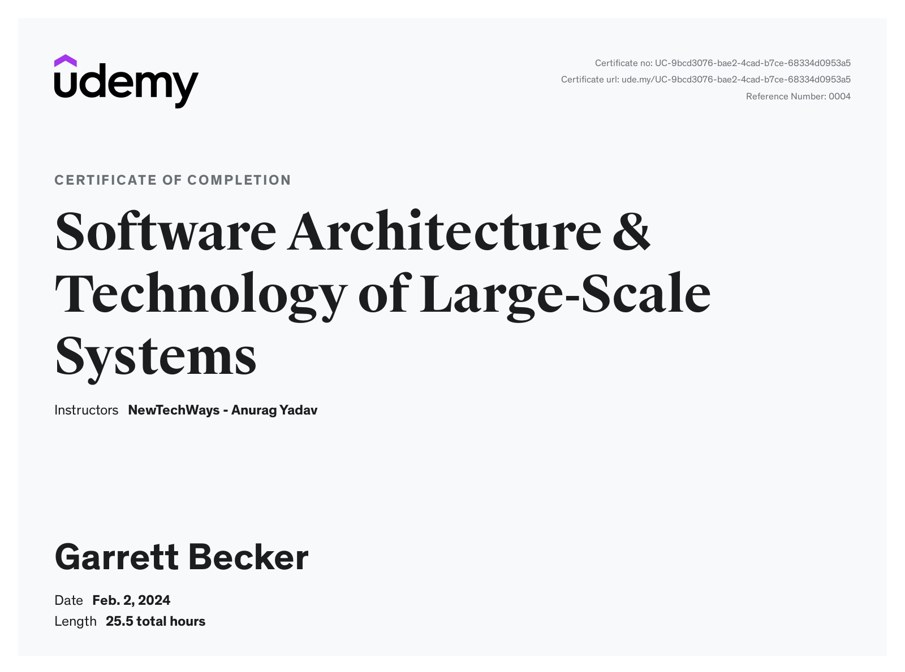

# Udemy - Software Architecture & Technology of Large-Scale Systems

Projects and learning from Anurag Yadav's [Software Architecture & Technology of Large-Scale Systems course on Udemy](https://www.udemy.com/course/developer-to-architect/).

### [Certificate](https://www.udemy.com/certificate/UC-9bcd3076-bae2-4cad-b7ce-68334d0953a5/)

