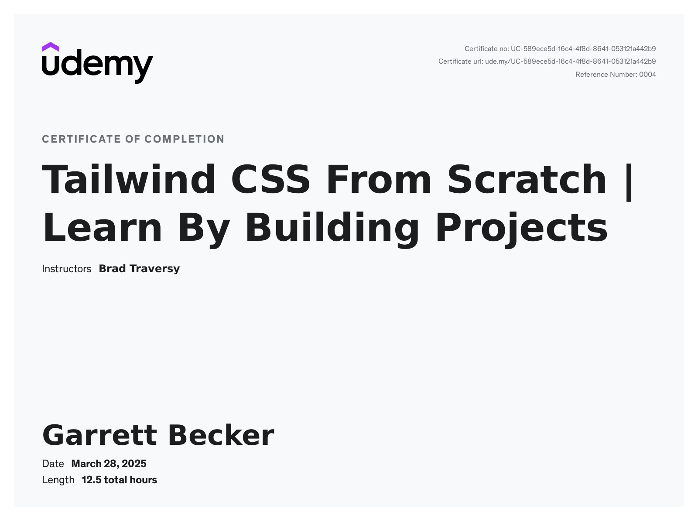

# Udemy - Tailwind CSS From Scratch | Learn By Building Projects

Projects and learning from Brad Traversy's [Tailwind CSS From Scratch | Learn By Building Projects course on Udemy](https://www.udemy.com/course/tailwind-from-scratch/).

### [Certificate](/)

### Course Details

#### What you'll learn
- Learn to create and edit layouts super fast
- Learn the Tailwind utility classes using a code sandbox
- Build 5 mini-projects and 6 website projects
- Learn how to set up a dev environment using the Tailwind CLI
- Configure your styles to create custom layouts

#### Requirements
- You should know the basics of CSS

#### Description
This is a fun project-based course to learn how to create awesome layouts using the Tailwind CSS framework and get comfortable using utility classes over something like Bootstrap, which uses component-based classes. Let's take a look at the outline for this course...

✔️ The Sandbox
I don't want to jump right into the projects, though you certainly could if you want. So the first two sections, we will be working in a coding sandbox. In every new video in these sections, we will have a new file to experiment with and learn all about a certain aspect of Tailwind. For example, we will have pages/videos for colors, typography, spacing, flex classes, and much more. This allows us to essential touch on all parts of Tailwind in a specific order, rather than just jumping right into projects.

✔️ Mini-Projects
Next, we will take what we learn in the sandbox environment and use it to create some small projects. These are things that will take 10 - 20 minutes to create and we will do it all in one video per project. The mini-projects include
1. Email Subscribe Card
2. Pricing Grids
3. Product Modal
4. Image Gallery
5. Login Modal

I may even add more mini-projects later. These will help you get your feet wet by creating something.

✔️ Website Projects
Next, we will start to work on larger landing-page websites. This will really put what you learned to the test. There will be 6 different websites. They are all very modern and clean-looking. We partnered with Frontend Mentor for the designs. Some projects will have a bit of javaScript for things like hamburger menus, tabs, and some validation. Let's take a look at the projects.
- Clipboard Website - Simple software product landing page. Focusing mostly on flexbox and alignment. Some background images, etc.
- Loopstudios - VR company website with cool images, responsive mobile menu with some JavaScript, gradient overlay effects.
- Shortly - Website for a link shortening tool. We will have a nice-looking responsive menu and add a little JavaScript for some form validation and working with the DOM.
- Testimonial Grid - A project where we focus on using Tailwind's grid classes.
- Fylo - Product page with a light/dark mode feature. We will add some JavaScript to save the color mode to local storage. We will also have a dynamic tab component for the FAQ.
- Bookmark - Bookmark manager extension landing page. This website will have some dynamic background images, a hamburger menu and some tabs that will use JavaScript.

#### Who this course is for:
- Anyone that wants to get better at creating website and UI layouts