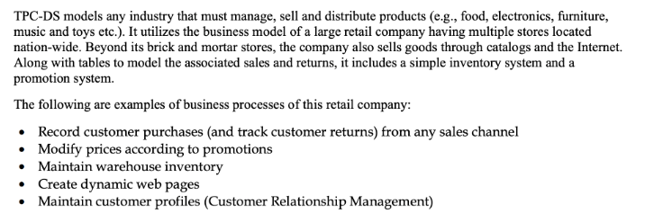

## 01_ Course Intro

### Initial Steps
- Create a Google Cloud storage bucket (use closest region to you)
- Upload all .dat files into here
- Create dataset within BigQuery (use same region as your Bucket)
- Open Cloud Shell for BigQuery
- Upload .sh file
- Copy/paste your specific details here for your Bucket to load in the .dat files there
- Change the mode of the .sh file to executable in the terminal: "chmod u+x create-big-query-tables.sh"
- Authorize Cloud Shell to execute
- This will create tables from these .dat files and assign column headers as needed

### About the Dataset
- TPC-DS, or the Transaction Processing Performance Council's Decision Support benchmark, is a widely recognized industry-standard dataset used for benchmarking the performance of Relational Database Management Systems and Big Data Frameworks.
- It's specifically designed to emulate modern-day data warehousing and business intelligence scenarios; this dataset provides a holistic snapshot of various business areas, including but not limited to sales, inventory, and customer relationship management.

- With its robust structure and real-world resemblances, the TPC-DS dataset serves as a formidable foundation for learning any data-related libraries and frameworks.
- The sample we use in this course is only one Gigabyte large, but you can generate up to 100 terabytes of data using the tools provided on TPC-DS
- [Link to more information](https://www.tpc.org/tpc_documents_current_versions/current_specifications5.asp)

### Resources
- [Supported data platforms](https://docs.getdbt.com/docs/supported-data-platforms)
- [Course Github repository](https://github.com/insightahead/dbt-learning-project)