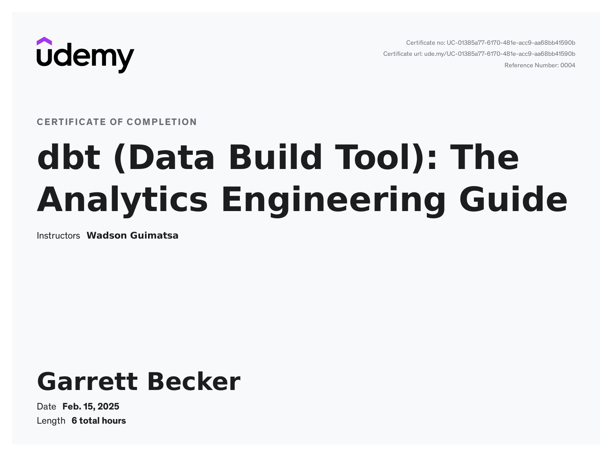

# Udemy - dbt (Data Build Tool): The Analytics Engineering Guide

Projects and learning from Wadson Guimatsa's [dbt (Data Build Tool): The Analytics Engineering Guide course on Udemy](https://www.udemy.com/course/dbt-data-build-tool-the-analytics-engineering-guide/).

### [Certificate](https://www.udemy.com/certificate/UC-01385a77-6170-481e-acc9-aa68bb41590b/)

### Course Details

#### What you'll learn
- Managing dbt Projects: Learn to initiate, structure, and effectively manage dbt projects, including dbt profiles understanding.
- Master dbt Models: Understand how to create and manage dbt models, including their dependencies, configurations.
- Grasp dbt's Core Purpose: You will confidently articulate what dbt is and its crucial role in data engineering.
- Implement Testing in dbt: Understand the different types of tests in dbt, and how to implement them effectively for different models and other dbt resources..
- Understand dbt Packages: Gain knowledge on how to use dbt packages to modularize and reuse code across different dbt projects.
- Deploy dbt Cloud Jobs: Learn how to configure and deploy dbt jobs in various environments, understanding the differences and requirements of each.
- Create and Maintain dbt Documentation: Learn how to generate and maintain documentation within dbt, including descriptions of sources, tables, and columns.
- Setting Up and Installing dbt: you should be able to navigate the process of installing dbt and setting it up whether that's a local machine or dbt cloud
- Version Control: Understand how dbt integrates with platforms like GitHub to provide version control, ensuring you can track and manage changes effectively.
- Streamlined Workflows: Instead of juggling multiple tools and platforms, learn how dbt serves as a one-stop solution for most of your data transformation needs.
- dbt Cloud IDE: Master how to use dbt Cloud IDE to write, test, and deploy DBT models and other resources without needing to interact with the command line.

#### Requirements
- Foundational SQL Knowledge: While the course will delve into dbt, which builds upon SQL, students should be comfortable with basic SQL queries, joins, and aggregations
- Hands-On Approach: An inclination to apply knowledge practically will be beneficial.
- Willingness to Learn and Install Software: While the course will guide through the essentials, students should be open to installing and exploring new software and tools as required.

#### Description
Take your skills as a data professional to the next level with this Hands-on Course course on **dbt, the Data Build Tool**.

Start your journey toward mastering Analytics Engineering by signing up for this course now!

This course aims to give you the necessary knowledge and abilities to effectively use dbt in your data projects and help you achieve your goals.

This course will guide you through the following:
1. **Understanding the dbt architecture:** Learn the fundamental principles and concepts underlying dbt.
2. **Developing dbt models:** Discover how to convert business logic into performant SQL queries and create a logical flow of models
3. **Debugging data modeling errors:** Acquire skills to troubleshoot and resolve errors that may arise during data modeling.
4. **Monitoring data pipelines:** Learn to monitor and manage dbt workflows efficiently.
5. **Implementing dbt tests:** Gain proficiency in implementing various tests in dbt to ensure data accuracy and reliability.
6. **Deploying dbt jobs:** Understand how to set up and manage dbt jobs in different environments.
7. **Creating and maintaining dbt documentation:** Learn to create detailed and helpful documentation for your dbt projects.
8. **Promoting code through version control:** Understand how to use Git for version control in dbt projects.
9. **Establishing environments in data warehouses for dbt:** Learn to set up and manage different environments in your data warehouse for dbt projects.
10. **Testing Data Models:** Learn how to use built-in tests in dbt and create custom ones.

By the end of this course, you will have a solid understanding of dbt, be proficient in its use, and be well-prepared to take the dbt Analytics Engineering Certification Exam. Whether you're a data engineer, a data analyst, or anyone interested in managing data workflows, this course will provide valuable insights and practical knowledge to advance your career.

Please note that this course does not require any prior experience with dbt. However, familiarity with SQL and basic data engineering concepts will be helpful.

**Disclaimer:**
This course is not affiliated, associated, authorized, endorsed by, or in any way officially connected with dbt Labs, Inc. or any of its subsidiaries or its affiliates.  The name “dbt” and related names, marks, emblems, and images are registered trademarks of dbt Labs, Inc. Similarly; this course is not officially connected with any data platform or tools mentioned in the course. The course content is based on the instructor's experience and knowledge and is provided only for educational purposes.

#### Who this course is for:
- Beginners in data analytics who are starting their journey with data processing tools and are looking for a thorough understanding of dbt.
- SQL practitioners of all levels looking to comprehensively incorporate dbt into their data processing toolset.
- Business analysts who work with data regularly and aim to optimize their workflow with a more in-depth understanding of dbt.
- Data engineers and data scientists enthusiastic about harnessing dbt's complete capabilities for improved ETL/ELT workflows, testing, and analytics.
- Professionals transitioning into data roles and seeking a hands-on introduction to a popular data build tool.

### Course Work

#### dbt Cloud

#### BigQuery Data Warehouse

