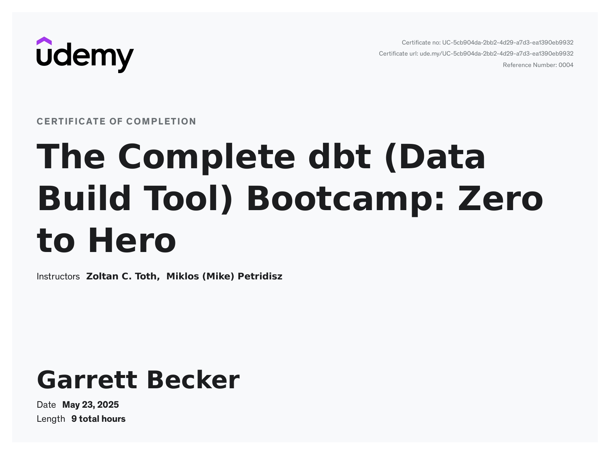

# Udemy - The Complete dbt (Data Build Tool) Bootcamp: Zero to Hero

Projects and learning from Zoltan C. Toth and Miklos (Mike) Petridisz's [The Complete dbt (Data Build Tool) Bootcamp: Zero to Hero course on Udemy](https://www.udemy.com/course/complete-dbt-data-build-tool-bootcamp-zero-to-hero-learn-dbt/).

### [Certificate](https://www.udemy.com/certificate/UC-5cb904da-2bb2-4d29-a7d3-ea1390eb9932/)

### Course Details

#### What you'll learn
- Learn to use the dbt platform professionally through the creation of an exhaustive, real-world, hands-on dbt - Airbnb project covering both Theory and Practice
- Set up the complete development environment on Mac & Windows, Connect to Snowflake and BI, Configure dbt profile, extend the IDE with dbt tools
- Learn core dbt concepts such as Models, Materialization, Sources, Seeds, Snapshots, Packages, Hooks, Exposures, Analyses, write complex SQL queries
- Understand the dbt project structure and learn about dbt tips & tricks, advanced techniques and best practices, extend dbt with your own / third-party macros
- Implement singular and generic dbt tests, work with additional arguments and default config values, customize dbt built-in tests
- Document your models and pipeline, customize the dbt docs page, Explore and analyse dependencies between transformation steps
- Understand how dbt fits into the modern data stack, learn about the stages of the Data-Maturity Model, and well functioning Data Architectures
- Master ETL/ELT procedures, Data Transformations, Modern Data Stack, Slowly Changing Dimensions, Common Table Expressions and Analytics Engineering
- Understand what is a Data Warehouse, Data Lake, or Data Lakehouse and when to use which, handle Data Collection, Data Wrangling and Data Integrations
- See how advanced testing works using dbt-expectations, a Great Expectations inspired testing framework
- Test your knowledge with certification preparation question
- Listen to real-world use-cases from industry professionals
- Learn dbt Orchestration Best Practices Hands On

#### Requirements
- Basic SQL experience
- No previous programming language experience required
- Working computer (Mac/Windows/Linux)
- Network access whitelist to snowflake(.com) and GitHub if you work behind a firewall or VPN
- Git and Python (We are linking to the installation instructions of these tools in the course)

#### Description
Become a dbt professional from scratch with this single course, solving a real-world problem step by step! We cover both theory and hands-on practice! Delivered by an instructor with 20+ years of Data Engineering experience. This is the MOST COMPLETE, CONTINUOUSLY UPDATED independent dbt (Data Build Tool) software course in the world - as of 2025!

This course is the TOP RATED and the BESTSELLER dbt course on Udemy!

"Fantastic course. Well-chosen examples perfectly illustrate the many features that are covered. The pacing is spot on and it is easy to replicate the examples."

"Excellent course! Edit: I managed to pass the dbt certification exam. I couldn't have done it without your help! Again, it's an awesome course!"

"I love how you're explaining everything at just the right level!"

**New in Jan 2025: dbt 1.9 & dbt Certification questions and certification interview!**

Thank you for joining us for The Complete dbt (Data Build Tool) Bootcamp: Zero to Hero - we are super excited to have you in the course!
The structure of the course is designed to have a top-down approach. It starts with the Analytics Engineering Theory - all you need to know to put dbt (Data Build Tool) in context and to have an understanding of how it fits into the modern data stack. We start with the big picture; then, we go deeper and deeper. Once you learn about the pieces, we will shift to the technicalities - a practical section - which will focus on putting together the dbt “puzzle”. The practical section will cover each and every single dbt feature present today through the construction of a complete, real-world project; Airbnb. This presents an opportunity for us to show you which features should be used at what stage in a given project, and you will see how dbt is used in the industry.

**THEORETICAL SECTION:**
Among several other topics, the theoretical section puts special emphasis on transferring knowledge in the following areas:
- Data-Maturity Model
- Well-functioning Data Architectures
- Data Warehouses, Data Lakes, and Data Lakehouses
- ETL and ELT procedures and Data Transformations
- Fundamentals of dbt (Data Build Tool)
- Analytics Engineering
- Modern Data Stack
- Slowly Changing Dimensions
- CTEs
Once we understand the theoretical layer and how dbt fits into the picture, we will start building out a dbt project from scratch, just as you would do in the real world.

**PRACTICAL SECTION:**
The practical section will go through a real-world Airbnb project where you will master the ins and outs of dbt! We put special focus on getting everyone up and ready before the technical deep dive; hence we will start off by setting up our Development Environment:
- MAC Development Environment Setup
- WINDOWS Development Environment Setup
- IDE dbt Extension Installation
- Creation and Activation of Virtual Environments
- Setting up Snowflake
- Using the dbt Power User Visual Studio extension

Once we are ready - among several other technical topics, the following features will be covered;
- dbt Models
- dbt Materializations
- dbt Tests
- dbt Documentation
- dbt Sources, Seeds, Snapshots
- dbt Hooks and Operations
- Jinja and Macros
- dbt Packages
- Analyses, Exposures
- dbt Seeds
- Data Visualization (Preset)
- Working with Great Expectations (dbt-expectations)
- Debugging tests in dbt
- dbt Orchestration

Once the theory and the practical stages are finished, we will dive into the best practices and more advanced topics. The course is continuously updated; whenever dbt publishes an update, we adjust the course accordingly, so you always be up to date!

**Who is this course for?**
- Data Engineers
- Data Analysts
- Data Scientists
- BI Developers
- BI Analyst
- ... and anyone who interacts with data lake/data warehouse/data lakehouse or uses SQL!
- 
**Course Level Explained (Zero > Hero)**
The course has no expectations about your abilities and starts education from zero. Every exercise is an unavoidable step in your studies. In the same way, don't start an exercise of a superior level without completing the preceding ones: you will be in difficulty if you do so. Practice is the only way to learn, and it cannot be taken lightly. We will be next to you along the journey and you have our absolute support!

When the Airbnb project is presented to you, you must do it entirely, without omitting any guidelines, and by understanding the objective. A project "almost completely" done is often a project "totally incomplete" for us. Give special attention to detail. Your only reliable source of information regarding the instructions is the pedagogical team, don't trust the "I've heard".

By the time you complete the course, you will be equipped with both a very solid theoretical understanding and practical expertise with dbt. All the fundamentals, dbt features, best practices, advanced techniques and more will be covered in our course, which will make you become a master in dbt. Are you ready? ;)

**How to get help?**
We just published our initial round of Discussions on Udemy which is the easiest and most efficient way for you to post questions, receive answers, and peruse questions from other students. If you have questions or feedback, please reach out to us!

That wraps it up for us for now!

Once again, thank you for being a part of this course.

We can't wait to get started with you soon!
All the best,
Zoltan C. Toth

dbt Mark and the dbt logo are trademarks of dbt Labs, Inc.

#### Who this course is for:
- Analytics Engineers
- Data Analysts
- BI Analysts
- Data Scientists
- Data Engineers